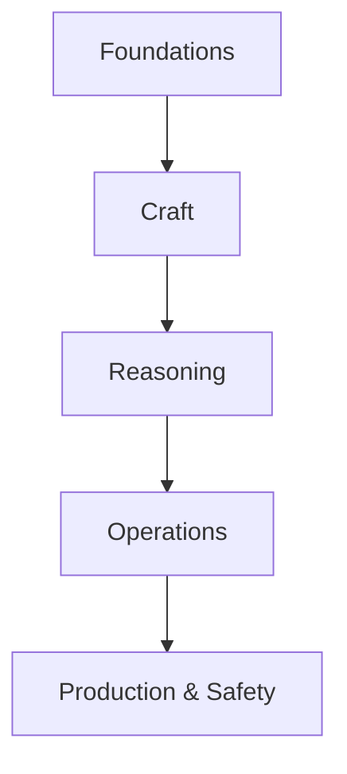

# Prompt Engineering

> Production-quality handbook treating prompts as maintainable software artifacts — restructured into the same nested Handbooks hierarchy.

**Prerequisites:** [Large Language Models](../llm-engineering/README.md)  
**Unlocks:** [Context Engineering](../context-engineering/README.md) · [RAG](../rag/README.md) · [AI Agents](../ai-agents/README.md)

Start with a section hub below (or expand **10. Prompt Engineering** in the left sidebar). Existing deep-dive pages are preserved — only the folder/nav structure changed.

---

## Sections

| # | Section | What you will learn | Hub |
|---|---------|---------------------|-----|
| 1 | **Foundations** | Intro, anatomy, message types, design principles | [foundations/](foundations/README.md) |
| 2 | **Craft** | Patterns, templates, structured prompting, strategies | [craft/](craft/README.md) |
| 3 | **Reasoning Strategies** | Advanced reasoning and chaining | [reasoning-strategies/](reasoning-strategies/README.md) |
| 4 | **Prompt Operations** | Lifecycle, versioning, testing, evaluation, optimization | [prompt-operations/](prompt-operations/README.md) |
| 5 | **Production & Safety** | Security, mistakes, production, comparisons | [production-and-safety/](production-and-safety/README.md) |

```mermaid
flowchart TB
  F[Foundations] --> C[Craft]
  C --> R[Reasoning]
  R --> O[Operations]
  O --> P[Production & Safety]
```

---

## Hierarchy

### 1. Foundations

| # | Topic |
|---|-------|
| 1 | [Introduction to Prompt Engineering](foundations/01-introduction-to-prompt-engineering.md) |
| 2 | [Prompt Anatomy](foundations/02-prompt-anatomy.md) |
| 3 | [Message Types](foundations/03-message-types.md) |
| 4 | [Prompt Design Principles](foundations/04-prompt-design-principles.md) |

### 2. Craft

| # | Topic |
|---|-------|
| 1 | [Prompt Patterns](craft/01-prompt-patterns.md) |
| 2 | [Prompt Templates Guide](craft/02-prompt-templates-guide.md) |
| 3 | [Structured Prompting](craft/03-structured-prompting.md) |
| 4 | [Prompting Strategies](craft/04-prompting-strategies.md) |

### 3. Reasoning Strategies

| # | Topic |
|---|-------|
| 1 | [Advanced Reasoning Strategies](reasoning-strategies/01-advanced-reasoning-strategies.md) |
| 2 | [Prompt Chaining](reasoning-strategies/02-prompt-chaining.md) |

### 4. Prompt Operations

| # | Topic |
|---|-------|
| 1 | [Prompt Lifecycle](prompt-operations/01-prompt-lifecycle.md) |
| 2 | [Prompt Versioning](prompt-operations/02-prompt-versioning.md) |
| 3 | [Prompt Testing](prompt-operations/03-prompt-testing.md) |
| 4 | [Prompt Evaluation](prompt-operations/04-prompt-evaluation.md) |
| 5 | [Prompt Optimization](prompt-operations/05-prompt-optimization.md) |

### 5. Production & Safety

| # | Topic |
|---|-------|
| 1 | [Prompt Security](production-and-safety/01-prompt-security.md) |
| 2 | [Prompt Engineering Mistakes](production-and-safety/02-prompt-engineering-mistakes.md) |
| 3 | [Production Prompt Engineering](production-and-safety/03-production-prompt-engineering.md) |
| 4 | [Prompt Comparison Guides](production-and-safety/04-prompt-comparison-guides.md) |

---

## Definition

Prompt Engineering is a software engineering discipline — not a collection of hacks. Design, test, version, optimize, and deploy prompts as production artifacts.

---

## Template Library

16 production templates in [`prompts/templates/`](../../prompts/templates/):

QA · Summarization · Classification · Extraction · Translation · Code generation · Code review · Documentation · Brainstorming · Email · SQL · JSON · Markdown · Agent planning · Evaluation judge · RAG query

---

## Code Examples

[`examples/prompt-engineering/`](../../examples/prompt-engineering/) — loader, chaining, few-shot, XML, evaluation, RAG, function calling, support chatbot, document analysis

---

## Cheat Sheets

- [Prompt Anatomy](../../cheat-sheets/prompt-anatomy-cheat-sheet.md)
- [Prompt Patterns](../../cheat-sheets/prompt-patterns-cheat-sheet.md)
- [Structured Prompting](../../cheat-sheets/structured-prompting-cheat-sheet.md)
- [Output Constraints](../../cheat-sheets/prompt-output-constraints-cheat-sheet.md)
- [Delimiters](../../cheat-sheets/prompt-delimiters-cheat-sheet.md)
- [XML Prompting](../../cheat-sheets/xml-prompting-cheat-sheet.md)
- [JSON Prompting](../../cheat-sheets/json-prompting-cheat-sheet.md)
- [Testing Checklist](../../cheat-sheets/prompt-testing-checklist.md)
- [Debugging Checklist](../../cheat-sheets/prompt-debugging-checklist.md)
- [LLM Sampling Parameters](../../cheat-sheets/llm-sampling-parameters.md)

---

## Learning path

| Stage | Sections | Focus |
|-------|----------|-------|
| Foundations | 1 | Anatomy, roles, principles |
| Craft | 2 | Patterns, templates, structure |
| Reasoning | 3 | CoT-style strategies and chains |
| Operations | 4 | Version, test, evaluate, optimize |
| Production | 5 | Security, mistakes, ship |

**Milestone:** Versioned prompt with golden dataset, CI regression tests, and structured output validation.

---

## See also

- [Large Language Models](../llm-engineering/README.md)
- [Prompt Library](../../prompts/README.md)
- [Master Index](../../meta/indexes/MASTER-INDEX.md)

---

## Continue learning

Next: [LLM Application Development](../llm-application-development/README.md)

