# Advanced Reasoning Strategies

> How to elicit reliable multi-step reasoning from LLMs — from chain-of-thought to ReAct, Tree of Thoughts, reflection loops, and multi-agent debate — and how these patterns prepare you for AI agent architectures.

## Table of Contents

- [Overview](#overview)
- [When Reasoning Strategies Matter](#when-reasoning-strategies-matter)
- [Chain of Thought](#chain-of-thought)
- [Self-Reflection](#self-reflection)
- [ReAct: Reasoning and Acting](#react-reasoning-and-acting)
- [Tree of Thoughts](#tree-of-thoughts)
- [Graph of Thoughts](#graph-of-thoughts)
- [Self-Consistency](#self-consistency)
- [Planning Prompts](#planning-prompts)
- [Reflection Loops](#reflection-loops)
- [Debate Prompting](#debate-prompting)
- [Multi-Agent Prompting Overview](#multi-agent-prompting-overview)
- [Strategy Selection Guide](#strategy-selection-guide)
- [Production Considerations](#production-considerations)
- [Cost and Latency Tradeoffs](#cost-and-latency-tradeoffs)
- [Python Examples](#python-examples)
- [Common Mistakes](#common-mistakes)
- [Interview Preparation](#interview-preparation)
- [Navigation](#navigation)

---

## Overview

Basic prompts ask the model for an answer.
Advanced reasoning strategies ask the model to **show its work** — decomposing problems, exploring alternatives, using tools, critiquing its own output, and converging on higher-quality conclusions.

This document is **Section 9** of Phase 5 in the AI Engineering Playbook.
It bridges prompt engineering and AI agents: every agent framework you will use in later phases is built on one or more of these reasoning patterns.

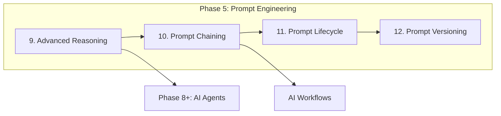

> **Prerequisites:** Complete [Phase 4 LLM Engineering](../llm-engineering/README.md) and Sections 1–8 of Phase 5 before applying advanced reasoning strategies in production.

---

## When Reasoning Strategies Matter

| Scenario | Basic Prompt Risk | Reasoning Strategy |
|----------|-------------------|------------------|
| Multi-step math or logic | Wrong answer with high confidence | Chain of Thought + Self-Consistency |
| Tool use (search, APIs, DB) | Hallucinated tool results | ReAct |
| Open-ended design decisions | Single shallow answer | Tree of Thoughts or Debate |
| Code generation with bugs | Syntax errors slip through | Reflection loops |
| Complex planning | Missed dependencies | Planning prompts + decomposition |

> **Production Standard:** Match reasoning depth to task criticality.
A customer support FAQ bot does not need Tree of Thoughts.
A financial compliance review pipeline does.

---

## Chain of Thought

**Chain of Thought (CoT)** instructs the model to produce intermediate reasoning steps before the final answer.
The model's internal computation benefits from explicit step-by-step token generation — especially on tasks requiring arithmetic, logic, or multi-hop inference.

### Zero-Shot CoT

Add a simple trigger phrase:

```
Solve the problem step by step. Show your reasoning before giving the final answer.
```

The phrase "Let's think step by step" (Kojima et al., 2022) is the canonical zero-shot trigger.

### Few-Shot CoT

Provide examples where each demonstration includes reasoning steps followed by the answer:

```
Q: Roger has 5 tennis balls. He buys 2 cans of 3 tennis balls each. How many does he have?
A: Roger started with 5 balls. 2 cans × 3 balls = 6 new balls. 5 + 6 = 11. The answer is 11.

Q: {actual question}
A:
```

### When CoT Helps

- Arithmetic and symbolic reasoning
- Multi-hop question answering
- Constraint satisfaction problems
- Debugging and root-cause analysis

### When CoT Hurts

- Simple classification or extraction (adds latency and tokens for no gain)
- Tasks where reasoning steps leak sensitive internal logic
- Models too small to maintain coherent multi-step chains

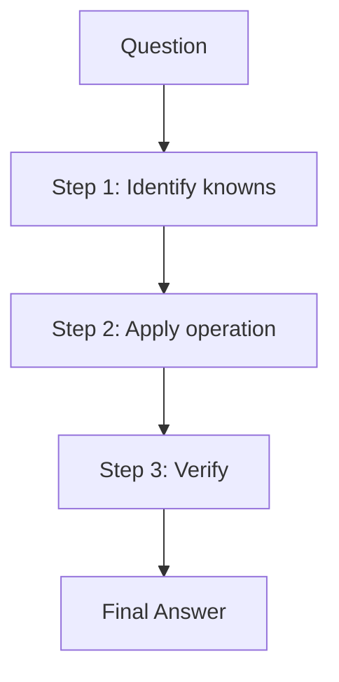

### CoT Prompt Template

```
You are a careful analyst. For every task:

1. Restate the problem in your own words.
2. List known facts and constraints.
3. Work through the solution step by step.
4. State your final answer clearly, prefixed with "ANSWER:".

Problem: {problem}
```

> **Tip:** For structured pipelines, parse the final answer with a delimiter (`ANSWER:`) rather than trying to extract it from free-form reasoning.

---

## Self-Reflection

**Self-reflection** asks the model to evaluate its own output against criteria before finalizing.
Unlike CoT (which reasons forward), reflection reasons **backward** — critiquing and revising.

### Basic Reflection Pattern

```
Step 1 — Generate: Produce an initial answer.
Step 2 — Critique: List errors, omissions, or weak assumptions.
Step 3 — Revise: Produce an improved answer addressing the critique.
```

### Reflection Prompt Template

```
Task: {task}

Phase 1 — Draft:
Write your initial response.

Phase 2 — Self-Critique:
Review your draft against these criteria:
- Correctness
- Completeness
- Clarity
- Safety

List specific issues found.

Phase 3 — Final:
Produce a revised response that fixes all identified issues.
```

### Self-Reflection vs External Review

| Approach | Cost | Quality Ceiling | Use When |
|----------|------|-----------------|----------|
| Self-reflection | 2–3× tokens | Good | Fast iteration, moderate stakes |
| Separate critic model | 3–4× tokens | Higher | High stakes, diverse perspectives |
| Human review | Highest | Highest | Regulated domains |

> **Warning:** Models can "reflect" without genuinely fixing errors — they may rubber-stamp their own draft.
Combine self-reflection with evaluation metrics or a separate verifier for critical paths.

---

## ReAct: Reasoning and Acting

**ReAct** (Reason + Act) interleaves reasoning traces with tool actions and environment observations.
It is the foundational pattern for tool-using agents.

### The ReAct Loop

Each cycle produces three components:

| Component | Purpose | Example |
|-----------|---------|---------|
| **Thought** | Reason about what to do next | "I need the user's order history to answer this." |
| **Action** | Invoke a tool or API | `search_orders(user_id="u-42")` |
| **Observation** | Result returned by the environment | `[{"order_id": "o-1", "status": "shipped"}]` |

The loop continues until the model produces a final answer or hits a step limit.

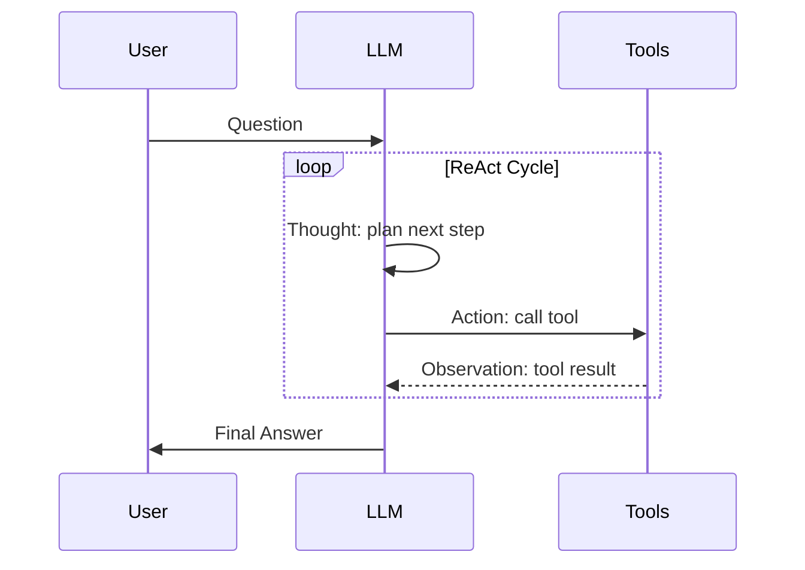

### ReAct Architecture

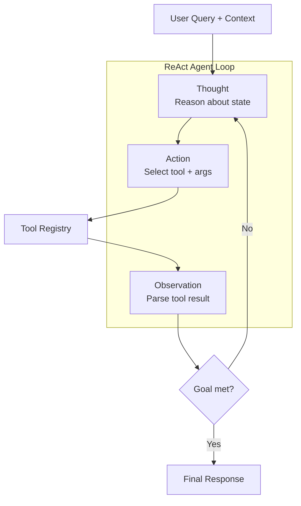

### ReAct System Prompt Template

```
You solve tasks by alternating between Thought, Action, and Observation.

Available tools:
- search(query: str) → returns relevant documents
- calculator(expression: str) → returns numeric result
- finish(answer: str) → submit final answer

Format each step exactly as:
Thought: <your reasoning>
Action: <tool_name>(<arguments>)
Observation: <filled by system — do not invent>

When you have enough information, call finish(answer).
```

### Parsing ReAct Output

Production systems must parse structured Thought/Action/Observation blocks reliably:

```python
import re
from dataclasses import dataclass


@dataclass
class ReActStep:
    thought: str
    action: str
    action_input: str


ACTION_PATTERN = re.compile(
    r"Thought:\s*(?P<thought>.*?)\nAction:\s*(?P<tool>\w+)\((?P<args>.*?)\)",
    re.DOTALL,
)


def parse_react_step(text: str) -> ReActStep | None:
    match = ACTION_PATTERN.search(text)
    if not match:
        return None
    return ReActStep(
        thought=match.group("thought").strip(),
        action=match.group("tool").strip(),
        action_input=match.group("args").strip(),
    )
```

> **Production Standard:** Never let the model fabricate Observations.
The orchestrator executes Actions and injects real Observations before the next LLM call.

### ReAct vs Function Calling

| Feature | ReAct (text-based) | Native Function Calling |
|---------|-------------------|------------------------|
| Portability | Works on any model | Provider-specific |
| Transparency | Full reasoning visible | Often hidden |
| Parsing | Custom regex / structured output | Schema-validated JSON |
| Debugging | Easier to trace | Harder to inspect |

Modern agent frameworks often combine both: function calling for reliable tool dispatch, ReAct-style thoughts for observability.

---

## Tree of Thoughts

**Tree of Thoughts (ToT)** treats reasoning as a search problem over a tree of intermediate "thought" states.
Instead of one linear CoT chain, the model generates multiple candidate thoughts at each step, evaluates them, and explores the most promising branches.

### ToT Process

1. **Decompose** the problem into steps.
2. **Generate** multiple candidate thoughts per step.
3. **Evaluate** each candidate (model self-eval or heuristic).
4. **Search** — breadth-first or depth-first — through the tree.
5. **Select** the best path and produce the final answer.

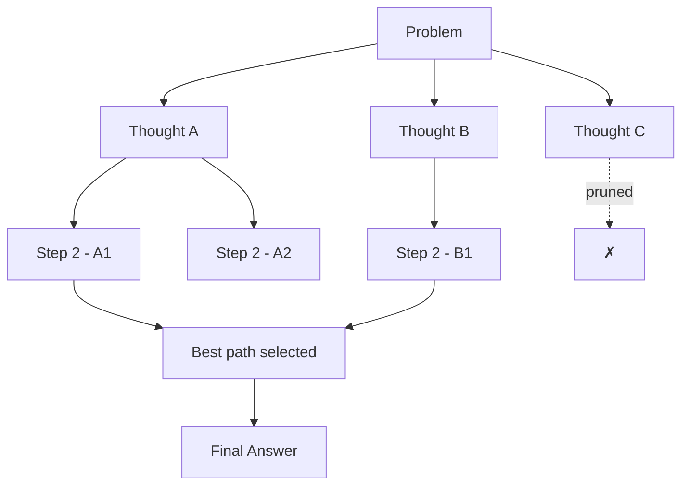

### ToT Evaluation Prompt

```
You are evaluating candidate approaches to a problem.

Problem: {problem}
Current step: {step_number}
Candidate thought: {candidate}

Rate this thought on a scale of 1-10 for:
- Progress toward solution
- Logical soundness
- Feasibility

Return JSON: {"score": N, "reasoning": "..."}
```

### When to Use ToT

- Creative writing with multiple valid directions
- Game playing (chess, puzzles)
- Complex planning with backtracking
- Problems where the first reasoning path often fails

### ToT Costs

ToT can require **dozens of LLM calls** per query.
Use it only when answer quality justifies the cost — or prune aggressively with early stopping.

---

## Graph of Thoughts

**Graph of Thoughts (GoT)** generalizes ToT by allowing thoughts to **merge**, not just branch.
Multiple reasoning paths can be combined into a synthesized thought — capturing dependencies that trees cannot represent.

### Tree vs Graph

| Structure | Relationship | Best For |
|-----------|-------------|----------|
| Chain | Linear sequence | Simple step-by-step |
| Tree | Branch and prune | Exploration with alternatives |
| Graph | Branch, merge, reuse | Complex interdependent subproblems |

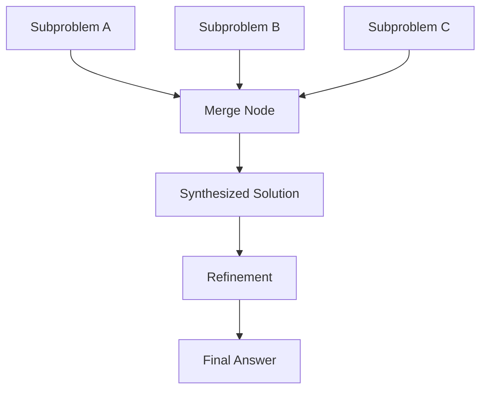

### GoT Operations

| Operation | Description |
|-----------|-------------|
| **Generate** | Create a new thought node |
| **Aggregate** | Merge multiple nodes into one |
| **Refine** | Improve an existing node with new information |
| **Score** | Evaluate node quality for pruning |

GoT shines when sub-solutions are **reusable** across branches — e.g., summarizing three documents then merging summaries for a comparative analysis.

> **Note:** GoT is primarily a research and high-value-analytics pattern.
Most production systems use simpler chaining or ReAct unless the problem explicitly requires thought merging.

---

## Self-Consistency

**Self-Consistency** improves reliability by generating multiple independent reasoning paths and taking a majority vote on the final answer.

### Process

1. Run the same CoT prompt **N times** with temperature > 0.
2. Extract the final answer from each run.
3. Select the most frequent answer (majority vote).

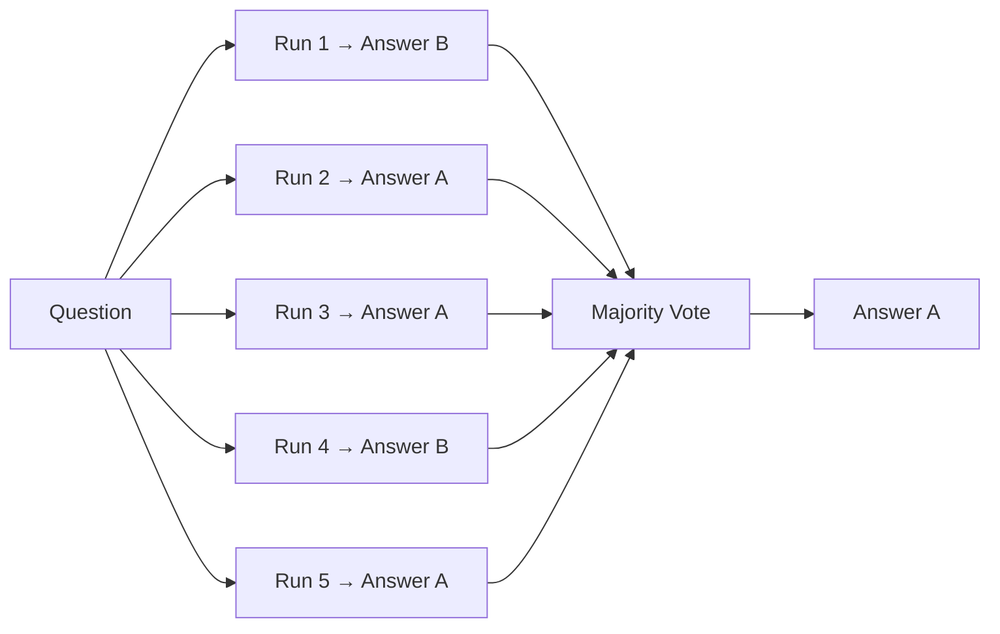

### Configuration Guidelines

| Parameter | Recommended | Notes |
|-----------|-------------|-------|
| Sample count (N) | 5–10 | Diminishing returns beyond 10 |
| Temperature | 0.5–0.8 | Too low → identical paths |
| Extraction | Structured delimiter | Parse `ANSWER:` reliably |

### Self-Consistency Tradeoffs

- **Pros:** Significant accuracy gains on reasoning benchmarks; simple to implement.
- **Cons:** N× cost and latency; useless if all paths share the same systematic error.

```python
from collections import Counter


def self_consistent_answer(answers: list[str]) -> str:
    counts = Counter(answers)
    best_answer, frequency = counts.most_common(1)[0]
    confidence = frequency / len(answers)
    return best_answer, confidence
```

> **Tip:** Return confidence (vote fraction) to downstream systems.
Low confidence triggers human review or a stronger model.

---

## Planning Prompts

**Planning prompts** force the model to produce an explicit plan before execution.
This separates strategic thinking from tactical action — critical for agents and multi-step workflows.

### Plan-and-Execute Pattern

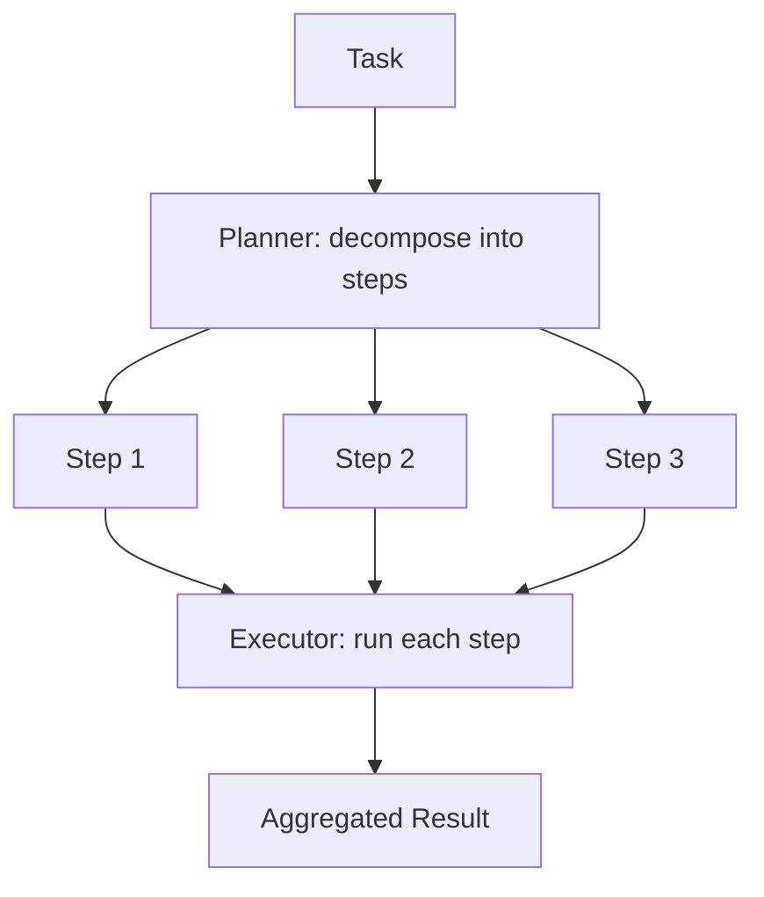

### Planning Prompt Template

```
You are a planning agent. Do NOT execute the task yet.

Task: {task}
Available tools: {tool_list}
Constraints: {constraints}

Output a JSON plan:
{
  "goal": "...",
  "steps": [
    {"id": 1, "description": "...", "tool": "...", "depends_on": []},
    {"id": 2, "description": "...", "tool": "...", "depends_on": [1]}
  ],
  "success_criteria": ["..."]
}
```

### Planning Variations

| Variant | Description |
|---------|-------------|
| **Static plan** | Full plan upfront, execute sequentially |
| **Dynamic replanning** | Revise plan after each step based on observations |
| **Hierarchical plan** | High-level plan → sub-plans per step |
| **Budgeted plan** | Plan must fit within token/cost/time limits |

> **Production Standard:** Validate plans programmatically before execution — check tool names exist, dependencies are acyclic, and step count is within limits.

---

## Reflection Loops

A **reflection loop** is an iterative cycle: generate → evaluate → refine → repeat until a stopping condition is met.

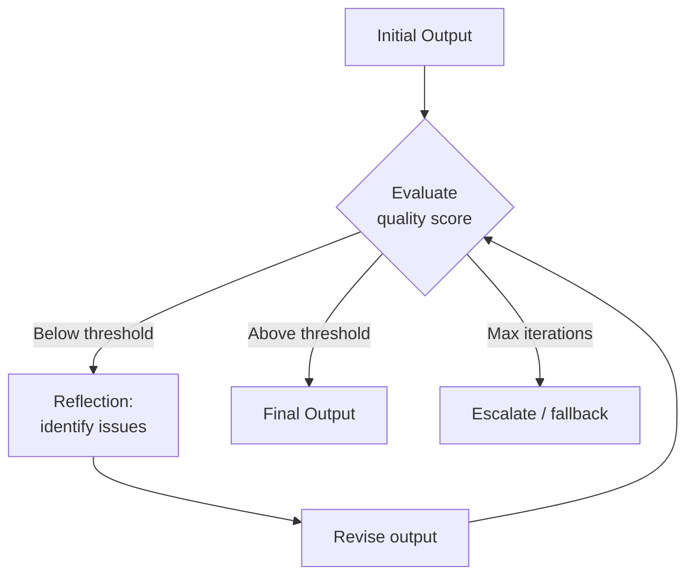

### Stopping Conditions

| Condition | When to Use |
|-----------|-------------|
| Quality score ≥ threshold | Automated eval available |
| No improvement between iterations | Prevent infinite loops |
| Max iterations reached | Hard cost cap |
| Critic approves | Separate verifier model |

### Reflexion Pattern

The **Reflexion** pattern (Shinn et al., 2023) stores reflections in memory across attempts:

```
Attempt 1: Failed — forgot to handle edge case X.
Reflection: "Always check for empty input before processing."
Attempt 2: Uses stored reflection → succeeds.
```

This is the bridge between prompt engineering and agent memory systems.

### Reflection Loop Template

```
Iteration {n} of {max}.

Previous output:
{previous_output}

Evaluator feedback:
{feedback}

Instructions:
1. Address every issue in the feedback.
2. Preserve what was correct in the previous output.
3. Produce the complete revised output (not a diff).
```

---

## Debate Prompting

**Debate prompting** uses multiple LLM personas that argue opposing positions before a judge synthesizes a final answer.
Diversity of perspective reduces single-model blind spots.

### Debate Architecture

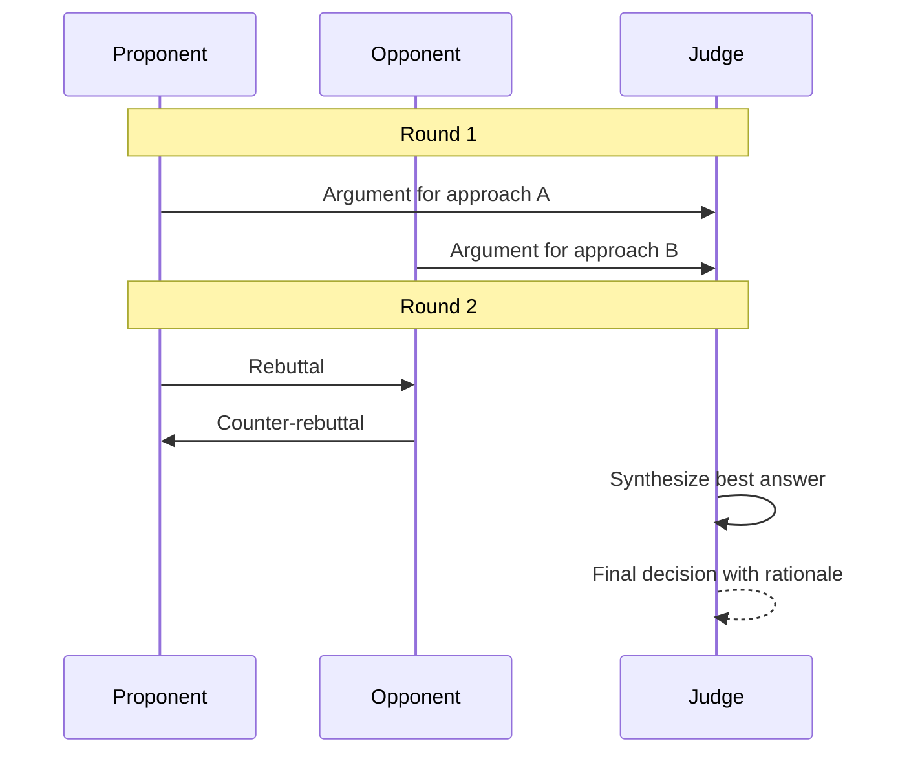

### Debate Prompt Roles

**Proponent:**
```
You advocate for the best solution to: {problem}.
Present evidence, reasoning, and address likely objections.
```

**Opponent:**
```
You challenge the proposed solution. Find flaws, edge cases,
and alternative approaches. Be rigorous but fair.
```

**Judge:**
```
Review both arguments. Identify the strongest points from each side.
Produce a final recommendation with clear rationale.
```

### When Debate Helps

- Architecture and design decisions
- Ethical or policy tradeoffs
- Code review with competing implementations
- Fact-checking and claim verification

### Debate Costs and Mitigations

| Challenge | Mitigation |
|-----------|------------|
| 3×+ model calls | Limit debate rounds (1–2) |
| Arguing past the point | Judge enforces word limits |
| False balance | Judge prompt weights evidence quality |

---

## Multi-Agent Prompting Overview

**Multi-agent prompting** assigns specialized roles to separate LLM instances that collaborate on a task.
This is the prompt-level foundation of multi-agent systems covered in later playbook phases.

### Common Agent Roles

| Role | Responsibility |
|------|---------------|
| **Planner** | Decompose task, assign subtasks |
| **Researcher** | Gather information via tools or retrieval |
| **Coder** | Write and modify code |
| **Reviewer** | Critique output quality |
| **Executor** | Run tools and return observations |
| **Synthesizer** | Merge sub-agent outputs |

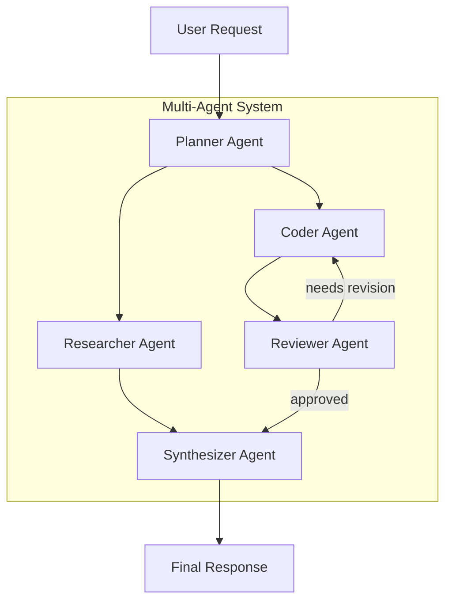

### Communication Patterns

| Pattern | Flow | Use Case |
|---------|------|----------|
| **Sequential** | A → B → C | Pipeline processing |
| **Parallel** | A → (B ∥ C) → D | Independent subtasks |
| **Hierarchical** | Manager → workers | Complex delegation |
| **Debate** | A ↔ B → Judge | Adversarial refinement |

### Multi-Agent System Prompt Structure

Each agent gets a focused system prompt:

```
Role: {agent_role}
Goal: {specific_objective}
You can communicate with: {other_agents}
You CANNOT: {restrictions}
Output format: {schema}
```

> **Production Standard:** Define explicit handoff contracts between agents — message schemas, not free-form prose.
See [Prompt Chaining](prompt-chaining.md) for orchestration patterns.

### Preparing for AI Agents Phase

The reasoning strategies in this document map directly to agent frameworks:

| Prompt Pattern | Agent Framework Concept |
|----------------|------------------------|
| ReAct | Tool-calling agent loop |
| Planning prompts | Plan-and-execute agents |
| Reflection loops | Reflexion / self-correcting agents |
| Multi-agent prompting | Crew / swarm architectures |
| Debate prompting | Adversarial verification |

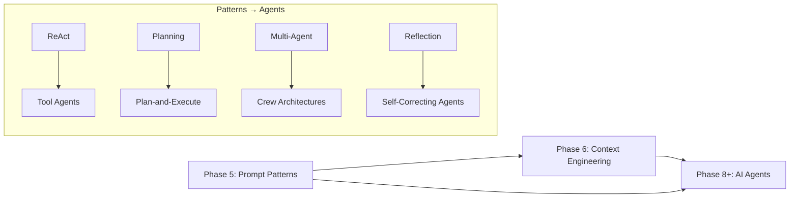

---

## Strategy Selection Guide

| Task Type | Recommended Strategy | Fallback |
|-----------|---------------------|----------|
| Math / logic | CoT + Self-Consistency | Calculator tool |
| Tool use | ReAct or function calling | Static pipeline |
| Creative exploration | Tree of Thoughts | Multiple samples |
| Interdependent subtasks | Graph of Thoughts | Modular chaining |
| Code generation | Reflection loop | Linting + test execution |
| High-stakes decisions | Debate + judge | Human review |
| Complex workflows | Planning + multi-agent | Sequential chaining |

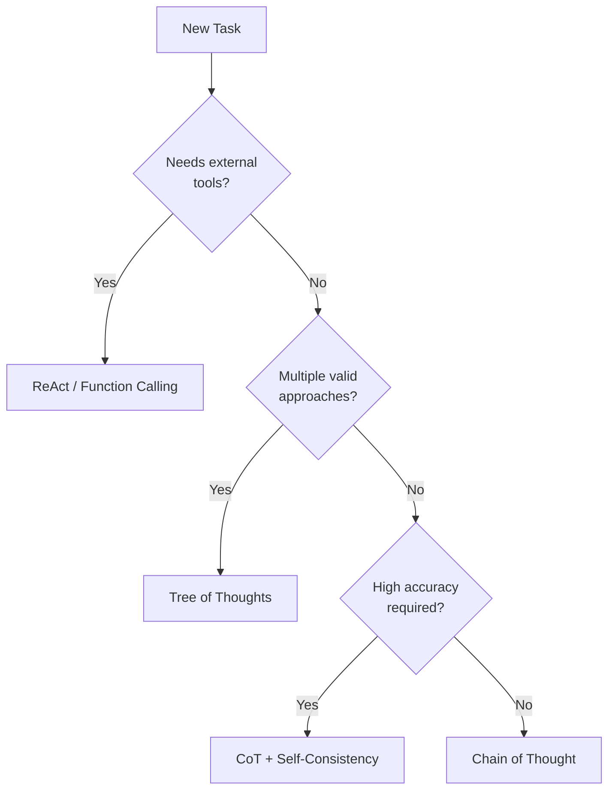

---

## Production Considerations

### Observability

Log every reasoning step with trace IDs:

```python
@dataclass
class ReasoningTrace:
    trace_id: str
    strategy: str  # "react", "cot", "reflection"
    steps: list[dict]
    total_tokens: int
    latency_ms: float
    final_answer: str
```

### Guardrails

| Risk | Mitigation |
|------|------------|
| Infinite ReAct loops | Max step count (typically 5–15) |
| Runaway ToT search | Branch limit + depth limit |
| Reasoning leakage | Strip Thought blocks from user-facing output |
| Tool hallucination | Orchestrator-only observation injection |
| Cost explosion | Per-request token budgets |

### Testing Reasoning Strategies

1. **Unit tests** — parse Thought/Action blocks, plan JSON schema validation.
2. **Golden sets** — expected reasoning paths for regression.
3. **Eval metrics** — accuracy, step efficiency, tool call correctness.
4. **Adversarial cases** — problems designed to trap shallow reasoning.

> **Production Standard:** Evaluate reasoning strategies on *your* data, not public benchmarks.
CoT gains vary dramatically by domain and model.

---

## Cost and Latency Tradeoffs

| Strategy | Relative Cost | Relative Latency | Accuracy Gain |
|----------|--------------|------------------|---------------|
| Basic prompt | 1× | 1× | Baseline |
| Chain of Thought | 1.5–2× | 1.5–2× | Moderate |
| Self-Consistency (N=5) | 5× | 5× (parallelizable) | High on reasoning |
| ReAct (5 steps) | 5–10× | 5–10× (sequential) | High on tool tasks |
| Tree of Thoughts | 10–50× | 10–50× | High on exploration |
| Debate (3 agents, 2 rounds) | 6–12× | 6–12× | Moderate–high |
| Reflection (3 iterations) | 3–4× | 3–4× | Moderate |

> **Tip:** Parallelize independent paths (self-consistency samples, ToT branches, debate agents) to reduce wall-clock latency at the cost of concurrent API usage.

---

## Python Examples

### ReAct Loop with Step Limit

```python
import asyncio
from dataclasses import dataclass, field


@dataclass
class ReActAgent:
    llm_client: object
    tools: dict
    max_steps: int = 10
    trace: list[dict] = field(default_factory=list)

    async def run(self, query: str) -> str:
        messages = [{"role": "user", "content": query}]

        for step in range(self.max_steps):
            response = await self.llm_client.complete(messages)
            parsed = parse_react_step(response.content)

            if parsed is None:
                return response.content

            self.trace.append({
                "step": step,
                "thought": parsed.thought,
                "action": parsed.action,
            })

            if parsed.action == "finish":
                return parsed.action_input

            tool_fn = self.tools.get(parsed.action)
            if tool_fn is None:
                observation = f"Error: unknown tool '{parsed.action}'"
            else:
                observation = await tool_fn(parsed.action_input)

            messages.append({"role": "assistant", "content": response.content})
            messages.append({
                "role": "user",
                "content": f"Observation: {observation}",
            })

        raise RuntimeError(f"ReAct exceeded max steps ({self.max_steps})")
```

### Self-Consistency with Parallel Execution

```python
import asyncio
from collections import Counter


async def self_consistent_solve(
    llm_client, prompt: str, n: int = 5, temperature: float = 0.7
) -> tuple[str, float]:
    tasks = [
        llm_client.complete(prompt, temperature=temperature)
        for _ in range(n)
    ]
    responses = await asyncio.gather(*tasks)

    answers = [extract_answer(r.content) for r in responses]
    counts = Counter(answers)
    best, freq = counts.most_common(1)[0]
    return best, freq / n
```

---

## Common Mistakes

| Mistake | Impact | Fix |
|---------|--------|-----|
| CoT on simple extraction | Wasted tokens, slower | Match strategy to task complexity |
| Model invents Observations | Hallucinated tool results | Orchestrator injects real observations |
| No step limit on ReAct | Runaway cost | Hard cap with fallback |
| Self-consistency at temperature 0 | Identical wrong answers | Use temperature 0.5–0.8 |
| Reflection without eval criteria | Circular self-approval | Define explicit quality rubric |
| ToT on every query | Prohibitive cost | Reserve for high-value tasks |
| Debate without a judge | Unresolved arguments | Always add synthesis step |

---

## Interview Preparation

### Frequently Asked Questions

**Q1: What is ReAct and how does it differ from chain-of-thought?**

> **Strong answer:** CoT produces a linear reasoning chain ending in an answer.
ReAct interleaves reasoning with tool actions and real observations from the environment.
CoT is for internal reasoning; ReAct is for agents that interact with external systems.

**Q2: When would you use self-consistency over a single CoT call?**

> **Strong answer:** When the task is high-stakes reasoning (math, logic, medical) and the cost of N samples is acceptable.
Run 5–10 CoT paths at moderate temperature, extract answers, majority vote.
Return confidence score for downstream routing.

**Q3: How do multi-agent prompting patterns relate to agent frameworks?**

> **Strong answer:** Multi-agent prompting defines roles, communication, and handoff contracts at the prompt level.
Agent frameworks (LangGraph, CrewAI, etc.) implement these patterns with state management, tool registries, and persistence.
The prompt patterns are the design; the framework is the infrastructure.

### Real-World Scenario

**Scenario:** A support bot hallucinates order statuses because the model generates fake API responses instead of calling the order API.

> **Discussion points:** Identify missing ReAct loop — model has no tool access.
Implement ReAct with orchestrator-injected Observations.
Add step limits, logging, and eval cases for tool-call correctness.

---

## Navigation

### Prerequisites

- [LLM Engineering](../llm-engineering/README.md) — Phase 4
- [Sampling and Decoding](../llm-engineering/sampling-and-decoding.md)
- [Function Calling and Tools](../llm-engineering/function-calling-and-tools.md)
- [Structured Outputs](../llm-engineering/structured-outputs.md)

### Related Topics

- [Prompt Chaining](prompt-chaining.md) — Section 10
- [Prompt Lifecycle](prompt-lifecycle.md) — Section 11
- [Prompt Versioning](prompt-versioning.md) — Section 12

### Next Topics

- [Prompt Chaining](prompt-chaining.md) — orchestrate multi-step reasoning
- [Agent Architectures](../agent-architectures/README.md) — Phase 8+
- [Multi-Agent Systems](../multi-agent-systems/README.md)
- [AI Workflows](../ai-workflows/README.md)

---

## See Also

- [Function Calling and Tools](../llm-engineering/function-calling-and-tools.md)
- [Structured Outputs](../llm-engineering/structured-outputs.md)
- [Software Engineering for AI](../foundations/software-engineering-for-ai.md)

## Changelog

| Version | Date | Changes |
|---------|------|---------|
| 1.0 | 2026-07-13 | Initial version — Section 9, Phase 5 |
