# Prompt Chaining

> How to decompose complex LLM tasks into reliable multi-step pipelines — sequential prompts, intermediate outputs, orchestration patterns, and reusable chains that scale from prototypes to production.

## Table of Contents

- [Overview](#overview)
- [Why Chain Prompts](#why-chain-prompts)
- [Sequential Prompting](#sequential-prompting)
- [Multi-Step Workflows](#multi-step-workflows)
- [Intermediate Outputs](#intermediate-outputs)
- [Pipeline Prompts](#pipeline-prompts)
- [Orchestration Patterns](#orchestration-patterns)
- [Modular Prompts](#modular-prompts)
- [Reusable Chains](#reusable-chains)
- [Architecture Diagrams](#architecture-diagrams)
- [Error Handling in Chains](#error-handling-in-chains)
- [Production Considerations](#production-considerations)
- [Python Examples](#python-examples)
- [Common Mistakes](#common-mistakes)
- [Interview Preparation](#interview-preparation)
- [Navigation](#navigation)

---

## Overview

A single monolithic prompt asking an LLM to research, analyze, draft, edit, and format a report will fail unpredictably as complexity grows.
**Prompt chaining** breaks work into discrete steps where each LLM call has a narrow, testable responsibility and passes structured output to the next step.

This document is **Section 10** of Phase 5 in the AI Engineering Playbook.
Chaining is the bridge between prompt design and workflow orchestration — the pattern underlying RAG pipelines, agent systems, and production AI backends.

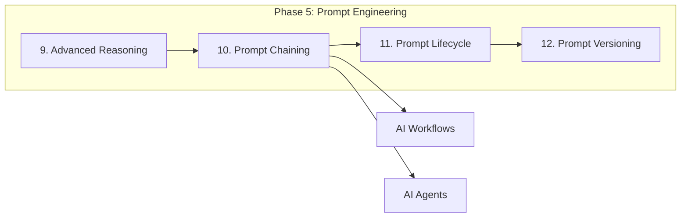

> **Prerequisites:** Sections 1–9 of Phase 5, especially [Advanced Reasoning Strategies](advanced-reasoning-strategies.md).

---

## Why Chain Prompts

| Monolithic Prompt Problem | Chaining Solution |
|--------------------------|-------------------|
| Instruction overload — model skips steps | One responsibility per step |
| Cannot test sub-steps independently | Unit-test each chain link |
| Hard to debug failures | Pinpoint failing step |
| Cannot reuse partial logic | Modular prompts compose |
| All-or-nothing retry | Retry individual steps |
| Token waste — huge context every call | Pass only what each step needs |

> **Production Standard:** If a prompt has more than three distinct tasks, decompose it into a chain.
If steps can run in parallel, use parallel orchestration instead of sequential chaining.

---

## Sequential Prompting

**Sequential prompting** passes the output of step N as input to step N+1 in a fixed order.
This is the simplest and most common chaining pattern.

### Basic Sequential Flow

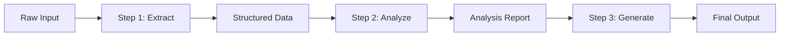

### Example: Document Processing Chain

| Step | Prompt Role | Input | Output |
|------|------------|-------|--------|
| 1 | Extractor | Raw PDF text | JSON entities |
| 2 | Classifier | JSON entities | Category + confidence |
| 3 | Summarizer | Entities + category | Executive summary |
| 4 | Formatter | Summary | Markdown report |

### Sequential Prompt Template

**Step 1 — Extract:**
```
Extract all named entities from the text below.
Return JSON matching this schema: {schema}

Text:
{raw_text}
```

**Step 2 — Analyze (receives Step 1 output):**
```
Given these extracted entities, identify the document category
and key themes.

Entities:
{step_1_output}

Return JSON: {"category": "...", "themes": [...], "confidence": 0.0-1.0}
```

**Step 3 — Summarize (receives Steps 1 + 2):**
```
Write a 3-sentence executive summary for a {category} document.

Entities: {step_1_output}
Themes: {step_2_output.themes}
```

### Sequential Chaining Rules

1. **Define output contracts** — each step produces parseable, schema-valid output.
2. **Minimize context** — pass only fields the next step needs, not the entire history.
3. **Name steps** — use identifiers (`extract`, `classify`, `summarize`) for logging and debugging.
4. **Make steps idempotent** — same input should produce equivalent output.

---

## Multi-Step Workflows

**Multi-step workflows** extend sequential chaining with branching, parallelism, conditional paths, and human-in-the-loop gates.

### Workflow Types

| Type | Structure | Example |
|------|-----------|---------|
| **Linear** | A → B → C | Extract → transform → load |
| **Conditional** | A → (B if X else C) | Classify → route to specialist |
| **Parallel** | A → (B ∥ C) → D | Translate to EN ∥ FR → merge |
| **Loop** | A → B → (repeat until done) | Draft → review → revise |
| **Fan-out/Fan-in** | A → [B1, B2, B3] → D | Map-reduce summarization |

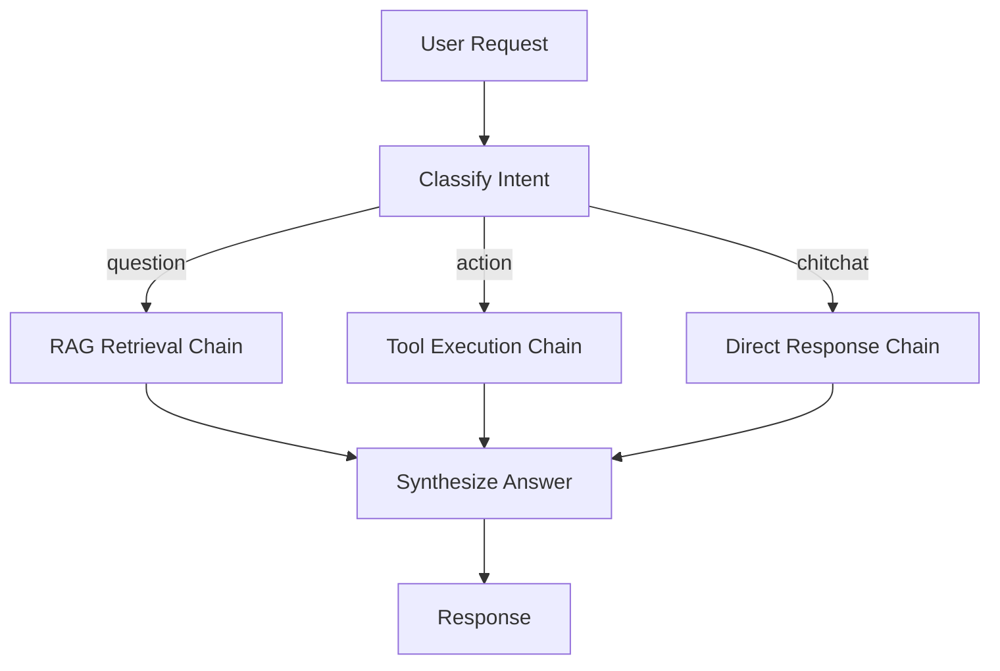

### Workflow State Machine

Production workflows maintain explicit state between steps:

```python
from dataclasses import dataclass, field
from enum import Enum


class StepStatus(Enum):
    PENDING = "pending"
    RUNNING = "running"
    COMPLETED = "completed"
    FAILED = "failed"
    SKIPPED = "skipped"


@dataclass
class WorkflowState:
    workflow_id: str
    current_step: str
    step_outputs: dict[str, object] = field(default_factory=dict)
    step_statuses: dict[str, StepStatus] = field(default_factory=dict)
    errors: list[dict] = field(default_factory=list)
```

### Human-in-the-Loop Gates

Insert approval steps where automated quality is insufficient:

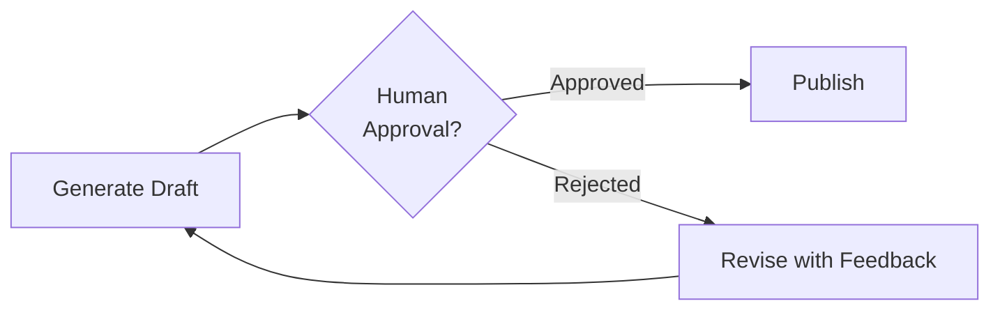

> **Tip:** Store human feedback as structured input to the revise step, not just "try again."

---

## Intermediate Outputs

**Intermediate outputs** are the structured artifacts passed between chain steps.
They are the API contract of your prompt pipeline.

### Design Principles

| Principle | Rationale |
|-----------|-----------|
| **Structured over prose** | JSON/YAML parses reliably; prose does not |
| **Schema-validated** | Catch malformed outputs before they propagate |
| **Minimal** | Reduce tokens and error surface |
| **Versioned** | Schema changes don't break downstream steps |
| **Inspectable** | Log and store for debugging |

### Intermediate Output Schema Example

```json
{
  "chain_version": "1.0",
  "step": "extract",
  "timestamp": "2026-07-13T10:30:00Z",
  "data": {
    "entities": [
      {"type": "person", "value": "Jane Doe", "confidence": 0.95}
    ],
    "metadata": {
      "source_length": 4520,
      "language": "en"
    }
  },
  "quality": {
    "parse_success": true,
    "validation_errors": []
  }
}
```

### Passing Context vs Passing Outputs

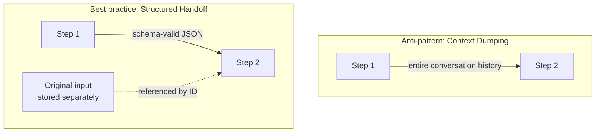

| Approach | Tokens | Debuggability | Reliability |
|----------|--------|---------------|-------------|
| Pass full history | High | Poor | Low |
| Pass structured output | Low | Excellent | High |
| Pass output + reference ID | Lowest | Excellent | High |

### Validation at Chain Boundaries

```python
from pydantic import BaseModel, ValidationError


class ExtractionOutput(BaseModel):
    entities: list[dict]
    language: str
    confidence: float


def validate_step_output(raw: str, schema: type[BaseModel]) -> BaseModel:
    try:
        return schema.model_validate_json(raw)
    except ValidationError as e:
        raise ChainValidationError(
            step="extract",
            errors=e.errors(),
            raw_output=raw,
        )
```

> **Production Standard:** Validate every intermediate output at chain boundaries.
A malformed JSON blob in step 2 should fail fast, not produce garbage in step 5.

---

## Pipeline Prompts

A **pipeline prompt** is a pre-designed sequence of prompts with defined inputs, outputs, and error handling — treated as a single deployable unit.

### Pipeline Anatomy

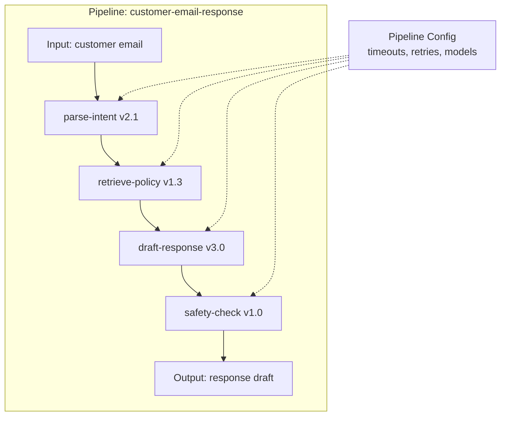

### Pipeline Configuration

```yaml
# pipelines/customer-email-response.yaml
name: customer-email-response
version: "2.0"
steps:
  - id: parse-intent
    prompt: prompts/parse-intent-v2.1.md
    model: gpt-4o-mini
    timeout_seconds: 10
    output_schema: schemas/intent.json

  - id: retrieve-policy
    prompt: prompts/retrieve-policy-v1.3.md
    model: gpt-4o-mini
    depends_on: [parse-intent]
    timeout_seconds: 15

  - id: draft-response
    prompt: prompts/draft-response-v3.0.md
    model: gpt-4o
    depends_on: [parse-intent, retrieve-policy]
    timeout_seconds: 30
    output_schema: schemas/response-draft.json

  - id: safety-check
    prompt: prompts/safety-check-v1.0.md
    model: gpt-4o-mini
    depends_on: [draft-response]
    on_failure: block
```

### Pipeline Design Patterns

| Pattern | Description | Use Case |
|---------|-------------|----------|
| **Map-reduce** | Split input → process chunks → merge | Long document summarization |
| **Router** | Classify → dispatch to specialist chain | Multi-intent systems |
| **Ensemble** | Parallel chains → vote/merge | High-accuracy extraction |
| **Cascade** | Cheap model first → expensive if uncertain | Cost optimization |
| **Guardrail** | Main chain → safety/quality check | Production compliance |

### Map-Reduce Chain

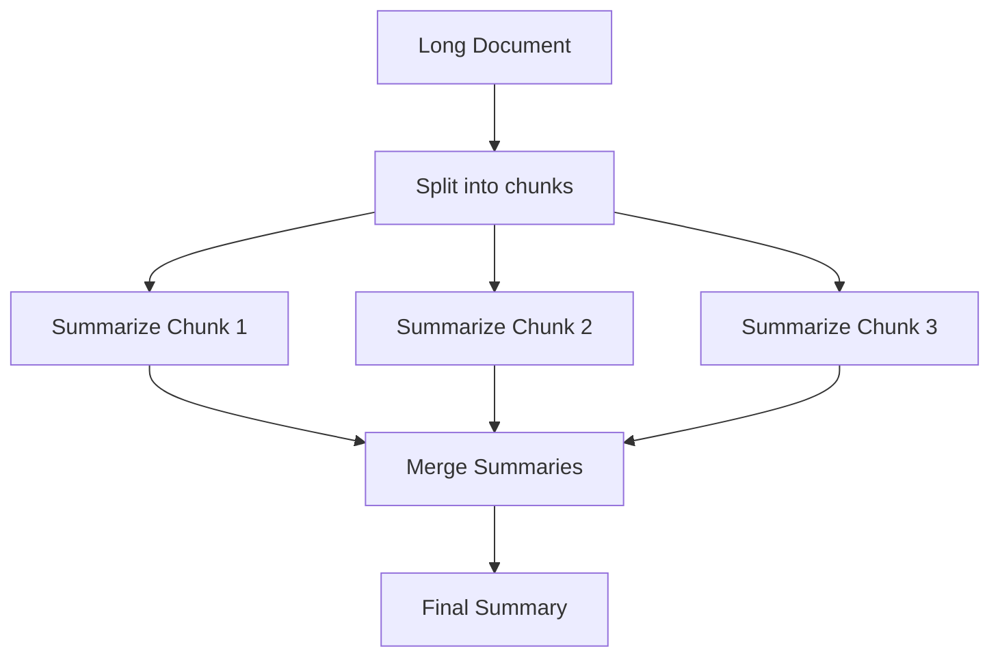

---

## Orchestration Patterns

**Orchestration** is the runtime layer that executes prompt chains — scheduling steps, managing state, handling failures, and coordinating parallel work.

### Orchestration Approaches

| Approach | Complexity | Best For |
|----------|-----------|----------|
| **Inline code** | Low | Prototypes, < 5 steps |
| **DAG executor** | Medium | Production pipelines |
| **Workflow engine** | High | Long-running, resumable workflows |
| **Agent framework** | High | Dynamic routing, tool use |

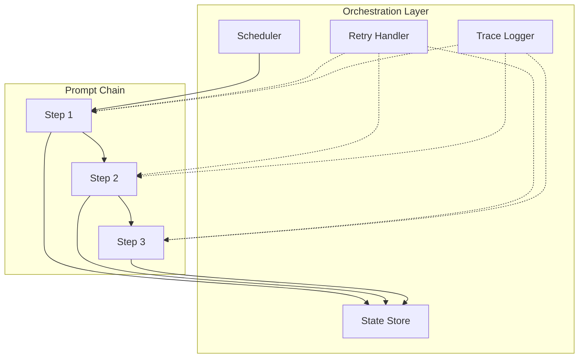

### DAG-Based Orchestration

Define steps as a directed acyclic graph:

```python
from dataclasses import dataclass


@dataclass
class ChainStep:
    id: str
    prompt_template: str
    depends_on: list[str]
    model: str = "gpt-4o"
    retry_count: int = 2


CHAIN_DAG = [
    ChainStep(id="extract", prompt_template="extract.md", depends_on=[]),
    ChainStep(id="classify", prompt_template="classify.md", depends_on=["extract"]),
    ChainStep(
        id="summarize",
        prompt_template="summarize.md",
        depends_on=["extract", "classify"],
    ),
]


def execution_order(steps: list[ChainStep]) -> list[str]:
    """Topological sort for dependency-respecting execution."""
    resolved: list[str] = []
    pending = {s.id: s for s in steps}

    while pending:
        ready = [
            sid for sid, step in pending.items()
            if all(dep in resolved for dep in step.depends_on)
        ]
        if not ready:
            raise ValueError("Circular dependency detected")
        for sid in ready:
            resolved.append(sid)
            del pending[sid]

    return resolved
```

### Sync vs Async Execution

| Mode | When | Tradeoff |
|------|------|----------|
| **Synchronous** | Short chains, low latency | Simple; blocks caller |
| **Async/await** | I/O-bound LLM calls | Better concurrency |
| **Background job** | Long chains (> 30s) | Requires polling/webhooks |
| **Event-driven** | Step completion triggers next | Scalable; more infrastructure |

> **Production Standard:** Chains exceeding 30 seconds total latency should run as background jobs with status endpoints.
See [Background Processing for AI](../backend-engineering/background-processing-for-ai.md).

---

## Modular Prompts

**Modular prompts** are self-contained, reusable prompt units that compose into chains.
Each module has a single responsibility, explicit interface, and independent version.

### Module Structure

```
prompts/
├── modules/
│   ├── extract-entities/
│   │   ├── v1.0.md          # Prompt template
│   │   ├── schema.json      # Output schema
│   │   └── README.md        # Usage docs
│   ├── classify-intent/
│   │   ├── v2.1.md
│   │   └── schema.json
│   └── summarize/
│       ├── v1.3.md
│       └── schema.json
└── chains/
    ├── document-pipeline.yaml
    └── email-response.yaml
```

### Module Interface Contract

Every prompt module defines:

| Field | Description |
|-------|-------------|
| `name` | Unique identifier |
| `version` | Semantic version |
| `inputs` | Required and optional input variables |
| `outputs` | Schema for structured output |
| `model_requirements` | Minimum model capabilities |
| `token_budget` | Expected input + output tokens |

### Composing Modules

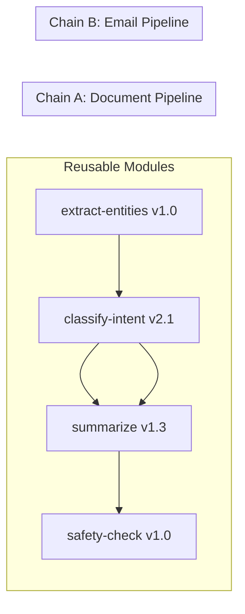

### Module Prompt Template

```markdown
---
module: extract-entities
version: "1.0"
inputs: [text]
outputs: entities.schema.json
model: gpt-4o-mini
---

# Extract Entities

Extract all named entities from the provided text.

## Input
- `text` (string, required): Raw text to process

## Output
Return JSON matching `entities.schema.json`.

## Rules
- Include confidence scores (0.0–1.0)
- Normalize dates to ISO 8601
- Return empty array if no entities found

## Text
{text}
```

> **Tip:** Treat prompt modules like functions — named, versioned, with typed inputs and outputs.

---

## Reusable Chains

A **reusable chain** packages a complete workflow — modules, orchestration config, error handling, and tests — for deployment across multiple features.

### Chain Registry

| Chain | Steps | Used By |
|-------|-------|---------|
| `document-pipeline` | extract → classify → summarize | Knowledge base, reports |
| `email-response` | classify → retrieve → draft → safety | Support bot |
| `code-review` | parse → analyze → suggest → format | CI integration |
| `rag-answer` | retrieve → rerank → generate → verify | Q&A system |

### Chain as Code

```python
from dataclasses import dataclass
from typing import Callable, Awaitable


@dataclass
class ChainContext:
    workflow_id: str
    inputs: dict
    outputs: dict
    metadata: dict


StepFn = Callable[[ChainContext], Awaitable[ChainContext]]


class PromptChain:
    def __init__(self, name: str, steps: list[tuple[str, StepFn]]):
        self.name = name
        self.steps = steps

    async def run(self, inputs: dict) -> ChainContext:
        ctx = ChainContext(
            workflow_id=generate_id(),
            inputs=inputs,
            outputs={},
            metadata={"chain": self.name},
        )
        for step_name, step_fn in self.steps:
            ctx.metadata["current_step"] = step_name
            ctx = await step_fn(ctx)
        return ctx
```

### Building Reusable Chains

1. **Extract** common steps into modules.
2. **Parameterize** chain config (model, temperature, timeouts).
3. **Test** the full chain and each module independently.
4. **Register** in a chain catalog with documentation.
5. **Version** the chain as a unit when step composition changes.

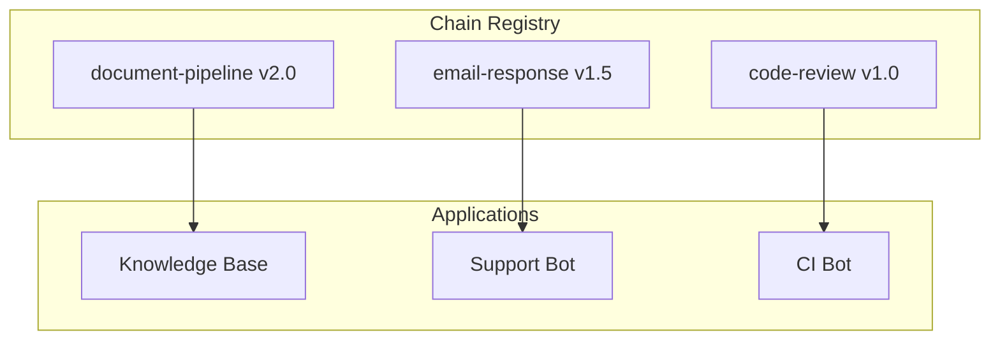

---

## Architecture Diagrams

### End-to-End Chaining Architecture

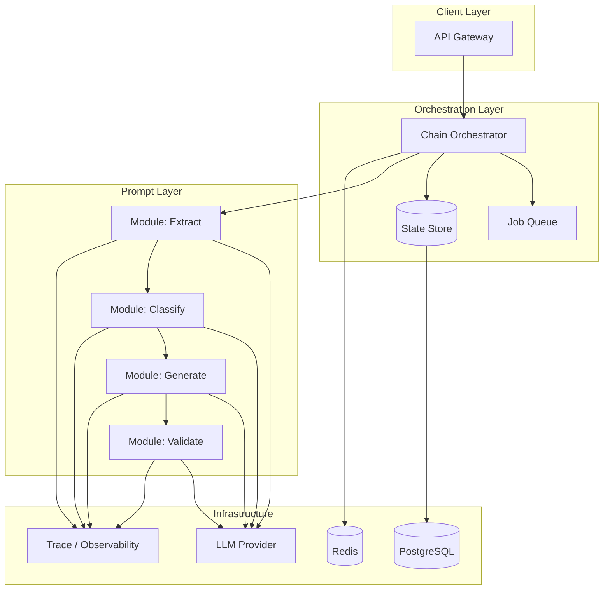

### RAG Pipeline as a Prompt Chain


### Parallel + Sequential Hybrid

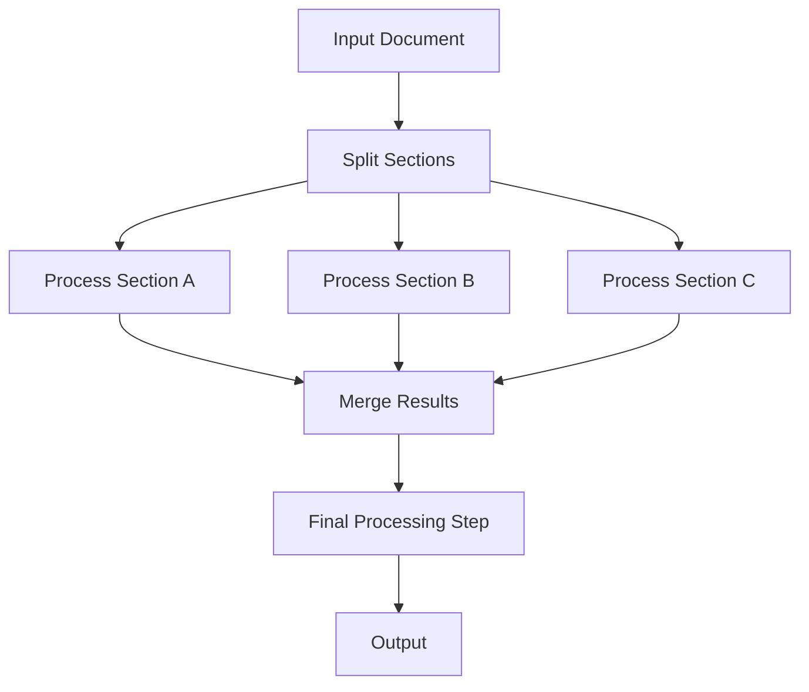

---

## Error Handling in Chains

### Failure Modes

| Failure | Step Behavior | Chain Behavior |
|---------|--------------|----------------|
| LLM timeout | Retry with backoff | Pause or skip step |
| Invalid JSON output | Retry with repair prompt | Fail or fallback |
| Schema validation error | Retry with error feedback | Fail with diagnostics |
| Rate limit | Exponential backoff | Queue and resume |
| Step logic error | Log and escalate | Abort chain |

### Retry with Repair

```python
REPAIR_PROMPT = """
Your previous output failed validation:
{validation_errors}

Original instruction:
{original_prompt}

Your invalid output:
{invalid_output}

Fix the output to match the required schema. Return ONLY valid JSON.
"""


async def execute_with_retry(
    step_fn, context, max_retries: int = 3
) -> object:
    for attempt in range(max_retries):
        try:
            output = await step_fn(context)
            validate_step_output(output, expected_schema)
            return output
        except (ValidationError, ChainValidationError) as e:
            if attempt == max_retries - 1:
                raise
            context = append_repair_context(context, e)
```

### Circuit Breaker Pattern

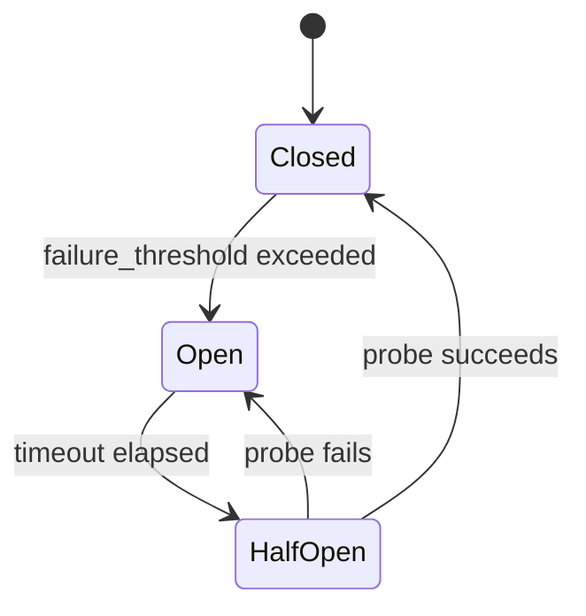

> **Warning:** Retrying a failing step indefinitely burns tokens and money.
Set per-step and per-chain retry limits with circuit breakers.

---

## Production Considerations

### Observability

Trace every chain execution:

| Field | Purpose |
|-------|---------|
| `chain_id` + `version` | Identify which pipeline ran |
| `step_id` + `duration_ms` | Per-step latency |
| `input_tokens` + `output_tokens` | Cost attribution |
| `model` per step | Model usage tracking |
| `intermediate_outputs` | Debug failures |
| `status` | Success / partial / failed |

### Caching

| Cache Level | Key | Invalidation |
|-------------|-----|-------------|
| Step output | hash(step_id, input) | Prompt version change |
| Full chain | hash(chain_id, input) | Any step version change |
| Intermediate | hash(module, input) | Module version change |

### Cost Optimization

1. **Cascade** — cheap model first, expensive only if needed.
2. **Parallelize** — independent steps concurrently.
3. **Cache** — identical inputs skip LLM calls.
4. **Truncate** — pass minimal context between steps.
5. **Right-size models** — extraction on mini, generation on flagship.

### Security

- Sanitize inputs before each step.
- Do not pass secrets through chain context.
- Validate outputs before feeding to downstream systems.
- Log prompts without PII in production.

> **Production Standard:** Store intermediate outputs encrypted at rest if they contain user data.
Set TTL on cached chain results.

---

## Python Examples

### Complete Chain Executor

```python
import asyncio
import json
from dataclasses import dataclass, field


@dataclass
class StepResult:
    step_id: str
    output: dict
    tokens_used: int
    latency_ms: float


@dataclass
class ChainExecutor:
    llm_client: object
    steps: list[dict]
    state: dict = field(default_factory=dict)

    async def execute(self, inputs: dict) -> dict:
        self.state["inputs"] = inputs
        results: list[StepResult] = []

        for step in self.steps:
            prompt = self._render_prompt(step, self.state)
            start = time.monotonic()

            response = await self.llm_client.complete(
                prompt,
                model=step["model"],
            )

            latency = (time.monotonic() - start) * 1000
            output = json.loads(response.content)

            self.state[step["id"]] = output
            results.append(StepResult(
                step_id=step["id"],
                output=output,
                tokens_used=response.total_tokens,
                latency_ms=latency,
            ))

        return {
            "final_output": self.state[self.steps[-1]["id"]],
            "steps": results,
        }

    def _render_prompt(self, step: dict, state: dict) -> str:
        template = load_prompt(step["prompt"])
        return template.format(**state)
```

### Parallel Step Execution

```python
async def run_parallel_steps(
    steps: list[tuple[str, StepFn]],
    context: ChainContext,
) -> ChainContext:
    tasks = [step_fn(context) for _, step_fn in steps]
    results = await asyncio.gather(*tasks, return_exceptions=True)

    for (name, _), result in zip(steps, results):
        if isinstance(result, Exception):
            raise ChainStepError(step=name, cause=result)
        context.outputs[name] = result

    return context
```

---

## Common Mistakes

| Mistake | Impact | Fix |
|---------|--------|-----|
| Monolithic mega-prompt | Unreliable, untestable | Decompose into chain |
| Unstructured handoffs | Parse failures cascade | Schema-validate at boundaries |
| Passing full history | Token bloat, confusion | Pass structured outputs only |
| No per-step logging | Impossible to debug | Trace every step |
| Same model for all steps | Wasted cost | Right-size model per step |
| No retry limits | Runaway costs | Circuit breakers + max retries |
| Hardcoded chain in routes | Untestable | Chain executor in service layer |
| Ignoring partial failures | Silent quality degradation | Explicit failure policies per step |

---

## Interview Preparation

### Frequently Asked Questions

**Q1: When should you chain prompts vs use a single prompt?**

> **Strong answer:** Chain when the task has 3+ distinct sub-tasks, when you need to test steps independently, when different steps need different models, or when intermediate results must be stored/audited.
Use a single prompt for simple, atomic tasks.

**Q2: How do you handle a step that returns invalid JSON?**

> **Strong answer:** Validate at the boundary with Pydantic or JSON Schema.
On failure, retry with a repair prompt that includes the validation errors and the invalid output.
After max retries, fail the chain with diagnostics — never pass malformed data downstream.

**Q3: Explain the difference between prompt chaining and agent loops.**

> **Strong answer:** Chains have a predefined, static step sequence (or DAG).
Agent loops dynamically decide the next step based on reasoning (ReAct).
Chains are predictable and testable; agents are flexible but harder to control.
Production systems often combine both — chain for structure, agent for dynamic steps.

### Real-World Scenario

**Scenario:** A document summarization feature works on short docs but fails on 50-page PDFs.

> **Discussion points:** Monolithic prompt exceeds context window.
Implement map-reduce chain: split → summarize chunks (parallel) → merge summaries → final pass.
Add intermediate output validation and per-chunk error handling.

---

## Navigation

### Prerequisites

- [Advanced Reasoning Strategies](advanced-reasoning-strategies.md) — Section 9
- [Structured Outputs](../llm-engineering/structured-outputs.md)
- [Software Engineering for AI](../foundations/software-engineering-for-ai.md)

### Related Topics

- [Prompt Lifecycle](prompt-lifecycle.md) — Section 11
- [Prompt Versioning](prompt-versioning.md) — Section 12
- [AI Workflows](../ai-workflows/README.md)
- [Background Processing for AI](../backend-engineering/background-processing-for-ai.md)

### Next Topics

- [Prompt Lifecycle](prompt-lifecycle.md) — operationalize chains
- [Prompt Versioning](prompt-versioning.md) — version chain modules
- [Agent Architectures](../agent-architectures/README.md)

---

## See Also

- [Advanced Reasoning Strategies](advanced-reasoning-strategies.md)
- [Structured Outputs](../llm-engineering/structured-outputs.md)
- [Background Processing for AI](../backend-engineering/background-processing-for-ai.md)

## Changelog

| Version | Date | Changes |
|---------|------|---------|
| 1.0 | 2026-07-13 | Initial version — Section 10, Phase 5 |
