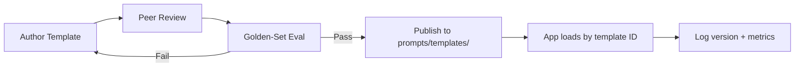

# Prompt Templates Guide

> Section 6 of Phase 5 — stop rewriting prompts from scratch. This guide defines a generic template structure and catalogs reusable templates for the most common AI engineering tasks. Production prompts belong in versioned files, not scattered across your codebase.

## Table of Contents

- [Why Templates Matter](#why-templates-matter)
- [Generic Template Structure](#generic-template-structure)
- [Template Library](#template-library)
- [QA Templates](#qa-templates)
- [Summarization Templates](#summarization-templates)
- [Classification Templates](#classification-templates)
- [Extraction Templates](#extraction-templates)
- [Translation Templates](#translation-templates)
- [Code Generation Templates](#code-generation-templates)
- [Code Review Templates](#code-review-templates)
- [Documentation Templates](#documentation-templates)
- [Brainstorming Templates](#brainstorming-templates)
- [Email Templates](#email-templates)
- [SQL Templates](#sql-templates)
- [JSON Output Templates](#json-output-templates)
- [Markdown Output Templates](#markdown-output-templates)
- [Agent Templates](#agent-templates)
- [Planning Templates](#planning-templates)
- [Evaluation Templates](#evaluation-templates)
- [Template Management](#template-management)
- [Production Considerations](#production-considerations)
- [Common Mistakes](#common-mistakes)
- [Interview Preparation](#interview-preparation)
- [Navigation](#navigation)

---

## Why Templates Matter

| Without Templates | With Templates |
|-------------------|----------------|
| Prompts copied from Slack threads | Versioned, reviewed assets |
| Inconsistent output formats | Standardized schemas per task |
| No eval baseline | Golden-set tests per template |
| Model swap breaks everything | Templates parameterized by model config |

> **Production Standard:** Every recurring LLM task gets a template in [`prompts/templates/`](../../prompts/templates/README.md). Application code loads templates by ID and injects variables — it never embeds prompt text.

---

## Generic Template Structure

Every template in this playbook follows the same skeleton. Copy this structure when adding a new template to the library.

### Anatomy

```yaml
# Template metadata (store as YAML front matter or JSON sidecar)
id: summarization-executive-v1
version: "1.0.0"
task: summarization
models:
  recommended: [gpt-4o-mini, claude-sonnet-4]
  min_capability: intermediate
token_budget:
  system: 200
  user_per_1k_input: 50
variables:
  required: [document, audience]
  optional: [max_words, focus_areas]
output:
  format: markdown
  schema: null
evaluation:
  metrics: [faithfulness, conciseness]
  golden_set: evals/summarization/
```

### System Prompt Block

```
[ROLE]
You are a {role} specializing in {domain}.

[CONSTRAINTS]
- {constraint_1}
- {constraint_2}

[OUTPUT FORMAT]
{format_specification}
```

### User Prompt Block

```
[CONTEXT — delimited]
<{delimiter}>
{variable_document}
</{delimiter}>

[TASK]
{task_instruction}

[PARAMETERS]
Audience: {audience}
Max words: {max_words}
```

### Complete Template File Layout

```markdown
---
id: template-id
version: "1.0.0"
task: classification
status: published
---

# Template Name

## Metadata
| Field | Value |
|-------|-------|
| Use case | ... |
| Token budget | ~X |

## System Prompt
\`\`\`
{system_template}
\`\`\`

## User Prompt
\`\`\`
{user_template}
\`\`\`

## Variables
| Name | Required | Description |
|------|----------|-------------|

## Example
### Input
### Output

## Evaluation
```

### Variable Injection Pattern

```python
from pathlib import Path
from string import Template

PROMPT_DIR = Path("prompts/templates")


def load_template(name: str) -> tuple[str, str]:
    """Load system and user templates from the library."""
    system = (PROMPT_DIR / f"{name}.system.txt").read_text()
    user = (PROMPT_DIR / f"{name}.user.txt").read_text()
    return system, user


def render_prompt(name: str, variables: dict[str, str]) -> list[dict]:
    system_tmpl, user_tmpl = load_template(name)
    return [
        {"role": "system", "content": Template(system_tmpl).safe_substitute(variables)},
        {"role": "user", "content": Template(user_tmpl).safe_substitute(variables)},
    ]
```

> Use `safe_substitute` to avoid KeyError on missing optional variables. Validate required variables before rendering.

---

## Template Library

All templates live in [`prompts/templates/`](../../prompts/templates/README.md). This guide documents their purpose and structure; the folder holds the copy-paste-ready files.

| Template | File | Primary Output |
|----------|------|----------------|
| QA | `qa.md` | Answer with citations |
| Summarization | `summarization.md` | Condensed text |
| Classification | `classification.md` | Label + confidence |
| Extraction | `extraction.md` | Structured fields |
| Translation | `translation.md` | Translated text |
| Code generation | `code-generation.md` | Source code |
| Code review | `code-review.md` | Findings list |
| Documentation | `documentation.md` | Docstrings / README |
| Brainstorming | `brainstorming.md` | Idea list |
| Email | `email.md` | Email draft |
| SQL | `sql.md` | SQL query |
| JSON output | `json-output.md` | Validated JSON |
| Markdown output | `markdown-output.md` | Formatted markdown |
| Agent | `agent.md` | Tool-aware reasoning |
| Planning | `planning.md` | Step plan |
| Evaluation | `evaluation.md` | Scores + rationale |

---

## QA Templates

**Purpose:** Answer questions using provided context (RAG) or general knowledge, with citation and refusal behavior.

### When to Use

- Customer support bots with knowledge bases
- Internal "ask your docs" features
- Compliance Q&A over policy documents

### Template Skeleton

```
System:
You are a precise Q&A assistant. Answer using ONLY the provided context.
If the context does not contain the answer, respond: "I don't have enough
information to answer that."
Cite sources as [source_id] after each claim.

User:
<context>
{retrieved_chunks}
</context>

Question: {question}
```

### Key Variables

| Variable | Description |
|----------|-------------|
| `retrieved_chunks` | RAG context with source IDs |
| `question` | User question |
| `refusal_message` | Custom "I don't know" text |

### Production Notes

- Always include source IDs in context chunks for citation.
- Eval faithfulness separately from fluency.
- Set `temperature=0` for factual QA.

---

## Summarization Templates

**Purpose:** Condense long documents while preserving key facts, tone, or structure.

### Variants

| Variant | Output | Use Case |
|---------|--------|----------|
| Executive | 3–5 bullets | Leadership briefings |
| Technical | Structured sections | Engineering docs |
| Extractive | Quoted key sentences | Legal/compliance |
| Abstractive | Paraphrased summary | General content |

### Template Skeleton

```
System:
Summarize the document for {audience}. Max {max_words} words.
Preserve all numbers, dates, and proper nouns exactly.
Do not add information not present in the document.

User:
<document>
{document}
</document>

Focus areas: {focus_areas}
```

### Production Notes

- Specify what to preserve (numbers, names, action items).
- For long documents, use map-reduce summarization, not one-shot.
- Eval with ROUGE for overlap; human eval for faithfulness.

---

## Classification Templates

**Purpose:** Assign labels from a predefined set with optional confidence and rationale.

### Template Skeleton

```
System:
Classify the input into exactly one category:
{categories}

Return JSON: {"label": "...", "confidence": 0.0-1.0, "rationale": "..."}

User:
<input>
{text}
</input>
```

### Key Design Choices

- **Closed set** — provide explicit category list and definitions.
- **Multi-label** — change schema to `"labels": [...]`.
- **Hierarchical** — classify at each level in separate calls or one nested JSON.

### Production Notes

- Include 2–3 few-shot examples per category for ambiguous taxonomies.
- Monitor class distribution drift in production logs.
- Use schema-constrained generation for reliable JSON.

---

## Extraction Templates

**Purpose:** Pull structured fields from unstructured text — invoices, contracts, resumes, logs.

### Template Skeleton

```
System:
Extract the following fields from the input. Use null for missing fields.
Do not infer values not explicitly stated.

Schema:
{json_schema}

User:
<text>
{source_text}
</text>
```

### Production Notes

- Define nullable fields explicitly.
- Validate with Pydantic after generation.
- For high-stakes extraction, add a verification step ("quote the source span for each field").

---

## Translation Templates

**Purpose:** Convert text between languages while preserving meaning, tone, and formatting.

### Template Skeleton

```
System:
Translate from {source_lang} to {target_lang}.
Preserve: markdown formatting, code blocks, proper nouns, placeholders like {var}.
Tone: {formality_level}

User:
{text}
```

### Production Notes

- Keep code blocks untranslated unless requested.
- For UI strings, preserve interpolation tokens exactly (`{username}`).
- Eval with BLEU/chrF plus native-speaker review for high-visibility content.

---

## Code Generation Templates

**Purpose:** Generate source code from specifications, schemas, or natural language requirements.

### Template Skeleton

```
System:
You are a {language} developer. Generate production-quality code.
Requirements:
- Include type hints
- Handle edge cases: {edge_cases}
- No external dependencies unless specified
- Return only code in a single markdown code block

User:
Task: {task_description}

Context:
{existing_code_or_schema}

API signature (if any):
{signature}
```

### Production Notes

- Specify language version (Python 3.12, TypeScript 5.x).
- Run generated code through linters and tests in CI.
- Never execute model-generated code without sandboxing.

---

## Code Review Templates

**Purpose:** Analyze code for bugs, security issues, performance problems, and style violations.

### Template Skeleton

```
System:
Review the code as a {seniority} {language} engineer.
Categories: security, correctness, performance, maintainability.
Return JSON array: [{severity, category, line, issue, suggestion}]

User:
<diff>
{code_or_diff}
</diff>

Focus: {review_focus}
```

### Production Notes

- Prefer diff-based review over full-file for large repos.
- Severity enum: `critical | high | medium | low | info`.
- Tune false-positive rate with few-shot examples of acceptable patterns.

---

## Documentation Templates

**Purpose:** Generate docstrings, README sections, API docs, or inline comments from code.

### Template Skeleton

```
System:
Write {doc_type} for the provided code.
Audience: {audience}
Style: Google docstring format / NumPy / JSDoc (as specified)
Include: parameters, returns, raises, examples

User:
<code>
{source_code}
</code>
```

### Production Notes

- Generate docs in CI and diff against committed docs — don't auto-commit without review.
- Validate generated examples actually run.

---

## Brainstorming Templates

**Purpose:** Generate diverse ideas, alternatives, or creative options without premature filtering.

### Template Skeleton

```
System:
Generate {count} distinct ideas for: {problem}.
Constraints: {constraints}
For each idea provide: title, one-line description, pros, cons.
Do not repeat ideas. Prioritize novelty over safety.

User:
Context: {background}
Target audience: {audience}
```

### Production Notes

- Use higher temperature (0.7–0.9) for diversity.
- Follow with a separate ranking/classification template to narrow results.
- Not for safety-critical decisions without human review.

---

## Email Templates

**Purpose:** Draft professional emails from bullet points, context, or intent.

### Template Skeleton

```
System:
Draft a {formality} email.
Tone: {tone}
Length: {length}
Include: subject line, greeting, body, sign-off.
Do not invent facts not in the provided notes.

User:
Recipient: {recipient}
Purpose: {purpose}
Key points:
{bullet_points}
```

### Production Notes

- Human review before send — always.
- Strip PII from logs; email drafts contain sensitive content.

---

## SQL Templates

**Purpose:** Generate SQL queries from natural language, schema descriptions, or analytics questions.

### Template Skeleton

```
System:
Generate {dialect} SQL for the question below.
Use only tables and columns defined in the schema.
Return only the SQL query — no explanation unless asked.
Prefer readable CTEs over nested subqueries.

User:
<schema>
{table_definitions}
</schema>

Question: {question}
```

### Production Notes

- Never execute generated SQL without validation and read-only roles.
- Provide sample rows for ambiguous column semantics.
- Log and review queries in staging before production analytics tools.

---

## JSON Output Templates

**Purpose:** Force structured JSON responses for downstream parsing. Pairs with [Structured Outputs](../llm-engineering/structured-outputs.md).

### Template Skeleton

```
System:
Return ONLY valid JSON matching this schema:
{json_schema}

Rules:
- No markdown fences
- No trailing commentary
- Use null for unknown values

User:
{task_instruction}

Input:
{input_data}
```

### Production Notes

- Prefer API-level schema enforcement over prompt-only.
- Always validate with Pydantic.
- Set `max_tokens` high enough for full JSON payload.

---

## Markdown Output Templates

**Purpose:** Generate formatted markdown for rendering in UIs, wikis, or reports.

### Template Skeleton

```
System:
Return markdown with this structure:
{section_outline}

Use: ## for sections, bullet lists for items, tables for comparisons.
Do not wrap output in code fences.

User:
{content_instruction}

Source material:
{source}
```

### Production Notes

- Sanitize rendered markdown if users contribute to shared surfaces (XSS).
- Specify heading levels to match your renderer's CSS.

---

## Agent Templates

**Purpose:** System prompts for tool-using agents — ReAct, plan-and-execute, or custom orchestration.

### Template Skeleton

```
System:
You are an AI agent with access to tools: {tool_list}

Rules:
- Think step by step before acting
- Use tools when you need external data or side effects
- After each tool result, decide: continue or respond to user
- Never call tools with guessed parameters

Output format:
Thought: ...
Action: {tool_name}
Action Input: {json_args}

User:
{user_request}
```

### Production Notes

- List tools with descriptions matching your function-calling schema.
- Cap max tool iterations to prevent runaway loops.
- Log every thought/action/observation for debugging.
- See [Function Calling and Tools](../llm-engineering/function-calling-and-tools.md).

---

## Planning Templates

**Purpose:** Decompose complex goals into ordered, actionable steps before execution.

### Template Skeleton

```
System:
Create an execution plan for the goal below.
Each step must be: atomic, verifiable, ordered.
Return JSON: {"steps": [{"id": 1, "action": "...", "depends_on": []}]}
Do not execute — plan only.

User:
Goal: {goal}
Constraints: {constraints}
Available tools: {tools}
Context: {context}
```

### Production Notes

- Separate planning from execution (two LLM calls or two agent phases).
- Validate plan structure before passing to executor.
- Re-plan on failure rather than blindly continuing.

---

## Evaluation Templates

**Purpose:** LLM-as-judge prompts for scoring outputs, comparing candidates, or grading rubrics.

### Template Skeleton

```
System:
You are an impartial evaluator. Score the candidate output against the rubric.
Be strict. Cite specific evidence from the output.
Return JSON: {"scores": {...}, "overall": 0-10, "rationale": "..."}

User:
<rubric>
{rubric}
</rubric>

<reference>
{reference_answer}
</reference>

<candidate>
{model_output}
</candidate>
```

### Production Notes

- LLM judges have bias — calibrate against human labels.
- Use separate judge model from generator when possible.
- Position bias: swap A/B order in pairwise comparisons.
- See [AI Evaluation](../ai-evaluation/README.md).

---

## Template Management



### Naming Conventions

| Pattern | Example |
|---------|---------|
| `{task}.md` | `summarization.md` |
| `{task}-{variant}.md` | `summarization-executive.md` |
| Version in front matter, not filename | `version: "2.1.0"` |

### Testing Checklist

- [ ] Renders without missing variables
- [ ] Passes golden-set eval (≥ target accuracy)
- [ ] Works on 2+ models
- [ ] Token budget documented
- [ ] Linked from this guide and domain README

---

## Production Considerations

| Concern | Practice |
|---------|----------|
| Versioning | Semantic version in front matter; git tags for releases |
| Loading | Load at startup, not per request; cache in memory |
| Hot reload | Feature-flag new versions; shadow traffic before cutover |
| Localization | Separate template per locale, not inline "respond in French" |
| Secrets | Never embed API keys or credentials in templates |
| Observability | Log `template_id`, `template_version`, token usage |

---

## Common Mistakes

| Mistake | Impact | Fix |
|---------|--------|-----|
| Prompts inline in code | Untestable, unversioned | `prompts/templates/` library |
| No variable validation | Silent empty renders | Validate required vars at load time |
| One giant template | Hard to maintain | Variants per use case |
| No eval per template | Quality regressions ship | Golden set per template ID |
| Copy-paste from ChatGPT | Inconsistent standards | Use generic structure |

---

## Interview Preparation

### Frequently Asked Questions

**Q1: How do you organize prompts in a production codebase?**

> **Strong answer:** Versioned template files in a dedicated directory, loaded by ID. Variables injected at runtime. Templates have metadata, eval suites, and semantic versions. Application code never contains raw prompt strings. A/B tests swap template versions via feature flags.

**Q2: What belongs in the system prompt vs user prompt in a template?**

> **Strong answer:** System: role, constraints, output format — stable across requests. User: delimited input data, task-specific parameters, instance instructions. This separation improves caching (system prefix is constant) and security (constraints aren't adjacent to untrusted data).

**Q3: How do you evaluate a new prompt template before shipping?**

> **Strong answer:** Golden-set with expected outputs or rubric scores. Measure accuracy, format compliance, latency, token cost. Test on multiple models. Run adversarial cases (injection, empty input, edge lengths). Shadow in production before full rollout.

### Real-World Scenario

**Scenario:** Your team has 40 ad-hoc prompts across 12 microservices with inconsistent JSON formats.

> **Discussion points:** Audit and consolidate into `prompts/templates/`. Define generic structure. Migrate highest-traffic tasks first. Add template ID logging. Build shared validation library. Establish review process for new templates.

---

## Navigation

### Prerequisites

- [Prompt Patterns](prompt-patterns.md) — Section 5

### Related Topics

- [Structured Prompting](structured-prompting.md)
- [Prompting Strategies](prompting-strategies.md)
- [Structured Outputs](../llm-engineering/structured-outputs.md)

### Next Topics

- [Structured Prompting](structured-prompting.md) — Section 7
- [Prompt Library](../../prompts/README.md)

### Future Reading

- [Prompt Templates Folder](../../prompts/templates/README.md)
- [AI Evaluation](../ai-evaluation/README.md)

---

## See Also

- [Prompt Pattern Template](../../meta/templates/prompt-pattern.md)
- [Prompt Patterns](prompt-patterns.md)

## Changelog

| Version | Date | Changes |
|---------|------|---------|
| 1.0 | 2026-07-13 | Initial version — Section 6 |
