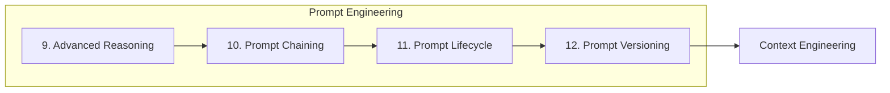
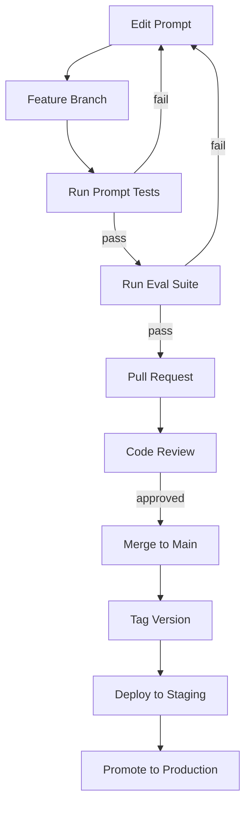
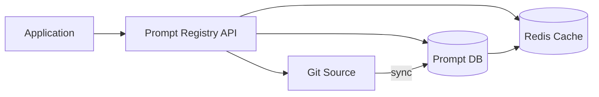
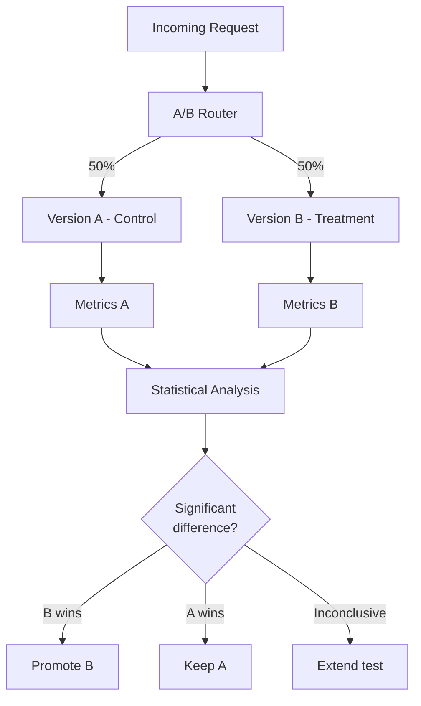
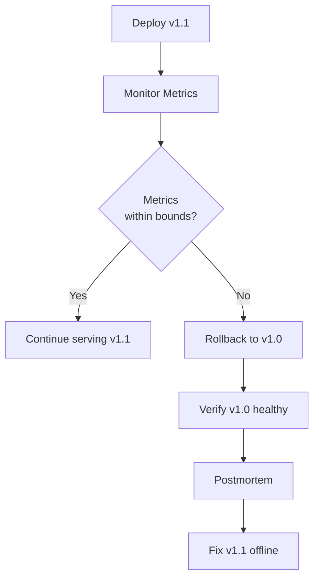
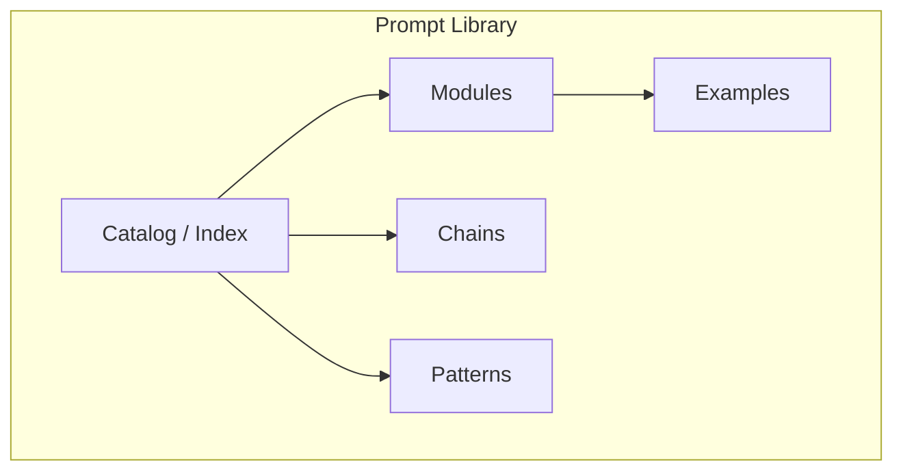
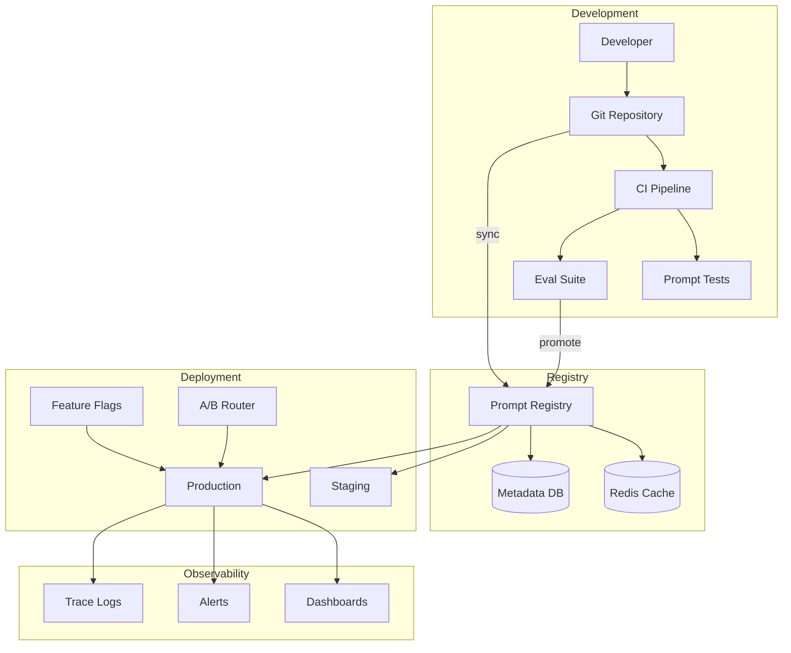
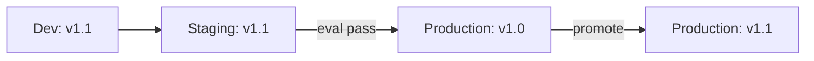

# Prompt Versioning

> How to version, store, test, deploy, and rollback prompts as first-class software assets — repositories, naming conventions, changelogs, A/B testing, and prompt libraries for production teams.

## Table of Contents

- [Overview](#overview)
- [Why Version Prompts](#why-version-prompts)
- [Version Control for Prompts](#version-control-for-prompts)
- [Prompt Repositories](#prompt-repositories)
- [Naming Conventions](#naming-conventions)
- [Changelogs](#changelogs)
- [A/B Testing Prompts](#ab-testing-prompts)
- [Rollback Strategies](#rollback-strategies)
- [Prompt Libraries](#prompt-libraries)
- [Repository Architecture](#repository-architecture)
- [Production Considerations](#production-considerations)
- [Python Examples](#python-examples)
- [Common Mistakes](#common-mistakes)
- [Interview Preparation](#interview-preparation)
- [Navigation](#navigation)

---

## Overview

Prompts change frequently — sometimes more often than application code.
Without versioning, you cannot reproduce results, compare quality, roll back failures, or audit what was deployed when.

This document is **Section 12** of this handbook.
It covers the infrastructure and practices for managing prompts as versioned, testable, deployable assets.



> **Prerequisites:** [Prompt Lifecycle](prompt-lifecycle.md) (Section 11) and [Git/GitHub Workflow](../foundations/git-github-workflow.md).

---

## Why Version Prompts

| Without Versioning | With Versioning |
|-------------------|-----------------|
| "Which prompt was live when the bug happened?" | Exact version in deployment logs |
| "Did the new prompt cause the quality drop?" | A/B comparison with metrics |
| "Can we undo last week's change?" | One-click rollback to v1.0 |
| "Are staging and production using the same prompt?" | Environment-specific version pins |
| "Who changed the safety instructions?" | Git blame + changelog |

> **Production Standard:** Treat prompts with the same rigor as database migrations — versioned, reviewed, tested, and reversible.

---

## Version Control for Prompts

### Git as the Source of Truth

Prompts live in Git alongside application code, not in spreadsheets or chat threads.

```
project/
├── prompts/
│   ├── system/
│   │   ├── assistant-v1.0.md
│   │   └── assistant-v1.1.md
│   ├── modules/
│   │   ├── extract-entities/
│   │   │   ├── v1.0.md
│   │   │   ├── v1.1.md
│   │   │   └── schema.json
│   │   └── classify-intent/
│   │       ├── v2.0.md
│   │       └── schema.json
│   ├── chains/
│   │   └── document-pipeline-v2.0.yaml
│   └── CHANGELOG.md
├── tests/
│   └── prompts/
│       ├── test_extract_entities.py
│       └── golden/
│           └── extract-entities.json
└── config/
    └── prompt-versions.yaml
```

### Version Control Workflow



### Branching Strategy for Prompts

| Branch | Purpose | Naming |
|--------|---------|--------|
| `main` | Production-ready prompts | — |
| `feature/prompt-{name}` | New prompt development | `feature/prompt-extract-v1.1` |
| `fix/prompt-{name}` | Bug fix to existing prompt | `fix/prompt-extract-abbrev` |
| `experiment/{name}` | Exploratory changes | `experiment/cot-vs-react` |

### Commit Message Convention

```
prompt(extract-entities): add abbreviation handling in v1.1

- Added 3 few-shot examples for common abbreviations
- Updated exclusion rule for product codes
- Eval accuracy: 87.2% → 93.1%

Refs: PROMPT-142
```

### What to Version

| Asset | Version? | Notes |
|-------|----------|-------|
| Prompt template text | Yes | Core content |
| Output schema | Yes | Breaking changes = major bump |
| Few-shot examples | Yes | Quality-impacting changes |
| Model configuration | Yes | In config, not prompt file |
| Eval datasets | Yes | Separate from prompt version |
| Test cases | Yes | Updated with prompt changes |

### What NOT to Put in Git

- API keys or secrets (use environment variables).
- Production user data in few-shot examples.
- Generated outputs (store in eval results, not repo).

---

## Prompt Repositories

A **prompt repository** is a structured store for prompt assets with metadata, schemas, tests, and deployment configuration.

### Repository Types

| Type | Location | Best For |
|------|----------|----------|
| **Monorepo** | `prompts/` in app repo | Small teams, tight coupling |
| **Dedicated repo** | `org/prompt-registry` | Multiple apps, shared prompts |
| **Registry service** | Internal API / database | Large orgs, dynamic loading |
| **Provider-native** | OpenAI Playground, etc. | Prototyping only — not production |

### Monorepo Structure

```
prompts/
├── README.md                    # Repository guide
├── CHANGELOG.md                 # Global changelog
├── registry.yaml                # Prompt catalog
├── system/                      # System prompts
├── modules/                     # Reusable prompt modules
│   └── {module-name}/
│       ├── README.md            # Module docs
│       ├── v{major}.{minor}.md  # Versioned prompts
│       ├── schema.json          # Output schema
│       └── eval-config.yaml     # Eval thresholds
├── chains/                      # Pipeline definitions
├── templates/                   # Jinja/format templates
└── deprecated/                  # Retired prompts (archived)
```

### Registry Catalog

```yaml
# prompts/registry.yaml
prompts:
  - id: extract-entities
    current_version: "1.1"
    production_version: "1.0"
    staging_version: "1.1"
    owner: ml-team
    description: Extract named entities from text
    model: gpt-4o-mini
    eval_threshold:
      accuracy: 0.90
      format_compliance: 1.0

  - id: classify-intent
    current_version: "2.0"
    production_version: "2.0"
    staging_version: "2.0"
    owner: ml-team
    description: Classify user intent for routing
    model: gpt-4o-mini
    eval_threshold:
      accuracy: 0.95
      format_compliance: 1.0

  - id: draft-response
    current_version: "3.0"
    production_version: "3.0"
    staging_version: "3.0"
    owner: product-team
    description: Draft customer support responses
    model: gpt-4o
    eval_threshold:
      quality_score: 0.85
      safety_pass: 1.0
```

### Dedicated Prompt Registry Service

For larger organizations, a registry service provides runtime prompt resolution:



```python
# Registry API response
{
    "prompt_id": "extract-entities",
    "version": "1.1",
    "content": "Extract named entities...",
    "schema": { "...": "..." },
    "model": "gpt-4o-mini",
    "config": {
        "temperature": 0.0,
        "max_output_tokens": 1024
    },
    "metadata": {
        "created": "2026-07-13",
        "author": "ml-team",
        "changelog": "Added abbreviation handling"
    }
}
```

---

## Naming Conventions

Consistent naming prevents confusion across teams, environments, and tools.

### Prompt File Naming

| Element | Convention | Example |
|---------|-----------|---------|
| **Module directory** | `kebab-case` | `extract-entities/` |
| **Version file** | `v{major}.{minor}.md` | `v1.1.md` |
| **Chain file** | `{name}-v{major}.{minor}.yaml` | `document-pipeline-v2.0.yaml` |
| **Schema file** | `schema.json` or `schema-v{major}.json` | `schema.json` |
| **Test file** | `test_{module_name}.py` | `test_extract_entities.py` |

### Prompt ID Naming

```
{domain}-{action}-{target}

Examples:
  support-classify-intent
  docs-extract-entities
  code-review-analyze
  rag-generate-answer
```

### Version Number Rules

Follow semantic versioning adapted for prompts:

```
v{MAJOR}.{MINOR}[.{PATCH}]

MAJOR: Breaking change (output format, behavior)
MINOR: New capability or quality improvement
PATCH: Wording fix, no behavior change
```

| Change | Version Bump | Example |
|--------|-------------|---------|
| Add few-shot example that improves accuracy | Minor | v1.0 → v1.1 |
| Change output from prose to JSON | Major | v1.1 → v2.0 |
| Fix typo in instruction | Patch | v1.1.0 → v1.1.1 |
| Switch model from gpt-4o to claude | Config change | No prompt version bump |
| Add new optional output field | Minor | v2.0 → v2.1 |
| Remove required output field | Major | v2.1 → v3.0 |

### Environment Version Pins

```yaml
# config/prompt-versions.yaml
environments:
  development:
    extract-entities: "1.1"      # latest for testing
    classify-intent: "2.0"
    draft-response: "3.0"

  staging:
    extract-entities: "1.1"      # candidate for promotion
    classify-intent: "2.0"
    draft-response: "3.0"

  production:
    extract-entities: "1.0"      # stable, proven
    classify-intent: "2.0"
    draft-response: "3.0"
```

> **Tip:** Development uses the latest version; production pins to the last proven version until explicitly promoted.

---

## Changelogs

A **changelog** records what changed in each prompt version, why, and what the impact was.

### Changelog Format

```markdown
# Changelog: extract-entities

## [1.1] - 2026-07-13

### Added
- Three few-shot examples for abbreviation handling (Dr., Inc., Ltd.)
- Exclusion rule for alphanumeric product codes

### Changed
- Confidence threshold guidance from 0.5 to 0.7

### Eval Impact
- Accuracy: 87.2% → 93.1% (+5.9%)
- Format compliance: 98.0% → 100%
- Avg latency: 820ms → 750ms
- Avg cost: $0.002 → $0.0018

### Migration Notes
- Output schema unchanged — drop-in replacement for v1.0
- No downstream chain changes required

## [1.0] - 2026-06-15

### Added
- Initial production release
- JSON output with entity type, value, confidence
- Support for person, organization, location, date, money

### Eval Impact
- Accuracy: 87.2%
- Format compliance: 98.0%
```

### Global Changelog

Maintain a top-level `prompts/CHANGELOG.md` for cross-prompt changes:

```markdown
# Prompt Changelog

## 2026-07-13

### extract-entities v1.1
- Improved abbreviation handling (+5.9% accuracy)
- [Details](modules/extract-entities/CHANGELOG.md)

### classify-intent v2.0
- Major rewrite with chain-of-thought reasoning
- [Details](modules/classify-intent/CHANGELOG.md)

## 2026-06-15

### extract-entities v1.0
- Initial production release
```

### Changelog Automation

```python
def generate_changelog_entry(
    prompt_id: str,
    old_version: str,
    new_version: str,
    eval_before: dict,
    eval_after: dict,
    changes: list[str],
) -> str:
    deltas = {
        metric: f"{eval_before[metric]:.1%} → {eval_after[metric]:.1%}"
        for metric in eval_before
    }
    return f"""
## [{new_version}] - {date.today()}

### Changed
{chr(10).join(f'- {c}' for c in changes)}

### Eval Impact
{chr(10).join(f'- {k}: {v}' for k, v in deltas.items())}
"""
```

> **Production Standard:** No prompt version ships without a changelog entry.
Eval impact numbers are mandatory — they justify the change.

---

## A/B Testing Prompts

**A/B testing** compares two prompt versions on live traffic to make data-driven promotion decisions.

### A/B Test Architecture



### A/B Test Configuration

```yaml
# ab-tests/extract-entities-v1.1.yaml
test_id: extract-entities-v1.1-trial
prompt_id: extract-entities
control_version: "1.0"
treatment_version: "1.1"
traffic_split: 0.10          # 10% to treatment
start_date: "2026-07-13"
end_date: "2026-07-20"
min_sample_size: 1000

primary_metric: accuracy
secondary_metrics:
  - latency_p95
  - cost_per_request
  - format_compliance

success_criteria:
  accuracy: ">= control"
  latency_p95: "<= control * 1.1"
  cost_per_request: "<= control * 1.05"

rollback_on:
  error_rate: "> control * 2"
  safety_violation: "> 0"
```

### A/B Router Implementation

```python
import hashlib
from dataclasses import dataclass


@dataclass
class ABTest:
    test_id: str
    control_version: str
    treatment_version: str
    traffic_split: float  # 0.0 to 1.0


def assign_variant(request_id: str, test: ABTest) -> str:
    hash_val = int(hashlib.md5(request_id.encode()).hexdigest(), 16)
    bucket = (hash_val % 1000) / 1000.0
    if bucket < test.traffic_split:
        return test.treatment_version
    return test.control_version
```

### A/B Test Analysis

| Metric | Control (v1.0) | Treatment (v1.1) | Significant? |
|--------|---------------|-------------------|-------------|
| Accuracy | 87.2% (n=5000) | 93.1% (n=500) | Yes (p < 0.01) |
| Latency p95 | 820ms | 750ms | Yes (p < 0.05) |
| Cost/request | $0.0020 | $0.0018 | No (p = 0.12) |
| Error rate | 1.2% | 0.8% | No (p = 0.08) |

### A/B Testing Best Practices

| Practice | Rationale |
|----------|-----------|
| **One variable** | Isolate prompt change from other changes |
| **Sufficient sample size** | Underpowered tests give false confidence |
| **Fixed duration** | Don't peek and stop early (p-hacking) |
| **Consistent traffic** | Same user segments in both groups |
| **Auto-rollback** | Safety violations immediately revert |
| **Document results** | Even negative results inform future work |

> **Warning:** A/B testing on insufficient traffic produces noise, not signal.
Minimum 1000 samples per variant for binary metrics; more for continuous metrics.

---

## Rollback Strategies

**Rollback** reverts to a previous known-good prompt version when the current version causes degradation.

### Rollback Triggers

| Trigger | Automatic? | Action |
|---------|-----------|--------|
| Error rate > 2× baseline | Yes | Immediate rollback |
| Safety violation detected | Yes | Immediate rollback |
| Latency p95 > SLO | Yes | Rollback after 5 min |
| Quality score drop | No | Alert → human decision |
| User complaint spike | No | Alert → human decision |



### Rollback Implementation

```python
from dataclasses import dataclass


@dataclass
class PromptDeployment:
    prompt_id: str
    current_version: str
    fallback_version: str
    config_source: str  # "file" | "registry" | "env"


class PromptRollback:
    def __init__(self, deployment: PromptDeployment):
        self.deployment = deployment

    def rollback(self, reason: str) -> str:
        previous = self.deployment.current_version
        self.deployment.current_version = self.deployment.fallback_version
        log_rollback(
            prompt_id=self.deployment.prompt_id,
            from_version=previous,
            to_version=self.deployment.fallback_version,
            reason=reason,
        )
        return self.deployment.fallback_version

    def auto_rollback_check(self, metrics: dict) -> bool:
        if metrics.get("error_rate", 0) > 0.05:
            self.rollback(reason="error_rate_exceeded")
            return True
        if metrics.get("safety_violations", 0) > 0:
            self.rollback(reason="safety_violation")
            return True
        return False
```

### Rollback Levels

| Level | Scope | Speed | Risk |
|-------|-------|-------|------|
| **Config flip** | Change version pin | Seconds | Low |
| **Feature flag** | Disable new version | Seconds | Low |
| **Git revert** | Revert commit | Minutes | Medium |
| **Full redeploy** | Redeploy previous build | Minutes | Medium |

### Rollback Runbook

```markdown
# Rollback Runbook: extract-entities

## Quick Rollback (< 1 minute)
1. Update `config/prompt-versions.yaml`:
   production.extract-entities: "1.0"  # revert from 1.1
2. Config reload is automatic (or restart service)
3. Verify: check dashboard for version label change

## Verify Rollback
- Error rate returns to baseline within 5 minutes
- Latency returns to baseline
- No new safety violations

## Post-Rollback
1. Create incident ticket
2. Preserve v1.1 failure samples for analysis
3. Do NOT delete v1.1 — fix offline and re-evaluate
```

> **Production Standard:** Test rollback quarterly.
A rollback procedure that hasn't been practiced is not a rollback procedure.

---

## Prompt Libraries

A **prompt library** is a curated, searchable collection of tested, versioned prompts organized by use case.

### Library Structure



### Library Organization

| Category | Contents | Example |
|----------|----------|---------|
| **Extraction** | Entity, field, structured data extraction | `extract-entities`, `extract-dates` |
| **Classification** | Intent, sentiment, category | `classify-intent`, `classify-urgency` |
| **Generation** | Summaries, drafts, reports | `summarize`, `draft-email` |
| **Analysis** | Code review, data analysis | `analyze-code`, `analyze-metrics` |
| **Safety** | Content moderation, PII detection | `safety-check`, `pii-detect` |
| **Reasoning** | CoT, planning, reflection templates | `plan-task`, `reflect-output` |
| **Chains** | Pre-built multi-step pipelines | `document-pipeline`, `rag-answer` |

### Library Entry Template

```markdown
---
id: extract-entities
version: "1.1"
category: extraction
tags: [ner, entities, json]
status: production
model: gpt-4o-mini
token_budget: 500-2000
eval_accuracy: 0.931
owner: ml-team
---

# Extract Entities

> Extract named entities (person, organization, location, date, money)
> from text with confidence scores.

## Quick Start

```python
result = await prompt_runner.run(
    "extract-entities",
    version="1.1",
    inputs={"text": "John works at Acme Corp."},
)
```

## Versions
| Version | Status | Accuracy | Notes |
|---------|--------|----------|-------|
| 1.1 | production (staging) | 93.1% | Abbreviation handling |
| 1.0 | production | 87.2% | Initial release |

## Changelog
[See CHANGELOG](CHANGELOG.md)
```

### Library Discovery

```yaml
# Library search index
search:
  by_tag: ["extraction", "classification", "generation"]
  by_model: ["gpt-4o", "gpt-4o-mini", "claude-sonnet-4"]
  by_status: ["production", "staging", "deprecated"]
  by_accuracy: ">= 0.90"
```

### Shared vs Application-Specific

| Library Type | Scope | Location |
|-------------|-------|----------|
| **Organization library** | Shared across teams | `org/prompt-registry` |
| **Domain library** | Shared within a product area | `prompts/modules/` |
| **Application library** | Specific to one app | `app/prompts/` |

### Library Governance

| Rule | Enforcement |
|------|------------|
| Production status requires eval pass | CI gate |
| Deprecated prompts archived, not deleted | `deprecated/` folder |
| Owner assigned to every prompt | Registry metadata |
| Quarterly review of production prompts | Calendar + alerts |
| New prompts require design spec | PR template checklist |

---

## Repository Architecture

### Full System Architecture



### Prompt Loader

```python
from pathlib import Path
from dataclasses import dataclass


@dataclass
class PromptLoader:
    base_path: Path
    version_config: dict[str, str]
    cache: dict[str, str]

    def load(self, prompt_id: str, version: str | None = None) -> str:
        version = version or self.version_config.get(prompt_id)
        cache_key = f"{prompt_id}:{version}"

        if cache_key in self.cache:
            return self.cache[cache_key]

        prompt_path = self._resolve_path(prompt_id, version)
        content = prompt_path.read_text()
        self.cache[cache_key] = content
        return content

    def _resolve_path(self, prompt_id: str, version: str) -> Path:
        return self.base_path / "modules" / prompt_id / f"v{version}.md"
```

---

## Production Considerations

### Version Pinning Strategy

| Environment | Pinning | Rationale |
|-------------|---------|-----------|
| Development | Latest | Rapid iteration |
| Staging | Candidate | Pre-production validation |
| Production | Explicit version | Stability and reproducibility |
| CI/CD | Locked versions | Deterministic tests |

### Multi-Environment Sync



### Access Control

| Action | Who Can Do It |
|--------|--------------|
| Edit draft prompts | Any engineer |
| Merge to main | PR review required |
| Promote to staging | ML engineer |
| Promote to production | ML lead + product owner |
| Emergency rollback | On-call engineer |
| Deprecate prompt | ML lead |

### Compliance and Audit

- Git history provides full audit trail.
- Changelog documents business justification.
- Eval reports prove quality at deployment time.
- A/B test results justify version promotions.
- Rollback logs document incident response.

---

## Python Examples

### Version-Aware Prompt Runner

```python
from dataclasses import dataclass, field


@dataclass
class PromptRunner:
    loader: PromptLoader
    llm_client: object
    ab_tests: dict[str, ABTest] = field(default_factory=dict)
    metrics: object = None

    async def run(
        self,
        prompt_id: str,
        inputs: dict,
        request_id: str | None = None,
    ) -> dict:
        version = self._resolve_version(prompt_id, request_id)
        template = self.loader.load(prompt_id, version)
        prompt = template.format(**inputs)

        response = await self.llm_client.complete(prompt)

        if self.metrics:
            self.metrics.record(
                prompt_id=prompt_id,
                version=version,
                tokens=response.total_tokens,
                latency_ms=response.latency_ms,
            )

        return {
            "content": response.content,
            "prompt_id": prompt_id,
            "version": version,
        }

    def _resolve_version(
        self, prompt_id: str, request_id: str | None
    ) -> str:
        if prompt_id in self.ab_tests and request_id:
            return assign_variant(request_id, self.ab_tests[prompt_id])
        return self.loader.version_config[prompt_id]
```

### Prompt Diff Tool

```python
import difflib


def diff_prompt_versions(
    old_content: str,
    new_content: str,
    old_version: str,
    new_version: str,
) -> str:
    diff = difflib.unified_diff(
        old_content.splitlines(keepends=True),
        new_content.splitlines(keepends=True),
        fromfile=f"v{old_version}",
        tofile=f"v{new_version}",
    )
    return "".join(diff)
```

---

## Common Mistakes

| Mistake | Impact | Fix |
|---------|--------|-----|
| Prompts in code strings | No versioning, no review | Move to `prompts/` directory |
| No version pins in production | Accidental deploys | Explicit version config per env |
| Skip changelog | Can't explain regressions | Mandatory changelog in PR template |
| A/B test too short | False conclusions | Fixed duration, min sample size |
| No fallback version | Extended outages on failure | Configure fallback for every prompt |
| Delete old versions | Can't rollback | Archive in `deprecated/` |
| Version prompt but not schema | Breaking schema changes ship | Co-version schemas with prompts |
| One giant prompt repo | Hard to navigate | Organize by module with registry |

---

## Interview Preparation

### Frequently Asked Questions

**Q1: How do you version prompts in a production system?**

> **Strong answer:** Prompts live in Git with semantic versioning (v{major}.{minor}).
Each version has a changelog with eval impact metrics.
Production pins explicit versions via config; staging tests candidates.
A/B testing validates promotions; fallback versions enable instant rollback.
CI runs tests and evals on every prompt change.

**Q2: Describe your A/B testing approach for prompts.**

> **Strong answer:** Route a percentage of traffic (typically 10%) to the treatment version using deterministic hashing.
Track primary metric (accuracy) and guardrails (latency, cost, error rate).
Run for a fixed duration with minimum sample size.
Auto-rollback on safety violations.
Promote only if treatment meets success criteria with statistical significance.

**Q3: How do you handle a prompt regression in production?**

> **Strong answer:** Automated monitoring detects error rate or quality degradation.
Auto-rollback flips version pin to fallback within seconds.
Preserve failure samples for analysis.
Postmortem identifies root cause.
Fix offline, re-evaluate, canary deploy the fix.

### Real-World Scenario

**Scenario:** Two teams independently modified the same system prompt, causing conflicting instructions and degraded output quality.

> **Discussion points:** Lack of centralized prompt repository and version control.
Implement monorepo with PR review for all prompt changes.
Registry catalog shows owner and current version per prompt.
Branch protection prevents direct commits to production prompts.

---

## Navigation

### Prerequisites

- [Prompt Lifecycle](prompt-lifecycle.md) — Section 11
- [Git/GitHub Workflow](../foundations/git-github-workflow.md)
- [Software Engineering for AI](../foundations/software-engineering-for-ai.md)

### Related Topics

- [Prompt Chaining](prompt-chaining.md) — Section 10
- [Configuration and Secrets](../foundations/configuration-and-secrets.md)
- [Prompt Library](../../prompts/README.md)

### Next Topics

- [Context Engineering](../context-engineering/README.md)
- [Embeddings](../embeddings/README.md)
- [AI Agents](../agent-architectures/README.md)

---

## See Also

- [Prompt Lifecycle](prompt-lifecycle.md)
- [Software Engineering for AI](../foundations/software-engineering-for-ai.md)
- [Prompt Library](../../prompts/README.md)

## Changelog

| Version | Date | Changes |
|---------|------|---------|
| 1.0 | 2026-07-13 | Initial publication — Section 12 |
