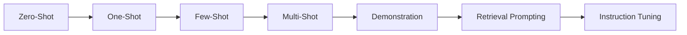
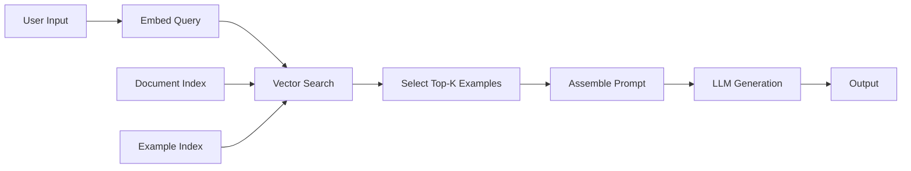
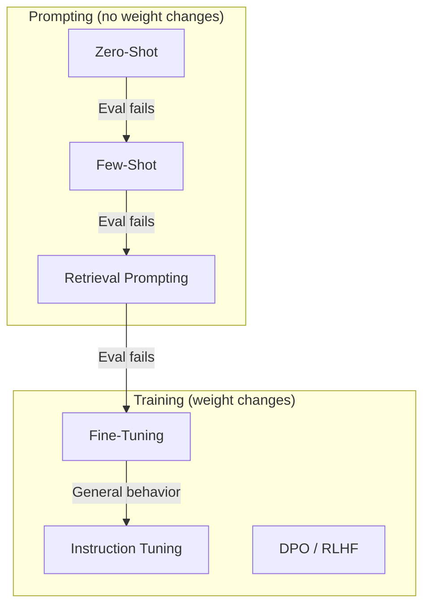
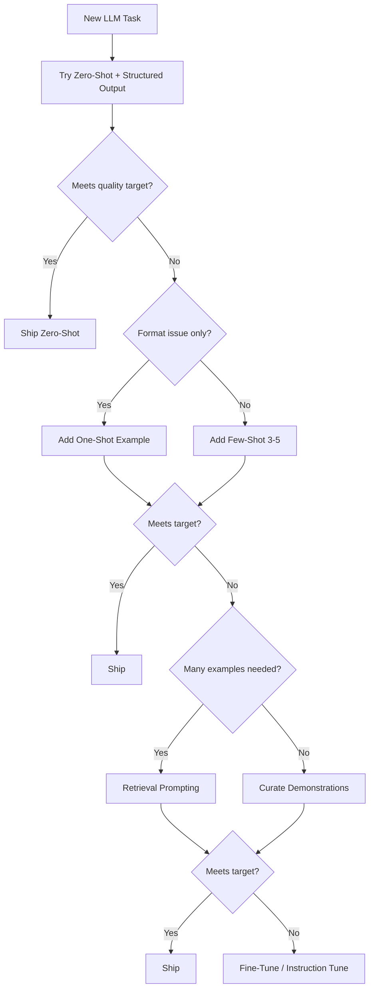

# Prompting Strategies

> Section 8 of Phase 5 — how much context you give the model changes everything. This guide compares prompting strategies from zero-shot simplicity to retrieval-augmented demonstrations, with honest tradeoffs on cost, latency, and quality.

## Table of Contents

- [Strategy Overview](#strategy-overview)
- [Zero-Shot Prompting](#zero-shot-prompting)
- [One-Shot Prompting](#one-shot-prompting)
- [Few-Shot Prompting](#few-shot-prompting)
- [Multi-Shot Prompting](#multi-shot-prompting)
- [Demonstration Prompting](#demonstration-prompting)
- [Retrieval Prompting](#retrieval-prompting)
- [Instruction Tuning Concepts](#instruction-tuning-concepts)
- [Strategy Comparison Matrix](#strategy-comparison-matrix)
- [Choosing a Strategy](#choosing-a-strategy)
- [Production Considerations](#production-considerations)
- [Common Mistakes](#common-mistakes)
- [Interview Preparation](#interview-preparation)
- [Navigation](#navigation)

---

## Strategy Overview

**Prompting strategy** answers: how much guidance do you provide in the prompt itself? The spectrum runs from instructions alone to rich demonstrations retrieved at runtime.



| Strategy | Examples in Prompt | External Data | Typical Use |
|----------|-------------------|---------------|-------------|
| Zero-shot | 0 | No | Well-defined tasks, strong models |
| One-shot | 1 | No | Format demonstration |
| Few-shot | 2–5 | No | Classification, extraction |
| Multi-shot | 6–20+ | No | Complex format compliance |
| Demonstration | Curated set | Sometimes | Consistent behavior patterns |
| Retrieval prompting | Dynamic | Yes (RAG) | Domain-specific Q&A |
| Instruction tuning | 0 (in weights) | Training data | Base model behavior |

> **Production Standard:** Start with zero-shot. Add shots only when evals prove they improve quality. Prefer retrieval prompting over static few-shot when examples exceed ~5 or change frequently.

---

## Zero-Shot Prompting

**Zero-shot prompting** provides instructions and input with no examples. The model relies entirely on pretraining and instruction-following alignment.

### When to Use

- Strong modern models (GPT-4o, Claude Sonnet) on well-defined tasks
- Tasks covered extensively in pretraining (summarization, translation, basic QA)
- Latency- and cost-sensitive endpoints
- When combined with schema-constrained output for structure

### When Not to Use

- Niche classification with company-specific labels
- Unusual output formats the model rarely produces
- Tasks where eval shows < target accuracy without examples

### Advantages

| Advantage | Detail |
|-----------|--------|
| Lowest token cost | No example overhead |
| Lowest latency | Smallest input size |
| Simplest to maintain | No example curation |
| Cache-friendly | Stable system prompt prefix |

### Disadvantages

| Disadvantage | Detail |
|--------------|--------|
| Format inconsistency | Model may guess output shape |
| Domain gap | Company-specific tasks underperform |
| Ambiguity sensitivity | Vague instructions hurt more without examples |

### Cost, Latency, Quality

| Dimension | Rating | Notes |
|-----------|--------|-------|
| Cost | ⭐ Lowest | ~100–500 input tokens typical |
| Latency | ⭐ Fastest | Minimal input to process |
| Quality | ⭐⭐ Variable | High for general tasks, low for niche |

### Example

```
Classify the sentiment of the review as positive, negative, or neutral.

Review: "The API documentation was clear but deployment took forever."
```

### Production Considerations

- Pair with structured output schemas for reliability.
- Use clear constraints and output format in system prompt.
- Establish zero-shot baseline in eval before adding shots.
- Default strategy for new features — prove few-shot is needed.

---

## One-Shot Prompting

**One-shot prompting** includes exactly one input-output example before the actual task. The example teaches format, tone, or reasoning style.

### When to Use

- Teaching output format ("return JSON exactly like this")
- Showing edge-case handling (one representative example)
- Token budget is tight but zero-shot fails format compliance

### When Not to Use

- Classification with many ambiguous categories (need more examples)
- When the single example is unrepresentative and biases output

### Advantages

- Minimal token increase over zero-shot (~50–300 tokens)
- Often sufficient for format compliance
- Easy to maintain (one example to update)

### Disadvantages

- Single example may bias toward its patterns
- Insufficient for complex or multi-class tasks
- Example choice is critical — wrong example → systematic errors

### Cost, Latency, Quality

| Dimension | Rating | Notes |
|-----------|--------|-------|
| Cost | ⭐⭐ Low | +1 example worth of tokens |
| Latency | ⭐⭐ Fast | Negligible increase |
| Quality | ⭐⭐⭐ Good for format | Limited for nuanced tasks |

### Example

```
Extract the company name and funding amount.

Example:
Input: "Stripe raised $600M in Series H."
Output: {"company": "Stripe", "amount": "$600M", "round": "Series H"}

Now extract from:
Input: "{input_text}"
Output:
```

### Production Considerations

- Choose the example that best represents the median case, not the easiest.
- Store the example in the template file, versioned alongside the prompt.
- A/B test one-shot vs zero-shot — one-shot is not always better.

---

## Few-Shot Prompting

**Few-shot prompting** (also called **in-context learning**) provides 2–5 input-output examples before the target input. The model infers the task pattern from examples without weight updates.

### When to Use

- Classification with company-specific categories
- Extraction with non-standard field definitions
- Tasks where zero-shot accuracy is below target
- Teaching complex reasoning patterns

### When Not to Use

- More than ~5 examples needed (use retrieval prompting or fine-tuning)
- Examples would consume significant context window
- Task is simple enough for zero-shot

### Advantages

| Advantage | Detail |
|-----------|--------|
| No training required | Immediate deployment |
| Flexible | Swap examples without retraining |
| Strong quality lift | Often 10–30% accuracy improvement |
| Teaches nuance | Handles ambiguous categories |

### Disadvantages

| Disadvantage | Detail |
|--------------|--------|
| Token cost | Each example adds 100–500+ tokens |
| Example sensitivity | Order and selection affect results |
| Maintenance | Examples drift as product evolves |
| Context limit | Few-shot + RAG may exceed window |

### Cost, Latency, Quality

| Dimension | Rating | Notes |
|-----------|--------|-------|
| Cost | ⭐⭐⭐ Medium | 500–2000 input tokens common |
| Latency | ⭐⭐⭐ Moderate | Linear with example count |
| Quality | ⭐⭐⭐⭐ High | Best ROI for niche tasks |

### Example Selection Principles

1. **Coverage** — at least one example per category or edge case type
2. **Diversity** — vary length, phrasing, and difficulty
3. **Consistency** — identical output format across all examples
4. **Order** — place hardest example last (recency bias)
5. **No leakage** — eval examples must not appear in few-shot set

### Example

```
Classify support tickets.

Example 1:
Input: "I was charged twice for my subscription."
Output: {"category": "billing", "priority": "high"}

Example 2:
Input: "How do I reset my API key?"
Output: {"category": "account", "priority": "medium"}

Example 3:
Input: "The webhook returns 500 on POST /events."
Output: {"category": "technical", "priority": "high"}

Classify:
Input: "{ticket_text}"
Output:
```

### Production Considerations

- Cap at 3–5 examples unless evals justify more.
- Version examples with the prompt template.
- Monitor for example memorization in eval (model quotes examples).
- Balance few-shot tokens against RAG context budget.

---

## Multi-Shot Prompting

**Multi-shot prompting** uses 6–20+ examples in the prompt. Pushes the boundary of in-context learning before fine-tuning or retrieval is more appropriate.

### When to Use

- Highly complex output formats with many edge cases
- Small static datasets where all examples fit in context
- Benchmark reproduction (research settings)

### When Not to Use

- Production endpoints (cost and latency explode)
- Dynamic domains where examples change frequently
- When retrieval prompting or fine-tuning is available

### Advantages

- Maximum in-context learning without training
- Can cover many edge cases explicitly
- Useful for eval baselines and research

### Disadvantages

- Very high token cost (thousands of input tokens)
- Diminishing returns after ~8–10 examples on most models
- Example order effects become significant
- May crowd out RAG context or conversation history

### Cost, Latency, Quality

| Dimension | Rating | Notes |
|-----------|--------|-------|
| Cost | ⭐⭐⭐⭐ High | 2000–10000+ input tokens |
| Latency | ⭐⭐⭐⭐ Slow | Proportional to total input |
| Quality | ⭐⭐⭐⭐ Plateau | Gains flatten after ~10 examples |

### Production Considerations

- Almost never deploy 15+ static examples — use retrieval prompting instead.
- If using 6–10 shots, measure marginal accuracy gain per example.
- Consider fine-tuning when multi-shot is consistently needed.
- Watch context window headroom for output generation.

---

## Demonstration Prompting

**Demonstration prompting** is few-shot's production-oriented cousin: a curated, maintained set of demonstrations designed to teach behavior patterns — not just format. Demonstrations may include reasoning traces, tool use, or multi-turn exchanges.

### When to Use

- Teaching chain-of-thought or step-by-step reasoning style
- Agent behavior (how to call tools, when to ask for clarification)
- Consistent multi-turn interaction patterns

### When Not to Use

- Simple classification (standard few-shot suffices)
- When demonstrations are stale or contradict current policies

### Advantages

- Teaches process, not just input-output mapping
- Reusable across similar tasks
- Can include negative examples ("don't do this")

### Disadvantages

- Expensive to create high-quality demonstrations
- Long demonstrations consume context rapidly
- Demonstration quality ceiling = output quality ceiling

### Demonstration Types

| Type | Content | Use Case |
|------|---------|----------|
| Input-output | Simple pairs | Classification, extraction |
| Chain-of-thought | Reasoning + answer | Math, logic, debugging |
| Tool-use | Thought → action → observation | Agents |
| Multi-turn | Conversation sequences | Chat behavior |
| Contrastive | Good vs bad examples | Style, safety |

### Example (Chain-of-Thought Demonstration)

```
Example:
Q: If a train travels 120 km in 1.5 hours, what is its speed in m/s?
A: Let me solve step by step.
   1. Speed = distance/time = 120 km / 1.5 h = 80 km/h
   2. Convert: 80 km/h × (1000 m / 1 km) × (1 h / 3600 s) = 22.22 m/s
   Answer: 22.22 m/s

Now solve:
Q: {question}
A:
```

### Production Considerations

- Curate demonstrations like test fixtures — reviewed, versioned, evaluated.
- Include 1 contrastive "bad example" for critical safety patterns.
- Refresh demonstrations when model generation changes (model upgrade).
- Separate demonstration library from per-request data.

---

## Retrieval Prompting

**Retrieval prompting** dynamically selects relevant examples or context at runtime using semantic search, then injects them into the prompt. Combines few-shot learning with RAG.

### When to Use

- Large example libraries (hundreds/thousands of cases)
- Domain-specific tasks where static few-shot cannot cover diversity
- When examples update frequently (new products, policies, code patterns)
- RAG Q&A (retrieve documents + optionally retrieve similar Q&A pairs)

### When Not to Use

- Tiny static example sets (static few-shot is simpler)
- When retrieval latency is unacceptable
- Tasks with no example library to retrieve from

### Advantages

| Advantage | Detail |
|-----------|--------|
| Scales beyond context window | Retrieve only top-k relevant |
| Always fresh | Update index, not prompt files |
| Personalized | Retrieve examples similar to current input |
| Combines with RAG | Documents + demonstrations in one prompt |

### Disadvantages

| Disadvantage | Detail |
|--------------|--------|
| Retrieval quality dependency | Bad examples → bad outputs |
| Added latency | Embedding + search + generation |
| Infrastructure complexity | Vector DB, indexing pipeline |
| Inconsistent shot count | Different k per query affects behavior |

### Architecture



### Example

```python
async def retrieval_prompt(
    query: str,
    example_index: VectorStore,
    doc_index: VectorStore,
    k_examples: int = 3,
    k_docs: int = 5,
) -> list[dict]:
    examples = await example_index.search(query, k=k_examples)
    docs = await doc_index.search(query, k=k_docs)

    example_block = "\n\n".join(
        f"Example:\nInput: {ex.input}\nOutput: {ex.output}"
        for ex in examples
    )
    doc_block = "\n".join(
        f'<chunk id="{d.id}">{d.text}</chunk>' for d in docs
    )

    user_content = f"""<examples>
{example_block}
</examples>

<context>
{doc_block}
</context>

Question: {query}
"""
    return [
        {"role": "system", "content": SYSTEM_PROMPT},
        {"role": "user", "content": user_content},
    ]
```

### Cost, Latency, Quality

| Dimension | Rating | Notes |
|-----------|--------|-------|
| Cost | ⭐⭐⭐⭐ High | Embedding + search + variable prompt size |
| Latency | ⭐⭐⭐⭐ Slow | +50–200ms retrieval overhead |
| Quality | ⭐⭐⭐⭐⭐ Highest | Best for domain-specific tasks at scale |

### Production Considerations

- Index examples with metadata: category, difficulty, date, quality score.
- Filter retrieved examples (deduplicate, exclude outdated).
- Monitor retrieval precision — are the right examples selected?
- Budget: `k_examples × avg_example_tokens + k_docs × avg_chunk_tokens < context_limit`.
- See [RAG](../rag/README.md) for full retrieval pipeline guidance.

---

## Instruction Tuning Concepts

**Instruction tuning** is training (not prompting) — fine-tuning a base model on instruction-response pairs so it follows instructions without in-context examples. Understanding it clarifies when prompting strategies hit their limits.

### Key Concepts

| Concept | Description |
|---------|-------------|
| **Instruction tuning** | Fine-tune on (instruction, response) datasets |
| **RLHF / RLAIF** | Further alignment with human/AI preference feedback |
| **Fine-tuning** | Update model weights on domain-specific data |
| **Distillation** | Train smaller model on larger model's outputs |
| **System prompt tuning** | Optimize system prompt via automated search (prompt tuning lite) |

### When Instruction Tuning Beats Prompting

- Same task invoked millions of times (amortize training cost)
- Consistent behavior needed without variable example retrieval
- Latency-critical: eliminate few-shot tokens from every request
- Proprietary domain where public models lack knowledge

### When Prompting Beats Instruction Tuning

- Rapid iteration — prompt changes deploy in minutes
- Low invocation volume — training cost not justified
- Multi-task flexibility — one model, many prompt templates
- Examples or policies change weekly

### Relationship to Prompting Strategies



### Production Considerations

- Instruction-tuned models (GPT-4, Claude) already have strong zero-shot — leverage that first.
- Fine-tuning does not eliminate need for good prompts — system prompt still matters.
- Combine: fine-tuned model + zero-shot prompt + structured output.
- Track fine-tuning data quality — garbage demonstrations → garbage model.

---

## Strategy Comparison Matrix

| Strategy | Examples | Token Cost | Latency | Quality Ceiling | Maintenance |
|----------|----------|------------|---------|-----------------|-------------|
| Zero-shot | 0 | Lowest | Fastest | Moderate | Lowest |
| One-shot | 1 | Low | Fast | Good (format) | Low |
| Few-shot | 2–5 | Medium | Moderate | High | Medium |
| Multi-shot | 6–20+ | High | Slow | High (plateau) | High |
| Demonstration | Curated | Medium–High | Moderate | Very High | High |
| Retrieval | Dynamic k | High (variable) | Slowest | Very High | Medium (index) |
| Instruction tuning | 0 in prompt | Lowest at inference | Fastest | Highest (trained) | Training pipeline |

### Quality vs Cost Curve

```
Quality
  ▲
  │                              ┌── Instruction tuning
  │                         ┌────┘
  │                    ┌────┘ Retrieval prompting
  │               ┌────┘
  │          ┌────┘ Few-shot (3-5)
  │     ┌────┘
  │ ┌───┘ One-shot
  │─┘ Zero-shot
  └──────────────────────────────────► Cost / Latency
```

Diminishing returns appear quickly. Measure your curve — don't assume more shots help.

---

## Choosing a Strategy

### Decision Flowchart



### Heuristics

| Signal | Strategy |
|--------|----------|
| General task, strong model | Zero-shot |
| JSON format violations | One-shot + schema enforcement |
| Company-specific labels | Few-shot (3 examples) |
| 100+ example library | Retrieval prompting |
| Agent tool-use patterns | Demonstration prompting |
| Millions of calls, stable task | Fine-tuning |

---

## Production Considerations

### Evaluation Protocol

For every strategy change, measure:

| Metric | How |
|--------|-----|
| Task accuracy | Golden-set labeled data |
| Format compliance | Schema validation pass rate |
| Latency p50/p95 | API timing |
| Input tokens | Provider usage logs |
| Cost per request | tokens × price |

### Token Budget Management

```python
MAX_CONTEXT = 128_000
RESERVED_OUTPUT = 4_096
SYSTEM_PROMPT = 800  # measured

available_for_input = MAX_CONTEXT - RESERVED_OUTPUT - SYSTEM_PROMPT

# Budget allocation for retrieval prompting
FEW_SHOT_BUDGET = 2_000
RAG_BUDGET = available_for_input - FEW_SHOT_BUDGET
```

### Model Upgrade Checklist

When switching models, re-evaluate all strategies:

- [ ] Zero-shot baseline still passes?
- [ ] Few-shot examples still representative?
- [ ] Retrieval example format still optimal?
- [ ] Token costs changed?

### Caching Implications

| Strategy | Prompt Cache Benefit |
|----------|---------------------|
| Zero-shot | High — static system prompt |
| Few-shot | Medium — static examples in prefix |
| Retrieval | Low — dynamic suffix changes |
| Instruction tuning | High — no example tokens |

---

## Common Mistakes

| Mistake | Impact | Fix |
|---------|--------|-----|
| Few-shot by default | Wasted tokens | Zero-shot baseline first |
| Eval examples in few-shot | Inflated metrics | Strict train/eval separation |
| 10+ static examples | Cost, latency, plateau | Retrieval or fine-tune |
| Ignoring example order | Inconsistent results | Hardest example last |
| No strategy in logs | Can't debug quality | Log strategy + example IDs |
| Skipping re-eval on model upgrade | Silent regression | Re-run eval suite |

---

## Interview Preparation

### Frequently Asked Questions

**Q1: When do you use few-shot vs fine-tuning?**

> **Strong answer:** Few-shot when I need fast iteration, low volume, or task variety. Fine-tuning when invocation volume amortizes training cost, latency matters (eliminate example tokens), or behavior must be consistent without retrieval variance. I always establish a zero-shot and few-shot baseline before recommending fine-tuning.

**Q2: What is retrieval prompting and how does it differ from RAG?**

> **Strong answer:** Retrieval prompting is the general pattern of dynamically selecting prompt content via search. RAG is retrieval prompting applied to documents for Q&A. You can also retrieve similar past Q&A pairs, code examples, or demonstrations. RAG is one instance of retrieval prompting, not the whole concept.

**Q3: Why might zero-shot outperform few-shot?**

> **Strong answer:** Poorly chosen examples bias the model. Examples may contradict instructions. Too many shots crowd out relevant context. Recency bias may overweight a misleading last example. Strong instruction-tuned models often need zero-shot plus clear format specs, not examples. Always measure — don't assume few-shot helps.

### Real-World Scenario

**Scenario:** Classification accuracy is 72% with zero-shot, 89% with 5-shot, but p95 latency doubled and costs tripled.

> **Discussion points:** Is 89% sufficient or is 95% required? Try 2-shot — often captures most gains. Try retrieval with k=2 dynamic examples. Consider fine-tuning if volume is high. Optimize with smaller model + few-shot vs larger model + zero-shot. Measure cost per correct classification, not accuracy alone.

---

## Navigation

### Prerequisites

- [Prompt Patterns](prompt-patterns.md) — Section 5
- [Structured Prompting](structured-prompting.md) — Section 7

### Related Topics

- [Prompt Templates Guide](prompt-templates-guide.md)
- [Context Windows](../llm-engineering/context-windows.md)
- [Embeddings](../embeddings/README.md)
- [RAG](../rag/README.md)

### Next Topics

- [Context Engineering](../context-engineering/README.md) — Phase 6
- [AI Evaluation](../ai-evaluation/README.md)

### Future Reading

- [Structured Outputs](../llm-engineering/structured-outputs.md)
- [Prompt Library](../../prompts/README.md)

---

## See Also

- [Prompt Patterns — Step-by-Step Prompting](prompt-patterns.md#step-by-step-prompting)
- [Prompt Templates](../../prompts/templates/README.md)

## Changelog

| Version | Date | Changes |
|---------|------|---------|
| 1.0 | 2026-07-13 | Initial version — Section 8 |
