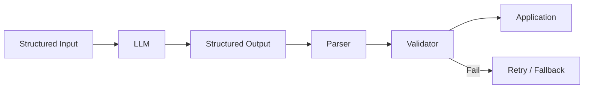
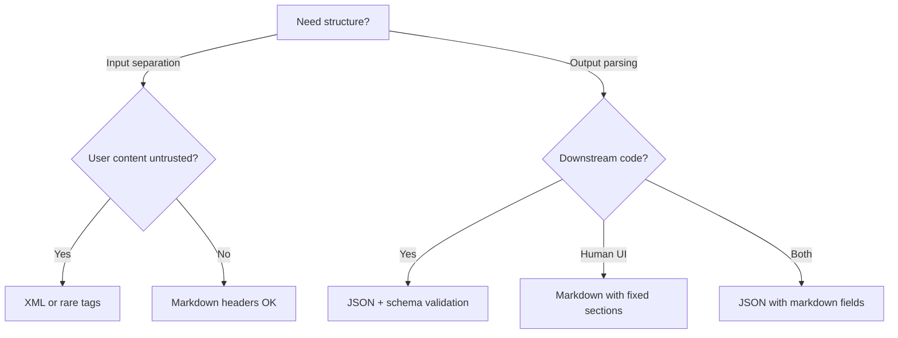
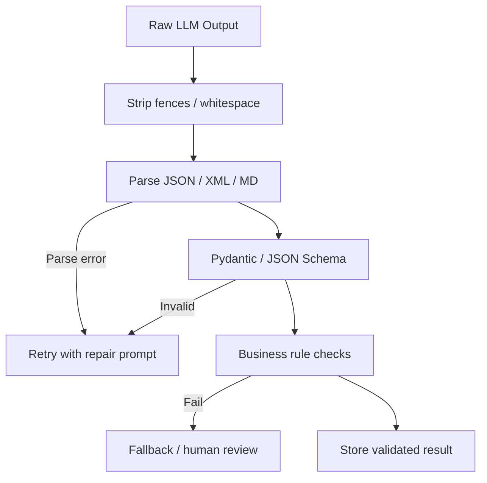

# Structured Prompting

> Section 7 of Phase 5 — structure is a contract. Whether you wrap inputs in XML tags, request JSON outputs, or format prompts in Markdown, structured prompting makes prompts parseable, testable, and safe to deploy at scale.

## Table of Contents

- [Why Structure Matters](#why-structure-matters)
- [Structured Prompting Styles Overview](#structured-prompting-styles-overview)
- [XML Prompting](#xml-prompting)
- [JSON Prompting](#json-prompting)
- [Markdown Prompting](#markdown-prompting)
- [Tagged Prompting](#tagged-prompting)
- [Comparing All Styles](#comparing-all-styles)
- [Hierarchy and Nesting](#hierarchy-and-nesting)
- [Parsing Strategies](#parsing-strategies)
- [Validation Pipelines](#validation-pipelines)
- [Production Workflows](#production-workflows)
- [Production Considerations](#production-considerations)
- [Common Mistakes](#common-mistakes)
- [Interview Preparation](#interview-preparation)
- [Navigation](#navigation)

---

## Why Structure Matters

Unstructured prompts work for prototyping. Production systems need structure for three reasons:

| Need | How Structure Helps |
|------|---------------------|
| **Reliability** | Model knows where instructions end and data begins |
| **Parsing** | Application code extracts outputs programmatically |
| **Safety** | Delimited untrusted content reduces injection surface |



> **Production Standard:** Structure both sides of the LLM call — structured input delimiters for untrusted content, structured output schemas for trusted parsing. Never rely on regex alone for business-critical extraction.

---

## Structured Prompting Styles Overview

| Style | Primary Use | Input / Output | Best For |
|-------|-------------|----------------|----------|
| XML | Section separation, Claude-optimized | Both | Complex multi-part prompts |
| JSON | Machine-readable contracts | Output (sometimes input) | API integration, tool calls |
| Markdown | Human-readable formatting | Output | Docs, reports, UI rendering |
| Tagged | Lightweight delimiters | Input | Simple section boundaries |

These styles compose. A common production pattern: XML-wrapped input → JSON output.

---

## XML Prompting

**XML prompting** uses angle-bracket tags to delineate sections of a prompt. Anthropic's models are particularly tuned for XML tag structure.

### When to Use

- Multi-document RAG with distinct source blocks
- Separating instructions, context, examples, and queries
- Claude API applications (first-class support in docs and training)

### When Not to Use

- Token-critical paths where tag overhead matters
- User content that frequently contains `<` characters (code-heavy input)
- Very simple single-field prompts

### Advantages

- Clear hierarchical nesting (`<doc><chunk>...</chunk></doc>`)
- Models reliably respect tag boundaries
- Self-documenting prompt structure for human reviewers

### Disadvantages

- Verbose — tags consume 5–15% more tokens than plain text
- Invalid XML in user content can confuse boundaries (rare but possible)
- Over-nesting reduces model attention to deep content

### XML Prompt Template

```xml
<system>
You are a compliance analyst. Answer questions using only the policies below.
If the answer is not in the policies, say "Not covered by policy."
</system>

<policies>
  <policy id="P001">
    {policy_text_1}
  </policy>
  <policy id="P002">
    {policy_text_2}
  </policy>
</policies>

<question>
{user_question}
</question>
```

### Production Considerations

- Use semantic tag names: `<document>`, `<query>`, `<example>` — not `<x>`.
- Include `id` attributes for citation: `<chunk id="c-42">`.
- Escape or strip `<` in user code content, or use CDATA sections.
- Anthropic system prompts can use XML directly; OpenAI typically uses role-based messages.

---

## JSON Prompting

**JSON prompting** requests or provides data in JSON format — either as the prompt structure or as the required output.

### When to Use

- Output consumed by application code (always)
- Passing structured configuration to the model
- Multi-field extraction with nested objects
- Tool argument generation

### When Not to Use

- Human-readable reports meant for direct display
- When provider schema-constrained generation is available (prefer API-level)

### Advantages

- Native parsing with `json.loads()` and Pydantic
- Unambiguous types and field names
- Integrates with JSON Schema validation and OpenAI structured outputs

### Disadvantages

- Models occasionally wrap JSON in markdown fences
- Truncation produces invalid JSON on long outputs
- Strict JSON disallows comments and trailing commas models sometimes emit

### JSON Output Prompt

```
Extract person information from the text below.

Return JSON matching this schema:
{
  "name": "string",
  "email": "string | null",
  "skills": ["string"],
  "years_experience": "integer | null"
}

Text:
{input_text}
```

### JSON Input Prompt

```json
{
  "task": "classify_support_ticket",
  "categories": ["billing", "technical", "account", "other"],
  "ticket": {
    "subject": "{subject}",
    "body": "{body}",
    "customer_tier": "{tier}"
  }
}
```

### Production Considerations

- Combine with `response_format` / schema-constrained generation.
- Validate with Pydantic; retry on `ValidationError`.
- Strip markdown fences in post-processing as a safety net.
- Set `max_tokens` with headroom for JSON overhead.

See [Structured Outputs](../llm-engineering/structured-outputs.md) for provider-specific implementation.

---

## Markdown Prompting

**Markdown prompting** uses markdown formatting — headers, lists, tables, code fences — to structure either the prompt or the expected output.

### When to Use

- Documentation generation, reports, wikis
- Human-in-the-loop review workflows
- Outputs rendered in web UIs (React markdown, Notion, etc.)

### When Not to Use

- Machine parsing without a markdown parser
- Strict schemas where free-form headers cause variability

### Advantages

- Human-readable without special tools
- Models excel at markdown generation
- Renders directly in most modern UIs

### Disadvantages

- Ambiguous structure ("was that a list or a paragraph?")
- Harder to validate than JSON
- Code fences inside markdown cause nesting issues

### Markdown Output Template

```
Analyze the codebase module below. Return markdown with exactly these sections:

## Summary
One paragraph overview.

## Issues
Bullet list of issues with severity (🔴 critical, 🟡 warning, 🟢 info).

## Recommendations
Numbered list of fixes, ordered by priority.

## Code Examples
Fenced code blocks for suggested fixes.

Module:
{source_code}
```

### Production Considerations

- Specify exact heading names for reliable section extraction.
- Use a markdown parser (e.g., `markdown-it`, `mistune`) for section splitting.
- Sanitize HTML output if rendering user-visible markdown (XSS risk).
- For mixed content, request JSON with markdown string fields instead of raw markdown.

---

## Tagged Prompting

**Tagged prompting** uses lightweight custom delimiters — not full XML — to separate prompt sections. Examples: `[INST]`, `###`, `---`, `<<<DOC>>>`.

### When to Use

- Simple delimiter needs without XML verbosity
- Legacy prompt formats (Llama `[INST]` tags)
- Quick section separation in internal tools

### When Not to Use

- Deep nesting (use XML instead)
- When delimiter string may appear in user content
- Cross-model portability is critical (tags are less standardized than XML/JSON)

### Advantages

- Minimal token overhead
- Fast to write and read
- Flexible — any delimiter you choose

### Disadvantages

- No standard — each team invents their own
- Collision risk with user content
- Weaker model priors than XML or JSON

### Tagged Template

```
### INSTRUCTIONS
Summarize the document below in 3 bullet points.

### DOCUMENT
{document}

### CONSTRAINTS
- Max 75 words total
- Preserve all statistics exactly

### OUTPUT
```

### Production Considerations

- Choose rare delimiters: `<<<DOCUMENT_START>>>` not `---`.
- Document your tag convention in a team style guide.
- Migrate to XML or JSON as prompt complexity grows.

---

## Comparing All Styles

| Criterion | XML | JSON | Markdown | Tagged |
|-----------|-----|------|----------|--------|
| Token efficiency | Low | Medium | Medium | High |
| Parse reliability | High | Highest | Low | Medium |
| Human readability | Medium | Low | Highest | High |
| Nesting support | Excellent | Excellent | Poor | Poor |
| Model compliance | High (Claude) | High | High | Variable |
| Injection resistance | Good | Good | Moderate | Moderate |
| Output validation | Manual / XPath | Schema + Pydantic | Section parsing | Manual |

### Decision Matrix



### Recommended Combinations

| Pattern | Input | Output |
|---------|-------|--------|
| RAG Q&A | XML chunks with IDs | Markdown + citations |
| Data extraction | XML or tagged text | JSON + Pydantic |
| Code review | Tagged code block | JSON findings array |
| Report generation | JSON config | Markdown sections |
| Agent tools | JSON tool definitions | JSON tool calls |

---

## Hierarchy and Nesting

Structured prompts need intentional hierarchy. Flat structure causes attention dilution; deep nesting buries content.

### Good Hierarchy (3 Levels Max)

```xml
<context>
  <document id="doc-1" title="API Spec">
    <section name="Authentication">
      {auth_content}
    </section>
    <section name="Endpoints">
      {endpoint_content}
    </section>
  </document>
</context>

<task>
  <instruction>Compare auth requirements across sections.</instruction>
  <format>JSON with fields: differences, recommendations</format>
</task>
```

### Hierarchy Principles

1. **Root tags define scope** — `<context>`, `<task>`, `<examples>`
2. **Attributes for metadata** — `id`, `type`, `priority` on tags, not in body
3. **Leaf nodes hold content** — deepest level is the actual text/data
4. **Instructions at boundaries** — before or after delimited blocks, not inside

### Anti-Patterns

| Anti-Pattern | Problem |
|--------------|---------|
| 6+ nesting levels | Model loses track of inner content |
| Mixed styles (XML + JSON + tags) | Unpredictable parsing |
| Instructions inside user data tags | Injection succeeds |
| Duplicate section names | Ambiguous references |

---

## Parsing Strategies

### Input Parsing (Application → Prompt)

Application code assembles structured prompts from templates:

```python
from xml.sax.saxutils import escape


def build_rag_prompt(chunks: list[dict], question: str) -> str:
    chunk_xml = "\n".join(
        f'  <chunk id="{c["id"]}" score="{c["score"]:.3f}">\n'
        f"    {escape(c['text'])}\n"
        f"  </chunk>"
        for c in chunks
    )
    return f"""<context>
{chunk_xml}
</context>

<question>
{escape(question)}
</question>"""
```

### Output Parsing (Model → Application)

```python
import json
import re
from pydantic import BaseModel, ValidationError


class ExtractionResult(BaseModel):
    name: str
    email: str | None = None
    skills: list[str] = []


def parse_json_output(raw: str) -> ExtractionResult:
    # Strip markdown fences if present
    cleaned = re.sub(r"^```(?:json)?\s*|\s*```$", "", raw.strip(), flags=re.MULTILINE)
    data = json.loads(cleaned)
    return ExtractionResult.model_validate(data)


def parse_markdown_sections(raw: str) -> dict[str, str]:
    sections: dict[str, str] = {}
    current_header = "preamble"
    current_lines: list[str] = []

    for line in raw.splitlines():
        if line.startswith("## "):
            sections[current_header] = "\n".join(current_lines).strip()
            current_header = line[3:].strip().lower().replace(" ", "_")
            current_lines = []
        else:
            current_lines.append(line)

    sections[current_header] = "\n".join(current_lines).strip()
    return sections
```

### Parsing Reliability Ranking

| Method | Reliability | Fallback |
|--------|-------------|----------|
| Schema-constrained JSON | 99%+ | Retry |
| JSON + fence stripping | 90–98% | Retry + regex |
| XML output | 85–95% | lxml / ElementTree |
| Markdown sections | 70–90% | Fuzzy header matching |
| Regex on free text | < 70% | Don't use in production |

---

## Validation Pipelines



### Validation Layers

| Layer | Checks | Action on Fail |
|-------|--------|----------------|
| Syntactic | Valid JSON/XML | Retry (max 2) |
| Schema | Field types, required fields | Retry with error message |
| Semantic | Business rules (e.g., date ranges) | Reject or flag |
| Safety | PII, toxicity, policy | Block and log |

### Repair Prompt Pattern

```
Your previous response was invalid JSON. Error: {error_message}

Return corrected JSON only. No commentary.

Previous response:
{invalid_output}
```

---

## Production Workflows

### Workflow 1: Structured RAG Pipeline

```
1. Retrieve chunks → wrap in XML with source IDs
2. Assemble prompt from template + XML context
3. Request JSON output with answer + citations
4. Validate JSON with Pydantic
5. Render citations in UI
```

### Workflow 2: Document Generation

```
1. Load JSON config (audience, tone, sections)
2. Build markdown-structured prompt
3. Generate markdown output
4. Parse sections by ## headers
5. Store each section in CMS fields
```

### Workflow 3: Extraction with Verification

```
1. Tagged input with source document
2. JSON extraction output
3. Schema validation
4. Second LLM call: verify each field against source (quote spans)
5. Accept only verified fields
```

### CI Integration

```yaml
# .github/workflows/prompt-eval.yml
- name: Run structured prompt evals
  run: |
    pytest evals/structured/ --model gpt-4o-mini
    # Fails if JSON parse rate < 98% or schema validation < 95%
```

---

## Production Considerations

### Model-Specific Preferences

| Model Family | Preferred Input Style | Output Notes |
|--------------|----------------------|--------------|
| Claude | XML tags | Strong XML compliance |
| GPT-4o | Role messages + JSON schema | Use structured outputs API |
| Gemini | JSON / schema | `response_schema` parameter |
| Open models | Tagged / simple XML | May need few-shot format examples |

### Token Budget Impact

| Style | Overhead per Section |
|-------|---------------------|
| XML tags | ~10–20 tokens |
| JSON keys | ~5–15 tokens |
| Markdown headers | ~3–5 tokens |
| Custom tags | ~5–10 tokens |

### Caching

Structured system prompts with fixed structure prefix well with KV cache and provider prompt caching. Variable content goes in user message after the stable prefix.

### Observability

Log structured parse success rates:

```python
metrics.increment("llm.structured.parse_success", tags={"format": "json"})
metrics.increment("llm.structured.validation_fail", tags={"field": "email"})
```

---

## Common Mistakes

| Mistake | Impact | Fix |
|---------|--------|-----|
| JSON output without schema enforcement | Parse failures | API schema + Pydantic |
| User content unescaped in XML | Broken boundaries / injection | `escape()` user text |
| Markdown output without fixed headers | Unparseable sections | Specify exact ## names |
| No retry on parse failure | User-facing errors | Repair prompt + retry |
| Mixing 4 delimiter styles in one prompt | Model confusion | One style per prompt |

---

## Interview Preparation

### Frequently Asked Questions

**Q1: When would you choose XML over JSON for prompt input structure?**

> **Strong answer:** XML for multi-part inputs with nesting and metadata attributes — RAG chunks with IDs, multi-document context, examples with labels. JSON for machine-generated inputs or when the prompt itself is built programmatically. XML has stronger Claude compliance; JSON is better when the input is already JSON from your database.

**Q2: How do you handle LLM outputs that are almost-valid JSON?**

> **Strong answer:** Layered defense: (1) schema-constrained generation at API level, (2) strip markdown fences, (3) Pydantic validation, (4) retry with repair prompt showing the error, (5) fallback to simpler format or human review. Log failure patterns to improve prompts. Never regex-fix arbitrary JSON in production.

**Q3: Compare structured prompting to structured outputs at the API level.**

> **Strong answer:** Structured prompting is instruction-based — the model may still deviate. Structured outputs (JSON Schema mode) constrain token generation — syntactically valid output is guaranteed. Use both: structured prompting for input separation and clarity, API-level schema for output reliability. Always validate with Pydantic regardless.

### Real-World Scenario

**Scenario:** Your extraction pipeline returns valid JSON 85% of the time. The rest breaks your downstream pipeline.

> **Discussion points:** Move from prompt-only JSON to schema-constrained generation. Add Pydantic validation with retry. Analyze failures: truncation? Wrong types? Fences? Increase max_tokens. Add few-shot JSON examples. Target 99%+ with layered approach.

---

## Navigation

### Prerequisites

- [Prompt Patterns](prompt-patterns.md) — Section 5
- [Structured Outputs](../llm-engineering/structured-outputs.md)

### Related Topics

- [Prompt Templates Guide](prompt-templates-guide.md)
- [Prompting Strategies](prompting-strategies.md)
- [Validation for AI APIs](../backend-engineering/validation-for-ai-apis.md)

### Next Topics

- [Prompting Strategies](prompting-strategies.md) — Section 8

### Future Reading

- [Context Engineering](../context-engineering/README.md)
- [Function Calling and Tools](../llm-engineering/function-calling-and-tools.md)

---

## See Also

- [Prompt Patterns — Delimiter Prompting](prompt-patterns.md#delimiter-prompting)
- [JSON Output Templates](../../prompts/templates/README.md)

## Changelog

| Version | Date | Changes |
|---------|------|---------|
| 1.0 | 2026-07-13 | Initial version — Section 7 |
