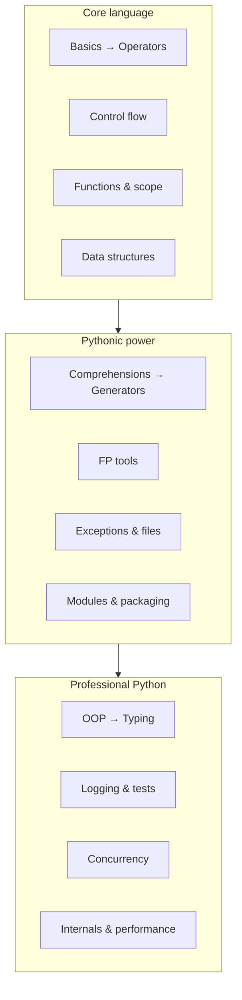

# Python

> Complete Python curriculum for AI engineers — from language basics to concurrency, internals, and clean production practices.

**Prerequisites:** None  
**Unlocks:** [Python Frameworks & Libraries](../python-frameworks-libraries/README.md) · [LLM Application Development](../llm-application-development/README.md)

Start with the **Topics** table below (or expand **1. Python** in the left sidebar). Each page has definitions, uses, types, diagrams, and commented examples.

---

## Topics

Click any topic to go deep.

| # | Topic | Document |
|---|-------|----------|
| 1 | Python Basics | [topics/01-python-basics.md](topics/01-python-basics.md) |
| 2 | Variables & Data Types | [topics/02-variables-data-types.md](topics/02-variables-data-types.md) |
| 3 | Operators | [topics/03-operators.md](topics/03-operators.md) |
| 4 | Conditional Statements | [topics/04-conditional-statements.md](topics/04-conditional-statements.md) |
| 5 | Loops | [topics/05-loops.md](topics/05-loops.md) |
| 6 | Functions | [topics/06-functions.md](topics/06-functions.md) |
| 7 | Scope & Namespaces | [topics/07-scope-namespaces.md](topics/07-scope-namespaces.md) |
| 8 | Strings | [topics/08-strings.md](topics/08-strings.md) |
| 9 | Lists | [topics/09-lists.md](topics/09-lists.md) |
| 10 | Tuples | [topics/10-tuples.md](topics/10-tuples.md) |
| 11 | Sets | [topics/11-sets.md](topics/11-sets.md) |
| 12 | Dictionaries | [topics/12-dictionaries.md](topics/12-dictionaries.md) |
| 13 | List/Set/Dictionary Comprehensions | [topics/13-comprehensions.md](topics/13-comprehensions.md) |
| 14 | Iterators & Iterables | [topics/14-iterators-iterables.md](topics/14-iterators-iterables.md) |
| 15 | Generators | [topics/15-generators.md](topics/15-generators.md) |
| 16 | Lambda Functions | [topics/16-lambda-functions.md](topics/16-lambda-functions.md) |
| 17 | `map()`, `filter()`, `reduce()` | [topics/17-map-filter-reduce.md](topics/17-map-filter-reduce.md) |
| 18 | Exception Handling | [topics/18-exception-handling.md](topics/18-exception-handling.md) |
| 19 | File Handling | [topics/19-file-handling.md](topics/19-file-handling.md) |
| 20 | Modules & Packages | [topics/20-modules-packages.md](topics/20-modules-packages.md) |
| 21 | Virtual Environments | [topics/21-virtual-environments.md](topics/21-virtual-environments.md) |
| 22 | Package Management | [topics/22-package-management.md](topics/22-package-management.md) |
| 23 | Object-Oriented Programming | [topics/23-oop.md](topics/23-oop.md) |
| 24 | Dataclasses | [topics/24-dataclasses.md](topics/24-dataclasses.md) |
| 25 | Decorators | [topics/25-decorators.md](topics/25-decorators.md) |
| 26 | Context Managers | [topics/26-context-managers.md](topics/26-context-managers.md) |
| 27 | Type Hints | [topics/27-type-hints.md](topics/27-type-hints.md) |
| 28 | Regular Expressions | [topics/28-regular-expressions.md](topics/28-regular-expressions.md) |
| 29 | Functional Programming | [topics/29-functional-programming.md](topics/29-functional-programming.md) |
| 30 | Logging | [topics/30-logging.md](topics/30-logging.md) |
| 31 | Unit Testing | [topics/31-unit-testing.md](topics/31-unit-testing.md) |
| 32 | Debugging | [topics/32-debugging.md](topics/32-debugging.md) |
| 33 | Concurrency | [topics/33-concurrency.md](topics/33-concurrency.md) |
| 34 | Multithreading | [topics/34-multithreading.md](topics/34-multithreading.md) |
| 35 | Multiprocessing | [topics/35-multiprocessing.md](topics/35-multiprocessing.md) |
| 36 | Asynchronous Programming | [topics/36-asynchronous-programming.md](topics/36-asynchronous-programming.md) |
| 37 | Memory Management | [topics/37-memory-management.md](topics/37-memory-management.md) |
| 38 | Python Internals | [topics/38-python-internals.md](topics/38-python-internals.md) |
| 39 | Performance Optimization | [topics/39-performance-optimization.md](topics/39-performance-optimization.md) |
| 40 | Clean Code & Python Best Practices | [topics/40-clean-code-best-practices.md](topics/40-clean-code-best-practices.md) |

---

## Definition

**Python** is a high-level, dynamically typed language and the default stack for AI engineering: model SDKs, data tooling, APIs, agents, and eval harnesses. This handbook is a **click-through curriculum** — each topic has definitions, uses, types/variants, diagrams, and commented code examples.

---

## Learning path

| Stage | Topics | Focus |
|-------|--------|-------|
| Foundations | 1–7 | Syntax, control flow, functions, scope |
| Data & text | 8–13 | Strings and collections + comprehensions |
| Iteration & FP | 14–17 | Iterators, generators, lambda, map/filter/reduce |
| I/O & project layout | 18–22 | Errors, files, modules, venv, packages |
| Modern OOP & quality | 23–32 | Classes, dataclasses, decorators, typing, tests, debug |
| Scale & craft | 33–40 | Concurrency, memory, internals, performance, clean code |

---

## Production deep dive

After the curriculum (or in parallel from topic 21+), read the AI-service oriented guide:

| Document | Description |
|----------|-------------|
| [Python for AI Engineering](python-for-ai-engineering.md) | uv/pip, typing, async, concurrency, project layout for LLM apps |

---

## Related topics

- [Python Frameworks & Libraries](../python-frameworks-libraries/README.md)
- [FastAPI](../fastapi/README.md)
- [Backend Engineering](../backend-engineering/README.md)

---

## See also

- [Domains overview](../README.md)
- [Learning Roadmap](../../meta/roadmap.md)
- [Master Index](../../meta/indexes/MASTER-INDEX.md)
