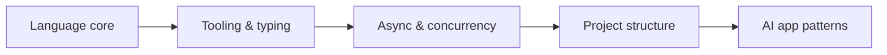

# Python

> Python language patterns, tooling, and best practices for AI applications.

**Prerequisites:** None  
**Unlocks:** [Python Frameworks & Libraries](../python-frameworks-libraries/README.md) · [LLM Application Development](../llm-application-development/README.md)

---

## Definition

**Python** is the dominant language for AI engineering: model SDKs, data tooling, APIs, and orchestration. This handbook focuses on production-grade Python — typing, async, packaging, and project structure — not beginner syntax.

---

## Learning path

---

## Documents

| # | Topic | Document |
|---|-------|----------|
| 1 | Python for AI Engineering | [python-for-ai-engineering.md](python-for-ai-engineering.md) |

---

## Related topics

- [Python Frameworks & Libraries](../python-frameworks-libraries/README.md)
- [FastAPI](../fastapi/README.md)
- [Backend Engineering](../backend-engineering/README.md)

---

## See also

- [Domains overview](../README.md)
- [Learning Roadmap](../../meta/roadmap.md)
- [Master Index](../../meta/indexes/MASTER-INDEX.md)
