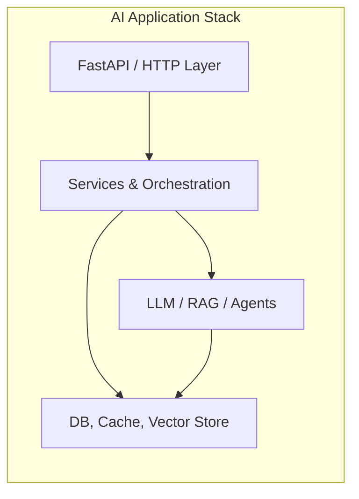
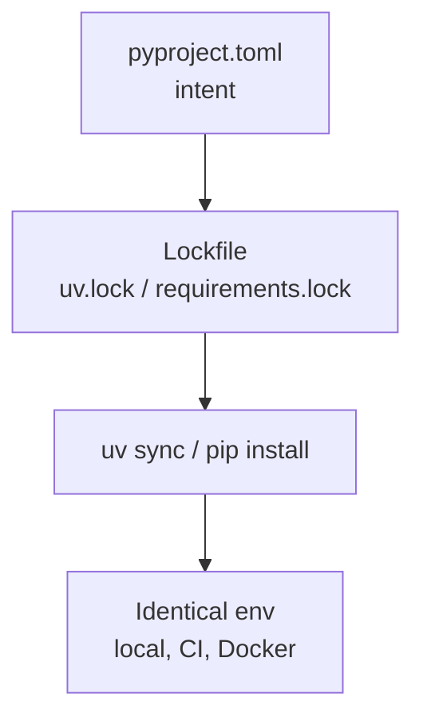
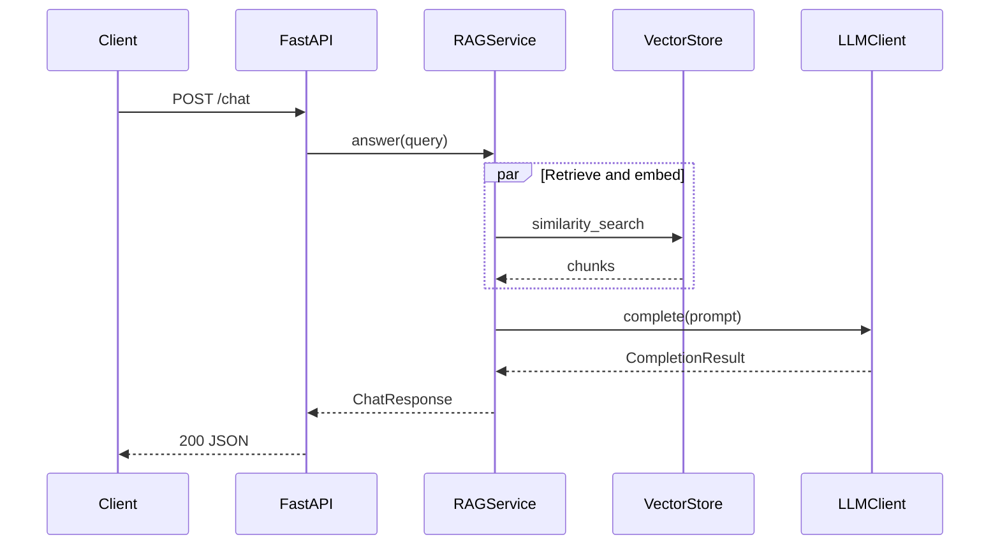
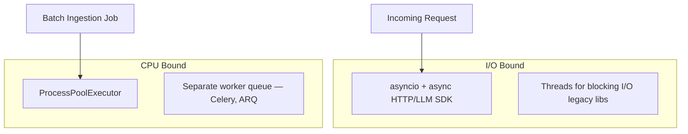

# Python for AI Engineering

> Production-oriented Python reference for software engineers building AI systems — covering dependency management, async I/O, typing, data validation, concurrency, and project layout patterns you will use daily in LLM services, RAG pipelines, and agent runtimes.

## Table of Contents

- [Why Python Matters for AI Engineering](#why-python-matters-for-ai-engineering)
- [Virtual Environments](#virtual-environments)
- [uv: Modern Python Tooling](#uv-modern-python-tooling)
- [pip and Package Management](#pip-and-package-management)
- [Dependency Locking](#dependency-locking)
- [Project Layouts for AI Applications](#project-layouts-for-ai-applications)
- [Typing](#typing)
- [Dataclasses](#dataclasses)
- [Pydantic](#pydantic)
- [Async Programming](#async-programming)
- [Concurrency and Multiprocessing](#concurrency-and-multiprocessing)
- [Context Managers](#context-managers)
- [Generators](#generators)
- [Decorators](#decorators)
- [Logging](#logging)
- [pathlib](#pathlib)
- [Reusable Utilities](#reusable-utilities)
- [Production Considerations](#production-considerations)
- [Common Mistakes](#common-mistakes)
- [Best Practices](#best-practices)
- [Interview Preparation](#interview-preparation)
- [Navigation](#navigation)

---

## Why Python Matters for AI Engineering

Python is the default implementation language for AI application backends, agent frameworks, data pipelines, and evaluation harnesses.
You are not learning Python syntax here — you are learning the patterns that keep AI services reliable under load, testable across providers, and maintainable as teams grow.



Most production failures in Python AI codebases trace to tooling drift, blocking I/O in async handlers, untyped boundaries between layers, or shared mutable state across workers — not to misunderstanding list comprehensions.
This document targets those failure modes.

> **Production Standard:** Pin dependencies, type your boundaries, keep I/O async at the framework layer, and isolate CPU-bound work from the event loop.

---

## Virtual Environments

A virtual environment isolates project dependencies from the system Python and from other projects.
For AI services this matters because transitive dependency trees are large (`openai`, `langchain`, `torch`, `numpy`) and version conflicts are common.

### When to Use What

| Approach | Use Case | Notes |
|----------|----------|-------|
| `python -m venv .venv` | Standard, universal | Built into Python 3.3+; works everywhere |
| `uv venv` | Fast env creation with uv workflow | Creates `.venv` in milliseconds |
| Conda/mamba | GPU/CUDA stacks, scientific stacks | Heavier; common in ML research, less in API services |
| Docker | Production deployment | Env inside image; not a substitute for lockfiles locally |

### Production-Oriented Setup

```bash
# Create and activate (stdlib venv)
python3.12 -m venv .venv
source .venv/bin/activate   # Linux/macOS
# .venv\Scripts\activate    # Windows

# Verify you are not using system site-packages
python -c "import sys; print(sys.prefix)"
# Should print .../your-project/.venv
```

```bash
# uv equivalent — preferred for new projects
uv venv --python 3.12
source .venv/bin/activate
```

> **Warning:** Never install project dependencies into the system Python on a server or laptop.
> CI images and local dev must use the same Python minor version (e.g., 3.12.x everywhere).

### `.gitignore` Convention

```text
.venv/
__pycache__/
*.py[cod]
.pytest_cache/
.mypy_cache/
.ruff_cache/
dist/
*.egg-info/
```

Commit `pyproject.toml` and lockfiles; never commit `.venv/`.

---

## uv: Modern Python Tooling

[uv](https://docs.astral.sh/uv/) is a Rust-based Python package and project manager that replaces slow `pip install` loops, manual venv juggling, and ad-hoc `requirements.txt` maintenance.
For AI engineering teams, uv's speed matters when rebuilding Docker layers or CI caches that pull dozens of packages.

### Core Commands

```bash
# Initialize a new project
uv init ai-service
cd ai-service

# Add runtime dependencies
uv add fastapi uvicorn pydantic-settings openai

# Add dev dependencies
uv add --dev pytest pytest-asyncio ruff mypy

# Sync environment exactly to lockfile
uv sync

# Run commands inside the project env without manual activation
uv run pytest
uv run uvicorn app.main:app --reload
```

### `pyproject.toml` with uv

```toml
[project]
name = "ai-service"
version = "0.1.0"
requires-python = ">=3.12"
dependencies = [
    "fastapi>=0.115.0",
    "uvicorn[standard]>=0.32.0",
    "pydantic>=2.10.0",
    "pydantic-settings>=2.6.0",
    "openai>=1.57.0",
    "httpx>=0.28.0",
]

[dependency-groups]
dev = [
    "pytest>=8.3.0",
    "pytest-asyncio>=0.24.0",
    "ruff>=0.8.0",
    "mypy>=1.13.0",
]

[tool.uv]
dev-dependencies = []

[tool.ruff]
target-version = "py312"
line-length = 100

[tool.mypy]
python_version = "3.12"
strict = true
```

> **Tip:** Use `uv lock` and commit `uv.lock` so CI, Docker builds, and teammates resolve identical dependency graphs.

---

## pip and Package Management

`pip` remains the underlying installer in many environments.
Understand it even when uv is your primary tool — production containers and legacy pipelines still invoke pip directly.

### Install Patterns

```bash
# Install from pyproject (PEP 517)
pip install .

# Editable install for local development
pip install -e ".[dev]"

# Install from constraints (reproducible subset of versions)
pip install -r requirements.txt -c constraints.txt
```

### Extras for Optional AI Stacks

Define optional dependency groups in `pyproject.toml` so lightweight API images do not pull GPU libraries:

```toml
[project.optional-dependencies]
rag = ["chromadb>=0.5.0", "tiktoken>=0.8.0"]
eval = ["ragas>=0.2.0", "deepeval>=1.0.0"]
```

```bash
uv sync --extra rag
# or: pip install -e ".[rag]"
```

### Dependency Resolution Pitfalls

| Problem | Symptom | Mitigation |
|---------|---------|------------|
| Unpinned transitive deps | "Works on my machine" breakages | Lockfile (`uv.lock`, `pip-tools`) |
| Conflicting CUDA/torch builds | Import errors at runtime | Separate optional extras; document base image |
| Stale `requirements.txt` | Drift from `pyproject.toml` | Generate from lockfile; never hand-edit both |
| Global installs | Wrong package version imported | Always use venv + `which python` checks |

---

## Dependency Locking

Lockfiles record the exact resolved versions of every direct and transitive dependency.
For AI services, a single unlocked week can change tokenizer behavior, API client defaults, or numpy ABI — causing silent eval regressions.



### uv Lock Workflow

```bash
# After changing dependencies in pyproject.toml
uv lock
uv sync

# CI pattern
uv sync --frozen   # fail if lockfile out of date
uv run pytest
```

### pip-tools Alternative

```bash
pip install pip-tools
pip-compile pyproject.toml -o requirements.txt
pip-compile pyproject.toml --extra dev -o requirements-dev.txt
pip-sync requirements.txt requirements-dev.txt
```

> **Production Standard:** Treat lockfile updates as a reviewed change — run tests and eval suites after bumping LLM client or embedding libraries.

---

## Project Layouts for AI Applications

Structure code so AI orchestration, HTTP transport, and infrastructure are separable.
See [Software Engineering for AI](../foundations/software-engineering-for-ai.md) for architectural rationale.

### Recommended Layout (Service)

```text
ai-service/
├── pyproject.toml
├── uv.lock
├── .env.example
├── Dockerfile
├── src/
│   └── ai_service/
│       ├── __init__.py
│       ├── main.py                 # app factory, lifespan
│       ├── config/
│       │   └── settings.py
│       ├── api/
│       │   ├── routes/
│       │   ├── schemas/            # request/response Pydantic models
│       │   └── dependencies.py     # DI wiring
│       ├── domain/
│       │   ├── entities/
│       │   ├── services/           # RAG, agent orchestration
│       │   ├── ports/              # LLMClient, VectorStore ABCs
│       │   └── prompts/
│       └── infrastructure/
│           ├── llm/
│           ├── vector_store/
│           └── cache/
├── tests/
│   ├── unit/
│   ├── integration/
│   └── conftest.py
└── scripts/
    └── ingest_documents.py
```

### Layout Principles

| Layer | Responsibility | AI Example |
|-------|----------------|------------|
| `api/` | HTTP, validation, auth | `POST /chat` body parsing |
| `domain/services/` | Use cases | `RAGService.answer(query)` |
| `domain/ports/` | Interfaces | `LLMClient`, `EmbeddingModel` |
| `infrastructure/` | SDK implementations | `OpenAIClient`, `PgVectorStore` |
| `config/` | Settings from env | `OPENAI_API_KEY`, model names |

### Package vs. Flat Layout

Use `src/` layout (`src/ai_service/`) so tests import the installed package, not accidental local modules.
This catches packaging mistakes before production.

```toml
# pyproject.toml
[build-system]
requires = ["hatchling"]
build-backend = "hatchling.build"

[tool.hatch.build.targets.wheel]
packages = ["src/ai_service"]
```

---

## Typing

Static typing documents contracts between layers and catches integration errors before runtime.
In AI codebases, the highest-value types live at boundaries: API schemas, port interfaces, and pipeline step inputs/outputs.

### Modern Typing Patterns (3.11+)

```python
from collections.abc import AsyncIterator, Sequence
from typing import TypeVar, Protocol, runtime_checkable

T = TypeVar("T")


@runtime_checkable
class Embedder(Protocol):
    async def embed(self, texts: Sequence[str]) -> list[list[float]]: ...


def top_k[T](items: Sequence[T], k: int, key: callable[[T], float]) -> list[T]:
    return sorted(items, key=key, reverse=True)[:k]


async def stream_tokens(client: Embedder, text: str) -> AsyncIterator[list[float]]:
    vectors = await client.embed([text])
    yield vectors[0]
```

### Typed Settings and Ports

```python
# domain/ports/llm.py
from abc import ABC, abstractmethod
from dataclasses import dataclass


@dataclass(frozen=True, slots=True)
class CompletionResult:
    content: str
    model: str
    input_tokens: int
    output_tokens: int


class LLMClient(ABC):
    @abstractmethod
    async def complete(self, prompt: str, *, system: str = "") -> CompletionResult: ...
```

### mypy Configuration for Services

```toml
[tool.mypy]
python_version = "3.12"
strict = true
warn_return_any = true
disallow_untyped_defs = true
plugins = ["pydantic.mypy"]
```

> **Tip:** Type the ports and domain layer strictly; external SDK wrappers may need targeted `# type: ignore` with a comment explaining why.

---

## Dataclasses

`dataclasses` are ideal for immutable value objects inside the domain layer — retrieval results, token usage records, chunk metadata.
Prefer them over untyped dicts for anything that crosses function boundaries repeatedly.

```python
from dataclasses import dataclass, field
from datetime import datetime
from uuid import UUID, uuid4


@dataclass(frozen=True, slots=True)
class DocumentChunk:
    id: UUID
    document_id: UUID
    text: str
    token_count: int
    metadata: dict[str, str] = field(default_factory=dict)

    @staticmethod
    def from_raw(document_id: UUID, text: str, **meta: str) -> "DocumentChunk":
        return DocumentChunk(
            id=uuid4(),
            document_id=document_id,
            text=text,
            token_count=len(text.split()),  # replace with tiktoken in production
            metadata=meta,
        )


@dataclass(slots=True)
class RetrievalResult:
    query: str
    chunks: list[DocumentChunk]
    retrieved_at: datetime = field(default_factory=datetime.utcnow)

    @property
    def context_text(self) -> str:
        return "\n\n".join(c.text for c in self.chunks)
```

### Dataclass vs. Pydantic

| Concern | Dataclass | Pydantic |
|---------|-----------|----------|
| HTTP request validation | No | Yes |
| JSON schema generation | Manual | Built-in |
| Immutability | `frozen=True` | `model_config = ConfigDict(frozen=True)` |
| Domain internals | Preferred | Use at edges |
| Performance (hot paths) | Slightly leaner | Small overhead; acceptable at boundaries |

Use dataclasses inside domain logic; use Pydantic at API and config edges.

---

## Pydantic

Pydantic v2 validates and serializes data at system boundaries: HTTP payloads, webhook callbacks, tool-call arguments from LLMs, and environment configuration.

### API Schemas

```python
from enum import StrEnum
from pydantic import BaseModel, Field, field_validator


class MessageRole(StrEnum):
    SYSTEM = "system"
    USER = "user"
    ASSISTANT = "assistant"


class ChatMessage(BaseModel):
    role: MessageRole
    content: str = Field(min_length=1, max_length=32_000)

    @field_validator("content")
    @classmethod
    def strip_content(cls, v: str) -> str:
        return v.strip()


class ChatRequest(BaseModel):
    messages: list[ChatMessage] = Field(min_length=1)
    model: str = "gpt-4o-mini"
    temperature: float = Field(default=0.2, ge=0.0, le=2.0)
    stream: bool = False


class ChatResponse(BaseModel):
    message: ChatMessage
    input_tokens: int
    output_tokens: int
    model: str
```

### Settings from Environment

```python
from pydantic import SecretStr
from pydantic_settings import BaseSettings, SettingsConfigDict


class Settings(BaseSettings):
    model_config = SettingsConfigDict(
        env_file=".env",
        env_file_encoding="utf-8",
        extra="ignore",
    )

    openai_api_key: SecretStr
    default_model: str = "gpt-4o-mini"
    request_timeout_seconds: float = 30.0
    log_level: str = "INFO"
    vector_store_url: str = "http://localhost:6333"


settings = Settings()  # fail fast at import if required vars missing
```

### Validating LLM Tool Arguments

```python
from pydantic import BaseModel, ValidationError


class SearchQuery(BaseModel):
    query: str = Field(min_length=3)
    top_k: int = Field(default=5, ge=1, le=20)


def parse_tool_call(raw: dict) -> SearchQuery:
    try:
        return SearchQuery.model_validate(raw)
    except ValidationError as exc:
        raise ValueError(f"Invalid tool arguments: {exc}") from exc
```

> **Warning:** Never pass unvalidated LLM JSON directly to SQL, shell, or file paths.
> Pydantic-validate tool inputs first.

---

## Async Programming

AI services spend most of their time waiting: LLM APIs, vector DB queries, Redis, HTTP callbacks.
Async I/O keeps a single worker process handling many concurrent requests without thread-per-request overhead.



### Async Service Pattern

```python
import asyncio
import logging
from openai import AsyncOpenAI

from domain.ports.llm import CompletionResult, LLMClient

logger = logging.getLogger(__name__)


class OpenAIClient(LLMClient):
    def __init__(self, api_key: str, model: str, timeout: float = 30.0):
        self._client = AsyncOpenAI(api_key=api_key, timeout=timeout)
        self._model = model

    async def complete(self, prompt: str, *, system: str = "") -> CompletionResult:
        messages: list[dict[str, str]] = []
        if system:
            messages.append({"role": "system", "content": system})
        messages.append({"role": "user", "content": prompt})

        response = await self._client.chat.completions.create(
            model=self._model,
            messages=messages,
        )
        usage = response.usage
        choice = response.choices[0]
        return CompletionResult(
            content=choice.message.content or "",
            model=response.model,
            input_tokens=usage.prompt_tokens if usage else 0,
            output_tokens=usage.completion_tokens if usage else 0,
        )


async def gather_with_concurrency(
    coros: list,
    *,
    limit: int = 10,
) -> list:
    """Run many async LLM/HTTP calls with a bounded semaphore."""
    semaphore = asyncio.Semaphore(limit)

    async def _run(coro):
        async with semaphore:
            return await coro

    return await asyncio.gather(*[_run(c) for c in coros])
```

### Async Rules for FastAPI Services

| Rule | Reason |
|------|--------|
| `async def` routes call async I/O | Non-blocking event loop |
| Never call `time.sleep()` in async code | Use `asyncio.sleep()` |
| Do not block the loop with CPU work | Offload to `run_in_executor` or workers |
| Use `httpx.AsyncClient` / async SDKs | Sync `requests` blocks all requests |
| Set timeouts on every external call | Prevents hung workers under provider slowness |

```python
# BAD — blocks the entire event loop
@app.get("/slow")
async def slow():
    import time
    time.sleep(5)
    return {"ok": True}

# GOOD — async sleep yields control
@app.get("/slow")
async def slow():
    await asyncio.sleep(5)
    return {"ok": True}
```

---

## Concurrency and Multiprocessing

**Concurrency** (asyncio, threads) suits I/O-bound work.
**Multiprocessing** suits CPU-bound work: document chunking, embedding batches with local models, PDF parsing, image preprocessing.



### Thread Pool for Blocking Libraries

```python
import asyncio
from concurrent.futures import ThreadPoolExecutor
from functools import partial

_executor = ThreadPoolExecutor(max_workers=4)


async def run_blocking(func, /, *args, **kwargs):
    loop = asyncio.get_running_loop()
    return await loop.run_in_executor(_executor, partial(func, *args, **kwargs))


# Usage in async route: legacy sync PDF parser
async def extract_text(path: str) -> str:
    return await run_blocking(_sync_extract_pdf, path)
```

### Process Pool for CPU-Bound Batches

```python
from concurrent.futures import ProcessPoolExecutor
import asyncio


def chunk_document(text: str, chunk_size: int = 512) -> list[str]:
    words = text.split()
    return [" ".join(words[i : i + chunk_size]) for i in range(0, len(words), chunk_size)]


async def chunk_many(documents: list[str]) -> list[list[str]]:
    loop = asyncio.get_running_loop()
    with ProcessPoolExecutor(max_workers=4) as pool:
        tasks = [
            loop.run_in_executor(pool, chunk_document, doc)
            for doc in documents
        ]
        return await asyncio.gather(*tasks)
```

### Choosing a Model

| Workload | Mechanism | Example |
|----------|-----------|---------|
| LLM API calls | asyncio + semaphore | 50 concurrent chats |
| Vector DB queries | asyncio | Parallel retrieval + rerank |
| Local embedding model | Process pool or dedicated GPU worker | Sentence-transformers |
| File parsing at ingest | Background job queue | ARQ, Celery, Temporal |
| Shared in-memory state | None across processes | Use Redis/DB instead |

> **Important:** `multiprocessing` on Linux defaults to `fork`.
> Open HTTP clients and DB pools before forking cause subtle bugs — create pools after fork or use `spawn` context for clean workers.

---

## Context Managers

Context managers guarantee setup and teardown — connections, files, locks, tracing spans.
Use them anywhere acquisition and release must pair, even across exceptions.

### `contextlib` for Custom Resources

```python
from contextlib import asynccontextmanager, contextmanager
import time
import logging

logger = logging.getLogger(__name__)


@contextmanager
def timed_operation(name: str):
    start = time.perf_counter()
    try:
        yield
    finally:
        elapsed_ms = (time.perf_counter() - start) * 1000
        logger.info("operation_complete", extra={"operation": name, "elapsed_ms": elapsed_ms})


@asynccontextmanager
async def llm_request_context(client, model: str):
    logger.debug("llm_request_start", extra={"model": model})
    try:
        yield
    except Exception:
        logger.exception("llm_request_failed", extra={"model": model})
        raise
    else:
        logger.debug("llm_request_success", extra={"model": model})
```

### FastAPI Lifespan

```python
from contextlib import asynccontextmanager
from fastapi import FastAPI
import httpx


@asynccontextmanager
async def lifespan(app: FastAPI):
  http_client = httpx.AsyncClient(timeout=30.0)
  app.state.http_client = http_client
  try:
      yield
  finally:
      await http_client.aclose()


app = FastAPI(lifespan=lifespan)
```

### When to Use

| Pattern | Tool |
|---------|------|
| Files | `open()` or `Path.open()` |
| DB transactions | `async with session.begin()` |
| Locks | `async with semaphore` |
| Temporary env vars | `contextlib.contextmanager` |
| App startup/shutdown | FastAPI `lifespan` |

---

## Generators

Generators process sequences lazily — essential for streaming LLM tokens, paginating large document sets, and keeping memory flat during ingestion.

### Streaming Tokens

```python
from collections.abc import AsyncIterator, Iterator


async def stream_completion(client, prompt: str) -> AsyncIterator[str]:
    stream = await client.chat.completions.create(
        model="gpt-4o-mini",
        messages=[{"role": "user", "content": prompt}],
        stream=True,
    )
    async for chunk in stream:
        delta = chunk.choices[0].delta.content
        if delta:
            yield delta


def batched(items: Iterator[str], size: int) -> Iterator[list[str]]:
    batch: list[str] = []
    for item in items:
        batch.append(item)
        if len(batch) >= size:
            yield batch
            batch = []
    if batch:
        yield batch
```

### Pagination Without Loading Everything

```python
from collections.abc import Iterator
from pathlib import Path


def iter_jsonl(path: Path) -> Iterator[dict]:
    with path.open(encoding="utf-8") as f:
        for line in f:
            line = line.strip()
            if line:
                import json
                yield json.loads(line)
```

> **Tip:** Prefer async generators (`async def` + `yield`) when producing streamed HTTP responses with Starlette/FastAPI `StreamingResponse`.

---

## Decorators

Decorators wrap cross-cutting behavior: retries, caching, auth checks, timing, and circuit breaking.
Keep decorators thin; business logic stays in the wrapped function.

### Retry with Exponential Backoff

```python
import asyncio
import functools
import logging
import random
from collections.abc import Callable, Coroutine
from typing import ParamSpec, TypeVar

P = ParamSpec("P")
R = TypeVar("R")
logger = logging.getLogger(__name__)


def async_retry(
    *,
    attempts: int = 3,
    base_delay: float = 0.5,
    max_delay: float = 8.0,
    retry_on: tuple[type[Exception], ...] = (Exception,),
) -> Callable[[Callable[P, Coroutine[None, None, R]]], Callable[P, Coroutine[None, None, R]]]:
    def decorator(fn: Callable[P, Coroutine[None, None, R]]) -> Callable[P, Coroutine[None, None, R]]:
        @functools.wraps(fn)
        async def wrapper(*args: P.args, **kwargs: P.kwargs) -> R:
            delay = base_delay
            for attempt in range(1, attempts + 1):
                try:
                    return await fn(*args, **kwargs)
                except retry_on as exc:
                    if attempt == attempts:
                        raise
                    jitter = random.uniform(0, delay * 0.1)
                    sleep_for = min(delay + jitter, max_delay)
                    logger.warning(
                        "retrying_after_error",
                        extra={"function": fn.__name__, "attempt": attempt, "sleep_for": sleep_for},
                        exc_info=exc,
                    )
                    await asyncio.sleep(sleep_for)
                    delay *= 2
            raise RuntimeError("unreachable")
        return wrapper
    return decorator


@async_retry(attempts=4, retry_on=(TimeoutError, ConnectionError))
async def call_llm(client, prompt: str) -> str:
    result = await client.complete(prompt)
    return result.content
```

### Decorator Guidelines

- Always use `functools.wraps` to preserve metadata.
- Type async decorators with `ParamSpec` for accurate inference.
- Avoid decorators that hide required arguments from FastAPI dependency injection.
- Prefer middleware or explicit wrapper functions when stack traces matter for on-call.

---

## Logging

Structured logging beats `print()` for production AI systems.
You need correlation IDs across retrieval and generation, token usage fields for cost dashboards, and log levels that keep noise out of alerts.

```python
import json
import logging
import sys
from datetime import datetime, timezone
from uuid import uuid4
from contextvars import ContextVar

request_id_var: ContextVar[str] = ContextVar("request_id", default="")


class JsonFormatter(logging.Formatter):
    def format(self, record: logging.LogRecord) -> str:
        payload = {
            "timestamp": datetime.now(timezone.utc).isoformat(),
            "level": record.levelname,
            "logger": record.name,
            "message": record.getMessage(),
            "request_id": request_id_var.get(),
        }
        if record.exc_info:
            payload["exception"] = self.formatException(record.exc_info)
        for key in ("model", "input_tokens", "output_tokens", "latency_ms", "operation"):
            if hasattr(record, key):
                payload[key] = getattr(record, key)
        return json.dumps(payload, default=str)


def configure_logging(level: str = "INFO") -> None:
    handler = logging.StreamHandler(sys.stdout)
    handler.setFormatter(JsonFormatter())
    root = logging.getLogger()
    root.handlers.clear()
    root.addHandler(handler)
    root.setLevel(level)


def bind_request_id() -> str:
    rid = str(uuid4())
    request_id_var.set(rid)
    return rid


logger = logging.getLogger("ai_service")


def log_completion(model: str, input_tokens: int, output_tokens: int, latency_ms: float) -> None:
    logger.info(
        "llm_completion",
        extra={
            "model": model,
            "input_tokens": input_tokens,
            "output_tokens": output_tokens,
            "latency_ms": latency_ms,
        },
    )
```

### Logging Rules for AI Services

| Do | Don't |
|----|-------|
| Log token counts and model id | Log full prompts with PII |
| Use `extra={}` for structured fields | Build strings with f-logs only |
| Propagate `request_id` via ContextVar | Rely on thread-local in async |
| Set library log levels explicitly | Leave `httpx`/`openai` at DEBUG in prod |

See the [Logging domain](../logging/README.md) for aggregation and retention guidance.

---

## pathlib

`pathlib.Path` replaces brittle `os.path` string juggling — common in document ingestion pipelines that walk directories, check extensions, and write chunk artifacts.

```python
from pathlib import Path
from datetime import datetime


DATA_ROOT = Path(__file__).resolve().parents[2] / "data"
INGEST_INBOX = DATA_ROOT / "inbox"
INGEST_ARCHIVE = DATA_ROOT / "archive"
SUPPORTED_EXTENSIONS = {".pdf", ".md", ".txt", ".jsonl"}


def discover_documents(inbox: Path = INGEST_INBOX) -> list[Path]:
    if not inbox.exists():
        inbox.mkdir(parents=True, exist_ok=True)
        return []
    return sorted(
        p for p in inbox.rglob("*")
        if p.is_file() and p.suffix.lower() in SUPPORTED_EXTENSIONS
    )


def archive_after_ingest(source: Path, archive_dir: Path = INGEST_ARCHIVE) -> Path:
    archive_dir.mkdir(parents=True, exist_ok=True)
    timestamp = datetime.utcnow().strftime("%Y%m%dT%H%M%S")
    destination = archive_dir / f"{timestamp}_{source.name}"
    return source.rename(destination)


def write_chunks(document_id: str, chunks: list[str], out_dir: Path) -> Path:
    out_dir.mkdir(parents=True, exist_ok=True)
    path = out_dir / f"{document_id}.jsonl"
    with path.open("w", encoding="utf-8") as f:
        for i, chunk in enumerate(chunks):
            f.write(f'{{"index": {i}, "text": {chunk!r}}}\n')
    return path
```

> **Tip:** Use `Path.read_text(encoding="utf-8")` and always specify encoding — default locale encoding breaks on servers.

---

## Reusable Utilities

Extract small, well-tested utilities once patterns repeat across services.
Avoid a premature `utils.py` junk drawer; group by concern.

### Suggested Utility Modules

```text
domain/
└── utils/
    ├── text.py          # truncation, normalization
    ├── tokens.py        # tiktoken helpers
    ├── timing.py        # perf counters
    └── http.py          # shared httpx client factory
```

### Text Truncation for Context Windows

```python
def truncate_to_tokens(text: str, max_tokens: int, encode, decode) -> str:
    tokens = encode(text)
    if len(tokens) <= max_tokens:
        return text
    return decode(tokens[:max_tokens]) + "…"


def normalize_whitespace(text: str) -> str:
    return " ".join(text.split())
```

### Idempotency Key Helper

```python
import hashlib
import json
from typing import Any


def stable_hash(payload: dict[str, Any]) -> str:
    canonical = json.dumps(payload, sort_keys=True, separators=(",", ":"))
    return hashlib.sha256(canonical.encode()).hexdigest()
```

### HTTP Client Factory

```python
import httpx


def build_async_client(*, timeout: float = 30.0, base_url: str | None = None) -> httpx.AsyncClient:
    return httpx.AsyncClient(
        timeout=httpx.Timeout(timeout),
        base_url=base_url,
        headers={"User-Agent": "ai-service/1.0"},
        limits=httpx.Limits(max_connections=100, max_keepalive_connections=20),
    )
```

Utility functions should be pure when possible, covered by unit tests, and free of global mutable state.

---

## Production Considerations

### Checklist Before Going Live

- [ ] Python version pinned in `.python-version`, Dockerfile, and CI
- [ ] Lockfile committed; `uv sync --frozen` or equivalent in CI
- [ ] All external calls have timeouts and bounded retries
- [ ] Async routes never block the event loop
- [ ] CPU-bound ingest paths isolated from API workers
- [ ] Pydantic validates all external input including LLM tool JSON
- [ ] Structured JSON logging with request correlation
- [ ] Secrets via environment / secret manager — not source code
- [ ] Health checks do not call paid LLM APIs on every probe
- [ ] Type checking and linting enforced in CI

### Monitoring What Matters

| Signal | Source | Alert Threshold |
|--------|--------|-----------------|
| p95 LLM latency | Structured logs / APM | > SLO (e.g., 8s) |
| Error rate by provider | HTTP status / SDK errors | Spike > 2% |
| Token usage per route | Log `extra` fields | Cost anomaly detection |
| Event loop lag | `uvicorn` / custom probe | Sustained > 100ms |
| Queue depth (ingest) | Redis / broker metrics | Backlog growth |

### Failure Modes

| Failure | Detection | Response |
|---------|-----------|----------|
| Dependency version drift | CI `--frozen` fails | Re-lock intentionally after testing |
| Event loop blocked | Latency on unrelated endpoints | Profile; offload blocking code |
| Memory spike during ingest | Container OOM | Stream with generators; batch size limits |
| Invalid tool JSON from LLM | Pydantic validation errors | Retry with schema hint; fallback response |
| Forked worker reused client | SSL / connection errors | Recreate clients post-fork |

### Cost Implications

- Async concurrency reduces worker count but increases simultaneous LLM calls — cap with semaphores.
- Process pools duplicate memory per worker — size pools to CPU cores, not request rate.
- Heavy optional extras in Docker images inflate pull time and attack surface — use slim extras per image.

---

## Common Mistakes

| Mistake | Symptom | Fix |
|---------|---------|-----|
| `pip install` without venv | Wrong package on import | `uv venv` + `uv sync` |
| Sync HTTP in `async def` | Whole service stalls | Async client or executor |
| God `utils.py` | Circular imports, untestable | Split by domain concern |
| Dicts instead of models at boundaries | Silent key typos | Pydantic + dataclasses |
| No lockfile in repo | CI/prod diverge | Commit `uv.lock` |
| Logging prompts with user data | Compliance incident | Log metadata only |
| `multiprocessing` + open DB pool | Random SSL failures | Spawn workers cleanly |
| Unbounded `gather` on LLM calls | Rate limits, cost spike | Semaphore-limited concurrency |
| `datetime.utcnow()` for IDs | Naive datetime bugs | Timezone-aware UTC |
| Skipping `encoding=` on file I/O | Unicode failures on Linux | Always UTF-8 |

---

## Best Practices

1. **One package, one lockfile, one Python minor version** across local, CI, and production images.
2. **Type ports, validate edges** — dataclasses/Pydantic at boundaries, not scattered dict access.
3. **Async for I/O, processes for CPU** — never mix them blindly.
4. **`src/` layout** with explicit `pyproject.toml` packages for import hygiene.
5. **Decorators for cross-cutting only** — retries, timing, auth; not business rules.
6. **Generators for streams and large datasets** — constant memory during ingest and SSE.
7. **Structured logging from day one** — you cannot retrofit correlation ids under incident pressure.
8. **pathlib everywhere** — paths are objects, not strings split on `/`.
9. **Test utilities and domain services** with mocked ports; see [Testing Fundamentals](../foundations/testing-fundamentals.md).
10. **Read architecture docs before scaling** — [Software Engineering for AI](../foundations/software-engineering-for-ai.md) complements this reference.

---

## Interview Preparation

### Frequently Asked Questions

**Q1: How do you manage Python dependencies for an AI microservice in production?**

> **Strong answer:** Describe `pyproject.toml` for intent, a lockfile (`uv.lock`) for exact resolution, `uv sync --frozen` in CI/Docker, optional extras for heavy RAG stacks, and pinning Python 3.12 across environments.
> Mention reviewing lockfile bumps because LLM SDK updates can change defaults.

**Q2: When would you use asyncio versus multiprocessing in an AI pipeline?**

> **Strong answer:** Asyncio for I/O-bound LLM API calls, vector search, and cache lookups.
> Multiprocessing or a worker queue for CPU-bound chunking, local embedding, PDF parsing.
> Explain blocking the event loop symptom (all requests slow) and mitigation with executors or separate workers.

**Q3: Where does Pydantic fit versus dataclasses in your architecture?**

> **Strong answer:** Pydantic at HTTP boundaries, webhooks, env settings, and LLM tool argument validation.
> Dataclasses (frozen, slots) for internal domain value objects.
> Emphasize failing fast on invalid external data.

**Q4: How do you implement retries for LLM calls without melting the provider?**

> **Strong answer:** Exponential backoff with jitter, cap max attempts, retry only transient errors (timeouts, 429, 5xx), use semaphores for concurrency limits, and make operations idempotent where possible.

**Q5: What logging would you add on day one of a RAG service?**

> **Strong answer:** JSON structured logs, `request_id` correlation, per-stage latency fields, token counts, model id, retrieval hit count — explicitly not raw user prompts in production.

### Follow-Up Questions Interviewers Ask

- How do you test async FastAPI routes that call an LLM?
- What happens if you share a global `httpx.AsyncClient` across `uvicorn` workers?
- How would you stream tokens to the client without buffering the full response?
- Explain the GIL's impact on your embedding ingestion design.
- How do you validate and sanitize function-calling output from an LLM?

### Real-World Scenarios

**Scenario A: Latency regression after a "harmless" dependency update**

> A teammate merged a lockfile bump.
> p95 chat latency jumped from 2s to 12s.
> **Discussion:** Check for accidental sync HTTP client in async path, debug log level enabling verbose SDK logging, or new default connection pool limits.
> Roll forward with profiling (`py-spy`, APM traces) and staged canary deploys.

**Scenario B: OOM during nightly document ingestion**

> Ingest script loads all PDFs into memory before chunking.
> **Discussion:** Refactor to generators, batch with `batched()`, offload parsing to process pool, archive files with `pathlib` moves instead of duplicating bytes.

**Scenario C: Invalid tool calls breaking the agent loop**

> LLM returns malformed JSON for a search tool.
> **Discussion:** Pydantic validation, structured error fed back to model, max retry policy, circuit breaker on repeated validation failures.

---

## Navigation

### Prerequisites

- [AI Engineering Overview](../foundations/ai-engineering-overview.md) — scope of AI engineering and system components
- [Software Engineering for AI](../foundations/software-engineering-for-ai.md) — layered architecture and DI patterns this document assumes

### Related Topics

- [Backend Fundamentals for AI](../backend-engineering/backend-fundamentals-for-ai.md) — service design, workers, and API hosting
- [HTTP Fundamentals for AI](../apis/http-fundamentals-for-ai.md) — REST, streaming, and status codes for LLM APIs
- [Testing Fundamentals](../foundations/testing-fundamentals.md) — pytest, mocking ports, async test patterns

### Next Topics

- [FastAPI](../fastapi/README.md) — web framework conventions for AI endpoints
- [Logging](../logging/README.md) — aggregation, retention, and observability pipelines
- [Model Integration](../model-integration/README.md) — provider clients and abstraction layers

### Future Reading

- [Performance Optimization](../performance-optimization/README.md) — profiling Python AI services under load
- [Docker](../docker/README.md) — containerizing uv-based Python services
- [Debugging](../debugging/README.md) — tracing failures across RAG and agent flows

---

## See Also

- [Python Engineering Domain Index](README.md)
- [Software Engineering for AI](../foundations/software-engineering-for-ai.md)
- [AI Engineering Playbook Style Guide](../../meta/style-guide.md)
- [Tag Registry](../../meta/indexes/tags/tag-registry.md)

## Changelog

| Version | Date | Changes |
|---------|------|---------|
| 1.0 | 2026-07-13 | Initial version |
