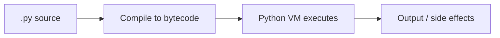

# Python Basics

> What Python is, how programs run, and the mental model you need before writing real code.

## Definition

**Python** is a high-level, interpreted, dynamically typed programming language that emphasizes readability. You write `.py` source files; the **CPython** interpreter (the common default) compiles them to bytecode and runs them on a virtual machine.

**Python basics** covers: running code, program structure, indentation, comments, input/output, expressions vs statements, and the `if __name__ == "__main__"` pattern.

## Why it matters

AI tooling (NumPy, PyTorch, FastAPI, OpenAI SDKs, LangGraph) is Python-first. Weak basics create endless `IndentationError`, import, and "why didn't this run?" issues later.

## How Python runs code



## Types of Python programs

| Kind | Description | Example |
|------|-------------|---------|
| Script | Runs top-to-bottom | `python train.py` |
| Module | Imported by others | `import utils` |
| Package | Folder of modules | `mypkg/` |
| REPL / notebook | Interactive | `python`, Jupyter |

## Core syntax rules

1. **Indentation defines blocks** (4 spaces). No braces for blocks.
2. **Case-sensitive** — `Name` and `name` differ.
3. **Comments** start with `#`.
4. Names bind to **objects**; types live on objects.

## Code examples

```python
# Smallest useful program
print("Hello, AI Engineering")  # writes to stdout

answer = 2 + 2                  # assignment; right side is an expression
print("2 + 2 =", answer)
```

```python
# Typical script layout
import sys

APP_NAME = "demo"

def greet(name: str) -> str:
    # Return a greeting string
    return f"Welcome, {name}!"

def main() -> None:
    print(greet("Samad"))
    print("Python:", sys.version.split()[0])

# Runs only when executed as a script (not on import)
if __name__ == "__main__":
    main()
```

```python
# Indentation creates blocks
score = 85
if score >= 80:
    grade = "A"
    print("Great job")
else:
    grade = "B"
print("Grade:", grade)
```

## Common mistakes

| Mistake | Fix |
|---------|-----|
| Mixing tabs/spaces | Use 4 spaces only |
| Missing `:` after `if`/`def` | Always end headers with `:` |
| Wrong interpreter | Check `python3 --version` |

## Practice checklist

- [ ] Run a `.py` file from the terminal
- [ ] Use a `main()` + `__name__` guard
- [ ] Explain indentation to someone else

---


## Worked example: tiny CLI

```python
# greeter.py
import sys

def main(argv: list[str]) -> int:
    # argv[0] is the script name
    name = argv[1] if len(argv) > 1 else "world"
    print(f"Hello, {name}!")
    return 0  # process exit code

if __name__ == "__main__":
    raise SystemExit(main(sys.argv))
```

Run: `python greeter.py Samad`

## AI engineering angle

Even “basic” scripts show up as:

- one-off data cleanup tools
- eval runners
- smoke tests for prompts

Keep them structured (`main` + guard) so they can grow into modules.

## Exercises

1. Create `hello.py` that prints your name and Python version.
2. Introduce an indentation error on purpose; fix it.
3. Import your greeter function from another file and call it.


## Continue

- **Hub:** [Python topics](../README.md)
- **Next:** [Variables & Data Types](02-variables-data-types.md)
- **AI production guide:** [Python for AI Engineering](../python-for-ai-engineering.md)
