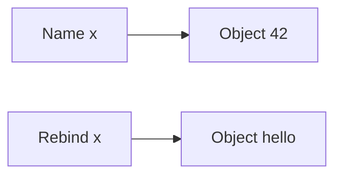

# Variables & Data Types

> Names, objects, and Python's built-in data types — how values live in memory and how to choose the right type.

## Definition

A **variable** is a **name** bound to an **object**. Assignment (`name = value`) creates or rebinds the name. Python is **dynamically typed**: the same name can later point to a different type.

A **data type** describes what an object is (`int`, `str`, `list`, …) and which operations it supports.

## Uses

- Hold config, user input, model outputs, API payloads
- Pick types that match meaning (`bool` vs `0/1`)
- Understand mutability to avoid shared-state bugs

## Binding model



```python
x = 42
y = x           # y refers to same int
x = "hello"     # x rebound; y still 42
print(y)        # 42
```

## Built-in types

| Category | Types | Mutable? |
|----------|-------|----------|
| Numeric | `int`, `float`, `complex` | No |
| Boolean | `bool` | No |
| Text | `str` | No |
| Sequences | `list`, `tuple`, `range` | only list |
| Sets | `set`, `frozenset` | only set |
| Mapping | `dict` | Yes |
| Null | `None` | No |
| Binary | `bytes`, `bytearray` | only bytearray |

## Code examples

```python
age = 30                      # int (arbitrary precision)
temp = 36.6                   # float
ready = True                  # bool
result = None                 # absence of value

name = "Samad"                # str (Unicode)
nums = [1, 2, 3]              # list — mutable
point = (10, 20)              # tuple — immutable
unique = {1, 2, 2}            # set → {1, 2}
user = {"id": 1, "role": "admin"}  # dict

# Always compare None with 'is'
if result is None:
    print("no result")

print(type(name), isinstance(name, str))
as_int = int("42")            # conversion; may raise ValueError
```

```python
# Mutability: aliases see in-place changes
a = [1, 2]
b = a
b.append(3)
print(a)          # [1, 2, 3]

c = a.copy()      # independent shallow copy
c.append(4)
print(a, c)       # [1, 2, 3] [1, 2, 3, 4]
```

## Naming conventions

```python
user_count = 10     # snake_case
MAX_RETRIES = 3      # constant by convention
_internal = True     # "private" by convention
```

## Common mistakes

- `== None` instead of `is None`
- Assuming floats are exact for money (use `decimal`)
- Mutating shared lists unintentionally

---


## Worked example: config object

```python
# Simple typed-ish config using plain variables + a dict
MODEL = "gpt-4.1-mini"
TEMPERATURE = 0.2
MAX_TOKENS = 512
FEATURES = {"rag": True, "tools": False}

def describe() -> str:
    return (
        f"model={MODEL} temp={TEMPERATURE} "
        f"max_tokens={MAX_TOKENS} rag={FEATURES['rag']}"
    )

print(describe())

# Prefer constants for values that shouldn't change by accident
# Prefer dict/dataclass when the shape grows
```

## Choosing types (decision guide)

| Need | Prefer |
|------|--------|
| Count / id | `int` |
| Measurement | `float` (or `Decimal` for money) |
| Flag | `bool` |
| Text | `str` |
| Ordered collection | `list` |
| Fixed record | `tuple` / dataclass |
| Unique ids | `set` |
| Keyed record / JSON | `dict` |
| Missing value | `None` |

## Exercises

1. Bind five values of different types; print `type(x)` for each.
2. Show that `a = b = []` shares one list (mutate via one name).
3. Convert `"3.14"` → `float` → `int` and explain the result.


## Continue

- **Previous:** [Python Basics](01-python-basics.md)
- **Hub:** [Python topics](../README.md)
- **Next:** [Operators](03-operators.md)
- **AI production guide:** [Python for AI Engineering](../python-for-ai-engineering.md)

---

## AI engineering angle

This topic shows up constantly in AI codebases: training scripts, eval runners, FastAPI services, agent tools, and data cleanup jobs. Prefer clear `main()` entrypoints, typed interfaces, and small testable functions over notebook-only workflows.

## Production checklist

- [ ] Errors are explicit (no bare `except:`)
- [ ] Logging instead of leftover `print` in services
- [ ] Deterministic seeds where experiments need reproduction
- [ ] Resource cleanup via `with` / context managers
- [ ] Unit tests for pure helpers

## Practice exercises

1. Rewrite one snippet from this page as a function with type hints and a docstring.
2. Add a failing unit test, then make it pass.
3. Note one way this concept appears in RAG, agents, or LLM API clients.

## Interview prompts

**Q: When would you choose a different approach than the default shown here?**

A: Tie the answer to performance, readability, concurrency, or API boundaries — and give a concrete AI-engineering example (streaming responses, batch embedding, tool sandboxing).

## See also

- [Python hub](../README.md)
- [Python Frameworks](../../python-frameworks-libraries/README.md)
- [LLM Application Development](../../llm-application-development/README.md)

