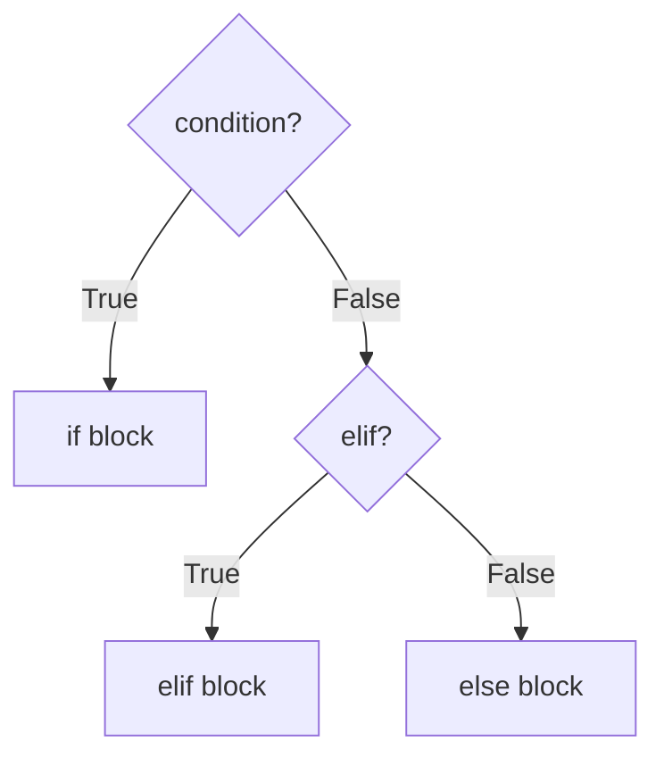

# Conditional Statements

> Branching with if / elif / else, truthiness, ternary expressions, and structural pattern matching.

## Definition

**Conditional statements** choose code paths based on whether conditions hold. Python provides `if` / `elif` / `else`, ternary expressions, and (3.10+) `match` / `case`.

## Uses

- Validate inputs and fail fast
- Route requests by status, role, or intent
- Feature flags and environment checks

## Types

| Form | Use |
|------|-----|
| `if` | Single branch |
| `if/else` | Binary choice |
| `if/elif/else` | Multi-way |
| Ternary | Tiny expression choice |
| `match` | Structured dispatch |



## Code examples

```python
def letter_grade(score: int) -> str:
    if score < 0 or score > 100:
        raise ValueError("score must be 0..100")
    if score >= 90:
        return "A"
    elif score >= 80:
        return "B"
    elif score >= 70:
        return "C"
    else:
        return "D/F"

print(letter_grade(92))
```

```python
# Truthiness: empty containers, 0, None, "" are falsy
items = []
if not items:
    print("empty")

latency_ms = 120
tier = "fast" if latency_ms < 200 else "slow"  # ternary
print(tier)
```

```python
# Guard clauses beat deep nesting
user = {"active": True, "role": "admin"}
if not user:
    raise ValueError("missing user")
if not user.get("active"):
    raise PermissionError("inactive")
if user.get("role") != "admin":
    raise PermissionError("admins only")
print("admin panel")
```

```python
def handle_event(event: dict) -> str:
    match event:  # Python 3.10+
        case {"type": "login", "user": str(name)}:
            return f"welcome {name}"
        case {"type": "error", "code": int(code)} if code >= 500:
            return "server fault"
        case _:
            return "unknown"

print(handle_event({"type": "login", "user": "samad"}))
```

## Common mistakes

- Monster `elif` chains → use dict dispatch
- Treating `0` as "missing" when zero is valid data

---


## Worked example: model router

```python
def pick_model(task: str, premium: bool) -> str:
    task = task.lower().strip()
    if task in {"embed", "embedding"}:
        return "text-embedding-3-large"
    if task == "chat" and premium:
        return "gpt-4.1"
    if task == "chat":
        return "gpt-4.1-mini"
    if task == "classify":
        return "small-classifier"
    return "gpt-4.1-mini"  # safe default

print(pick_model("chat", premium=True))
```

## Dict dispatch alternative

```python
ROUTES = {
    "embed": lambda premium: "text-embedding-3-large",
    "chat": lambda premium: "gpt-4.1" if premium else "gpt-4.1-mini",
}

def pick_model2(task: str, premium: bool) -> str:
    fn = ROUTES.get(task)
    if fn is None:
        return "gpt-4.1-mini"
    return fn(premium)
```

## Exercises

1. Write `fizzbuzz` for `n` in 1..20 using `if/elif`.
2. Rewrite a nested if into guard clauses.
3. Use `match` to handle HTTP status families (2xx/4xx/5xx).


## Continue

- **Previous:** [Operators](03-operators.md)
- **Hub:** [Python topics](../README.md)
- **Next:** [Loops](05-loops.md)
- **AI production guide:** [Python for AI Engineering](../python-for-ai-engineering.md)

---

## AI engineering angle

This topic shows up constantly in AI codebases: training scripts, eval runners, FastAPI services, agent tools, and data cleanup jobs. Prefer clear `main()` entrypoints, typed interfaces, and small testable functions over notebook-only workflows.

## Production checklist

- [ ] Errors are explicit (no bare `except:`)
- [ ] Logging instead of leftover `print` in services
- [ ] Deterministic seeds where experiments need reproduction
- [ ] Resource cleanup via `with` / context managers
- [ ] Unit tests for pure helpers

## Practice exercises

1. Rewrite one snippet from this page as a function with type hints and a docstring.
2. Add a failing unit test, then make it pass.
3. Note one way this concept appears in RAG, agents, or LLM API clients.

## Interview prompts

**Q: When would you choose a different approach than the default shown here?**

A: Tie the answer to performance, readability, concurrency, or API boundaries — and give a concrete AI-engineering example (streaming responses, batch embedding, tool sandboxing).

## See also

- [Python hub](../README.md)
- [Python Frameworks](../../python-frameworks-libraries/README.md)
- [LLM Application Development](../../llm-application-development/README.md)

