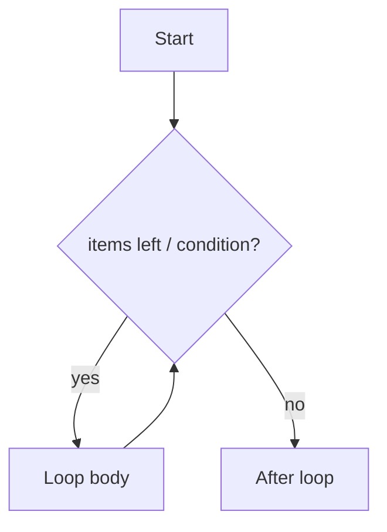

# Loops

> Repeat work with for and while — iteration patterns, else clauses, nested loops, and when to stop looping.

## Definition

A **loop** repeatedly executes a block of code. Python’s main loops are:

- **`for`** — iterate over an iterable (list, string, range, file, …)
- **`while`** — repeat while a condition stays true

Related control keywords: `break` (exit), `continue` (skip to next iteration), and optional `else` on loops (runs if no `break`).

## Uses

- Process batches of documents, tokens, or API pages
- Retry with backoff
- Aggregate metrics, build indexes, stream lines from files

## Types / patterns

| Pattern | Tool | Notes |
|---------|------|-------|
| Counted loop | `for i in range(n)` | Prefer over C-style indexes |
| Item loop | `for item in seq` | Idiomatic |
| Index + item | `enumerate` | When you need positions |
| Parallel iterables | `zip` | Same-length pairing |
| Conditional repeat | `while` | Unknown iteration count |
| Infinite + break | `while True` | Servers, CLIs, polls |



## Code examples

```python
# for over a sequence
models = ["gpt", "claude", "llama"]
for m in models:
    print("provider family:", m)

# range: 0..4
for i in range(5):
    print(i, end=" ")
print()

# enumerate — index + value
for i, m in enumerate(models, start=1):
    print(f"{i}. {m}")

# zip — iterate in parallel
names = ["a", "b"]
scores = [0.9, 0.7]
for name, score in zip(names, scores):
    print(name, score)
```

```python
# while + break/continue
attempts = 0
while attempts < 5:
    attempts += 1
    if attempts == 2:
        continue          # skip the rest of this iteration
    if attempts == 4:
        print("stopping early")
        break             # leave the loop
    print("attempt", attempts)
else:
    # runs only if loop did NOT break
    print("finished without break")
```

```python
# Nested loops — prefer clarity; extract helpers if deep
matrix = [[1, 2], [3, 4]]
total = 0
for row in matrix:
    for cell in row:
        total += cell
print(total)  # 10

# Comprehension alternative when building a collection (see topic 13)
flat = [cell for row in matrix for cell in row]
```

```python
# Practical: paginated API-style loop
def fetch_pages():
    page = 1
    while True:
        # pretend API returns [] when done
        batch = [f"doc-{page}"] if page <= 3 else []
        if not batch:
            break
        for doc in batch:
            yield doc
        page += 1

print(list(fetch_pages()))
```

## Common mistakes

| Mistake | Fix |
|---------|-----|
| Mutating a list while iterating it | Iterate over a copy or build a new list |
| `while True` without `break` | Always define an exit |
| Using `range(len(xs))` always | Iterate items directly unless you need indexes |
| Infinite loop on wrong condition | Print/log the condition while debugging |

## Performance notes

- `for x in huge_list` is fine; converting everything to a list first may not be
- Prefer generators/iterators for large streams (topics 14–15)

---


## Worked example: batching

```python
def batched(xs: list[str], size: int):
    """Yield lists of length <= size."""
    batch: list[str] = []
    for x in xs:
        batch.append(x)
        if len(batch) == size:
            yield batch
            batch = []
    if batch:
        yield batch

docs = [f"d{i}" for i in range(10)]
for b in batched(docs, 3):
    print("embed batch", b)
```

## Exercises

1. Sum numbers 1..100 with a `for` loop and with `sum(range(...))`.
2. Read a pretend list of lines; `continue` on empties; `break` on `STOP`.
3. Build a multiplication table with nested loops (then try a comprehension).


## Continue

- **Previous:** [Conditional Statements](04-conditional-statements.md)
- **Hub:** [Python topics](../README.md)
- **Next:** [Functions](06-functions.md)
- **AI production guide:** [Python for AI Engineering](../python-for-ai-engineering.md)
