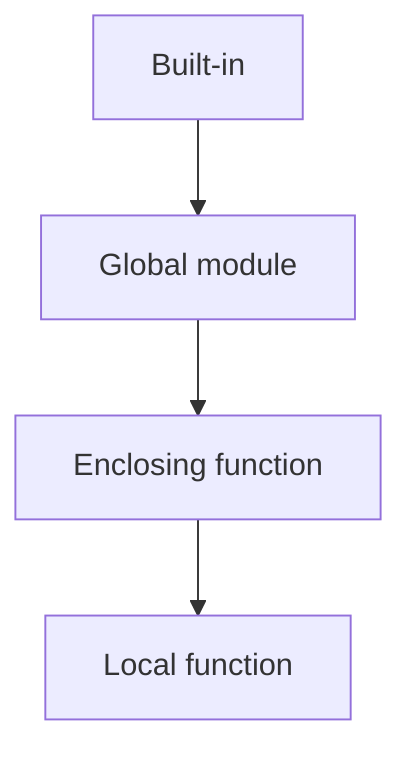

# Scope & Namespaces

> LEGB rule, global/nonlocal, name binding, and how Python finds names at runtime.

## Definition

A **namespace** is a mapping from names to objects (implemented as dicts under the hood for many scopes). **Scope** is the textual region where a name is visible.

Python resolves names with the **LEGB** rule:

1. **L**ocal — function body
2. **E**nclosing — outer function(s)
3. **G**lobal — module level
4. **B**uilt-in — `len`, `range`, `Exception`, …

## Uses

- Avoid accidental globals
- Write correct closures and decorators
- Debug `UnboundLocalError` and shadowing bugs

## Types of scopes

| Scope | Created by | Lifetime |
|-------|------------|----------|
| Built-in | Interpreter | Process |
| Global | Module | Module lifetime |
| Enclosing | Nested `def` | While outer function exists |
| Local | Function / comprehension | Call / evaluation |



## Code examples

```python
APP = "playbook"          # global

def show():
    print(APP)            # read global OK

def rebind_wrong():
    # Uncommenting next line without global makes APP local → UnboundLocalError on print
    # APP = "x"
    print(APP)

show()
```

```python
counter = 0

def bump():
    global counter        # needed to ASSIGN to global
    counter += 1

bump(); bump()
print(counter)            # 2
```

```python
def outer():
    total = 0

    def inner(n):
        nonlocal total    # assign to enclosing scope
        total += n
        return total

    return inner

acc = outer()
print(acc(5), acc(3))     # 5 8
```

```python
# Shadowing built-ins — avoid
def bad(list):            # shadows built-in list
    return list

# Prefer
def good(items):
    return list(items)
```

```python
# Comprehension scope (Python 3): loop variable does not leak
squares = [i * i for i in range(3)]
# print(i)  # NameError in Python 3
```

## Common mistakes

| Symptom | Cause |
|---------|-------|
| `UnboundLocalError` | Assigned locally later, so read is treated as local |
| Unexpected global mutation | Forgot that mutable globals are shared |
| Closure late-binding | `lambda: i` in a loop captures final `i` — use default arg `lambda i=i: i` |

---

## Continue

- **Previous:** [Functions](06-functions.md)
- **Hub:** [Python topics](../README.md)
- **Next:** [Strings](08-strings.md)
- **AI production guide:** [Python for AI Engineering](../python-for-ai-engineering.md)

---

## AI engineering angle

This topic shows up constantly in AI codebases: training scripts, eval runners, FastAPI services, agent tools, and data cleanup jobs. Prefer clear `main()` entrypoints, typed interfaces, and small testable functions over notebook-only workflows.

## Production checklist

- [ ] Errors are explicit (no bare `except:`)
- [ ] Logging instead of leftover `print` in services
- [ ] Deterministic seeds where experiments need reproduction
- [ ] Resource cleanup via `with` / context managers
- [ ] Unit tests for pure helpers

## Practice exercises

1. Rewrite one snippet from this page as a function with type hints and a docstring.
2. Add a failing unit test, then make it pass.
3. Note one way this concept appears in RAG, agents, or LLM API clients.

## Interview prompts

**Q: When would you choose a different approach than the default shown here?**

A: Tie the answer to performance, readability, concurrency, or API boundaries — and give a concrete AI-engineering example (streaming responses, batch embedding, tool sandboxing).

## See also

- [Python hub](../README.md)
- [Python Frameworks](../../python-frameworks-libraries/README.md)
- [LLM Application Development](../../llm-application-development/README.md)

