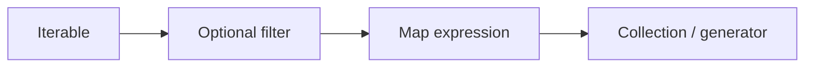

# List/Set/Dictionary Comprehensions

> Compact, readable ways to build collections from iterables with optional filters — and when not to use them.

## Definition

A **comprehension** is syntactic sugar for building a `list`, `set`, or `dict` from an iterable, optionally filtering elements. There are also **generator expressions** (lazy) with `()`.

## Uses

- Map/filter transforms in one readable line
- Build vocabularies, indexes, filtered batches
- Keep functional-style transforms local and clear

## Types

| Form | Example |
|------|---------|
| List | `[x*2 for x in xs if x > 0]` |
| Set | `{x.lower() for x in names}` |
| Dict | `{k: v for k, v in pairs}` |
| Generator expr | `(x*2 for x in xs)` |



## Code examples

```python
nums = [1, 2, 3, 4, 5]
squares = [n * n for n in nums]
evens = [n for n in nums if n % 2 == 0]
print(squares, evens)

# Equivalent loop for mental model
squares2 = []
for n in nums:
    squares2.append(n * n)
```

```python
names = ["Ada", "alan", "Ada"]
unique_lower = {n.lower() for n in names}
print(unique_lower)

pairs = [("a", 1), ("b", 2)]
d = {k: v for k, v in pairs}
print(d)

# Dict invert (last wins on collisions)
inv = {v: k for k, v in d.items()}
```

```python
# Nested — flatten matrix
matrix = [[1, 2], [3, 4]]
flat = [c for row in matrix for c in row]
print(flat)

# Keep nested comprehensions shallow; extract helper if complex
```

```python
# Generator expression — lazy, memory friendly
total = sum(n * n for n in range(1000))
print(total)

# Walrus in comprehension (3.8+)
raw = ["1", "x", "3"]
vals = [y for x in raw if (y := x.isdigit() and int(x))]
# cleaner approach:
vals = [int(x) for x in raw if x.isdigit()]
print(vals)
```

## When NOT to use comprehensions

- Multi-step logic with side effects (logging, I/O) → use a normal loop
- Deep nesting that hurts readability
- Building something that isn’t a collection

## Common mistakes

- Using a list comprehension only for side effects: `[print(x) for x in xs]` → just loop
- Accidental nested complexity

---

## Continue

- **Previous:** [Dictionaries](12-dictionaries.md)
- **Hub:** [Python topics](../README.md)
- **Next:** [Iterators & Iterables](14-iterators-iterables.md)
- **AI production guide:** [Python for AI Engineering](../python-for-ai-engineering.md)

---

## AI engineering angle

This topic shows up constantly in AI codebases: training scripts, eval runners, FastAPI services, agent tools, and data cleanup jobs. Prefer clear `main()` entrypoints, typed interfaces, and small testable functions over notebook-only workflows.

## Production checklist

- [ ] Errors are explicit (no bare `except:`)
- [ ] Logging instead of leftover `print` in services
- [ ] Deterministic seeds where experiments need reproduction
- [ ] Resource cleanup via `with` / context managers
- [ ] Unit tests for pure helpers

## Practice exercises

1. Rewrite one snippet from this page as a function with type hints and a docstring.
2. Add a failing unit test, then make it pass.
3. Note one way this concept appears in RAG, agents, or LLM API clients.

## Interview prompts

**Q: When would you choose a different approach than the default shown here?**

A: Tie the answer to performance, readability, concurrency, or API boundaries — and give a concrete AI-engineering example (streaming responses, batch embedding, tool sandboxing).

## See also

- [Python hub](../README.md)
- [Python Frameworks](../../python-frameworks-libraries/README.md)
- [LLM Application Development](../../llm-application-development/README.md)

