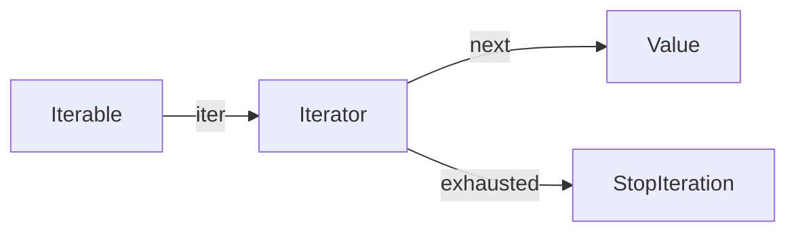

# Iterators & Iterables

> The iteration protocol — iterables, iterators, next(), and how for-loops really work.

## Definition

- An **iterable** can return an iterator (`__iter__`), e.g. list, str, dict, file, range.
- An **iterator** produces the next value (`__next__`) and is exhausted when `StopIteration` is raised.

`for x in xs` roughly does: `it = iter(xs)` then repeatedly `next(it)`.

## Uses

- Stream large datasets without loading everything
- Custom iteration APIs
- Understand generators, `map`, and `zip`

## Protocol



## Code examples

```python
xs = [10, 20, 30]
it = iter(xs)                 # list iterator
print(next(it), next(it))
print(next(it))
# next(it) → StopIteration

# for handles StopIteration for you
for v in xs:
    print(v)
```

```python
# Many built-ins return iterators/views
d = {"a": 1, "b": 2}
print(iter(d.keys()))

# zip/map are iterators (consume once)
z = zip([1, 2], ["a", "b"])
print(list(z))
print(list(z))                # empty — already consumed
```

```python
# Custom iterable
class CountDown:
    def __init__(self, start: int):
        self.start = start

    def __iter__(self):
        n = self.start
        while n > 0:
            yield n           # generator makes an iterator
            n -= 1

print(list(CountDown(3)))
```

```python
# itertools helpers
import itertools
print(list(itertools.islice(range(1000), 0, 5)))
print(list(itertools.chain([1, 2], [3, 4])))
```

## Iterable vs iterator

| | Iterable | Iterator |
|---|----------|----------|
| `iter()` | returns iterator | often returns self |
| `next()` | usually no | yes |
| Reusable | often yes (list) | usually one-shot |

## Common mistakes

- Exhausting an iterator then reusing it
- Calling `next` without default: `next(it, None)` avoids exceptions when desired

---

## Continue

- **Previous:** [List/Set/Dictionary Comprehensions](13-comprehensions.md)
- **Hub:** [Python topics](../README.md)
- **Next:** [Generators](15-generators.md)
- **AI production guide:** [Python for AI Engineering](../python-for-ai-engineering.md)

---

## AI engineering angle

This topic shows up constantly in AI codebases: training scripts, eval runners, FastAPI services, agent tools, and data cleanup jobs. Prefer clear `main()` entrypoints, typed interfaces, and small testable functions over notebook-only workflows.

## Production checklist

- [ ] Errors are explicit (no bare `except:`)
- [ ] Logging instead of leftover `print` in services
- [ ] Deterministic seeds where experiments need reproduction
- [ ] Resource cleanup via `with` / context managers
- [ ] Unit tests for pure helpers

## Practice exercises

1. Rewrite one snippet from this page as a function with type hints and a docstring.
2. Add a failing unit test, then make it pass.
3. Note one way this concept appears in RAG, agents, or LLM API clients.

## Interview prompts

**Q: When would you choose a different approach than the default shown here?**

A: Tie the answer to performance, readability, concurrency, or API boundaries — and give a concrete AI-engineering example (streaming responses, batch embedding, tool sandboxing).

## See also

- [Python hub](../README.md)
- [Python Frameworks](../../python-frameworks-libraries/README.md)
- [LLM Application Development](../../llm-application-development/README.md)

