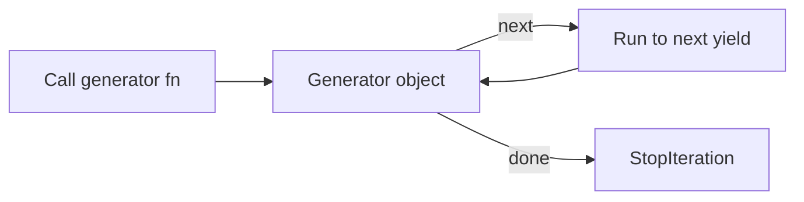

# Generators

> Lazy sequences with yield — generator functions, generator expressions, and streaming pipelines.

## Definition

A **generator** is a function that uses `yield` to produce a sequence of values lazily. Calling it returns a **generator iterator** without running the body until you iterate.

Generator expressions `(expr for x in xs)` create anonymous generators.

## Uses

- Stream large files / token batches / API pages
- Pipeline transforms with low memory
- Infinite sequences with care (`itertools.count`)

## Types

| Kind | How |
|------|-----|
| Generator function | `def f(): yield ...` |
| Generator expression | `(x for x in xs)` |
| `yield from` | Delegate to sub-iterator |



## Code examples

```python
def countdown(n: int):
    while n > 0:
        yield n
        n -= 1

g = countdown(3)
print(next(g), next(g), next(g))
print(list(countdown(3)))
```

```python
def read_lines(path: str):
    with open(path, encoding="utf-8") as f:
        for line in f:
            yield line.rstrip("\n")

# Composition: pipeline
def non_empty(lines):
    for line in lines:
        if line.strip():
            yield line

def numbered(lines):
    for i, line in enumerate(lines, 1):
        yield f"{i}: {line}"

# Example with in-memory data instead of file
sample = ["a", "", "b"]
pipe = numbered(non_empty(iter(sample)))
print(list(pipe))
```

```python
# yield from
def concat(a, b):
    yield from a
    yield from b

print(list(concat([1, 2], [3])))
```

```python
# Generator expression
squares = (n * n for n in range(5))
print(sum(squares))
# sum(squares) again → 0 because exhausted
```

```python
# send / generator as coroutine (advanced peek)
def accumulator():
    total = 0
    while True:
        x = yield total
        if x is None:
            break
        total += x

acc = accumulator()
next(acc)                 # prime
print(acc.send(5))
print(acc.send(3))
```

## vs lists

| | Generator | List |
|---|-----------|------|
| Memory | Lazy | Eager |
| Reusable | No (one-shot) | Yes |
| Indexing | No | Yes |
| Len | No (generally) | Yes |

## Common mistakes

- Expecting generators to restart automatically
- Using generators when you need random access / len

---

## Continue

- **Previous:** [Iterators & Iterables](14-iterators-iterables.md)
- **Hub:** [Python topics](../README.md)
- **Next:** [Lambda Functions](16-lambda-functions.md)
- **AI production guide:** [Python for AI Engineering](../python-for-ai-engineering.md)
