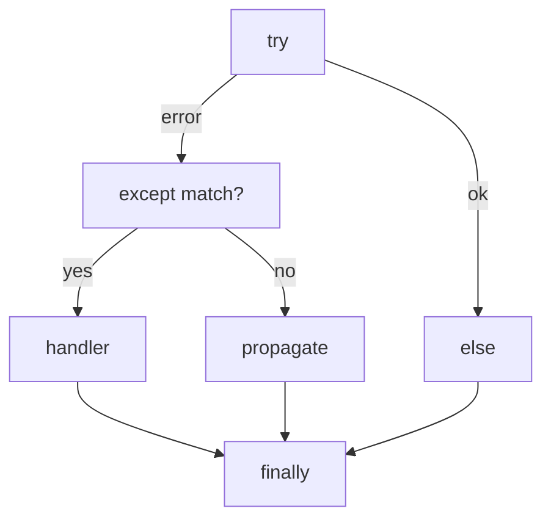

# Exception Handling

> Errors as objects — try/except/else/finally, raising, custom exceptions, and robust failure handling.

## Definition

An **exception** signals that something abnormal occurred. Python uses an exception hierarchy rooted at `BaseException` (you almost always catch `Exception`, not `BaseException`).

**Exception handling** means catching, enriching, converting, or propagating those errors deliberately.

## Uses

- Validate inputs and fail with clear messages
- Retry transient network errors
- Ensure files/locks close via `finally` / context managers
- Translate low-level errors into domain errors

## Key forms

| Construct | Role |
|-----------|------|
| `try` | Protected block |
| `except` | Handle specific errors |
| `else` | Runs if no exception |
| `finally` | Always runs |
| `raise` | Throw / rethrow |
| `raise X from e` | Chain causes |



## Code examples

```python
def parse_int(text: str) -> int:
    try:
        return int(text)
    except ValueError as e:
        raise ValueError(f"not an int: {text!r}") from e

print(parse_int("42"))
```

```python
# Multiple except + else + finally
values = ["10", "x", "20"]
total = 0
for v in values:
    try:
        n = int(v)
    except ValueError:
        print("skip", v)
    else:
        total += n            # only on success
    finally:
        pass                  # cleanup would go here
print(total)
```

```python
# Catch specific exceptions — never bare except:
try:
    d = {"a": 1}
    print(d["b"])
except KeyError as e:
    print("missing key", e)
```

```python
# Custom exception hierarchy
class AppError(Exception):
    """Base for application errors."""

class ConfigError(AppError):
    pass

def load_config(path: str) -> dict:
    if not path.endswith(".json"):
        raise ConfigError(f"unsupported config: {path}")
    return {"path": path}

try:
    load_config("settings.yaml")
except AppError as e:
    print("app failed:", e)
```

```python
# Don't swallow silently in libraries
def risky():
    try:
        1 / 0
    except ZeroDivisionError:
        # bad: pass
        # better: log + re-raise or return Result
        raise
```

## Common mistakes

| Mistake | Fix |
|---------|-----|
| Bare `except:` | Catch `Exception` or specific types |
| Swallowing errors | Log and decide: retry, convert, or raise |
| Using exceptions for normal control flow | Prefer returning values when expected |
| Catching `BaseException` | Avoid (includes `KeyboardInterrupt`) |

---

## Continue

- **Previous:** [`map()`, `filter()`, `reduce()`](17-map-filter-reduce.md)
- **Hub:** [Python topics](../README.md)
- **Next:** [File Handling](19-file-handling.md)
- **AI production guide:** [Python for AI Engineering](../python-for-ai-engineering.md)
