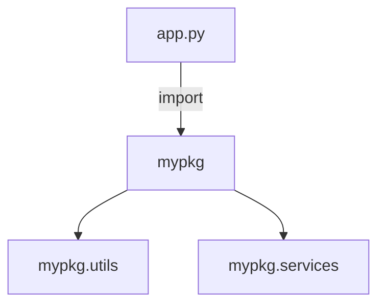

# Modules & Packages

> Organize code into importable units — modules, packages, imports, __init__.py, and project structure.

## Definition

- A **module** is a single `.py` file (or built-in/C extension) that you import.
- A **package** is a directory of modules (typically with `__init__.py`) forming a hierarchy.

Imports bind names in your namespace to objects defined elsewhere.

## Uses

- Split large programs into maintainable units
- Reuse utilities across apps
- Publish libraries / internal SDKs

## Types of imports

```python
import math                      # module binding
from math import sqrt            # name binding
from math import sqrt as root    # alias
import xml.etree.ElementTree as ET
```



## Code examples

```python
# mypkg/__init__.py
# (re)export convenient API
# from .utils import normalize

# mypkg/utils.py
def normalize(text: str) -> str:
    return " ".join(text.strip().lower().split())
```

```python
# Relative imports inside a package
# from .utils import normalize
# from ..core import engine

# Absolute imports preferred in apps:
# from mypkg.utils import normalize
```

```python
# __name__ and scripts
if __name__ == "__main__":
    print("running as script")

# Import side effects — keep module import light
# (don't train models at import time)
```

```python
# sys.path reality check
import sys
print(sys.path[0])    # often the script directory

# Prefer proper packaging / editable installs over path hacks
```

## Package layout (simple app)

```text
app/
  pyproject.toml
  src/
    myapp/
      __init__.py
      main.py
      services/
        __init__.py
        rag.py
  tests/
    test_rag.py
```

## Common mistakes

| Mistake | Fix |
|---------|-----|
| Circular imports | Invert dependencies / lazy import / extract shared module |
| Heavy work at import | Put in `main()` / functions |
| `sys.path.append` chaos | Use packages + install editable |
| Wildcard `from x import *` | Explicit imports only |

---

## Continue

- **Previous:** [File Handling](19-file-handling.md)
- **Hub:** [Python topics](../README.md)
- **Next:** [Virtual Environments](21-virtual-environments.md)
- **AI production guide:** [Python for AI Engineering](../python-for-ai-engineering.md)

---

## AI engineering angle

This topic shows up constantly in AI codebases: training scripts, eval runners, FastAPI services, agent tools, and data cleanup jobs. Prefer clear `main()` entrypoints, typed interfaces, and small testable functions over notebook-only workflows.

## Production checklist

- [ ] Errors are explicit (no bare `except:`)
- [ ] Logging instead of leftover `print` in services
- [ ] Deterministic seeds where experiments need reproduction
- [ ] Resource cleanup via `with` / context managers
- [ ] Unit tests for pure helpers

## Practice exercises

1. Rewrite one snippet from this page as a function with type hints and a docstring.
2. Add a failing unit test, then make it pass.
3. Note one way this concept appears in RAG, agents, or LLM API clients.

## Interview prompts

**Q: When would you choose a different approach than the default shown here?**

A: Tie the answer to performance, readability, concurrency, or API boundaries — and give a concrete AI-engineering example (streaming responses, batch embedding, tool sandboxing).

## See also

- [Python hub](../README.md)
- [Python Frameworks](../../python-frameworks-libraries/README.md)
- [LLM Application Development](../../llm-application-development/README.md)

