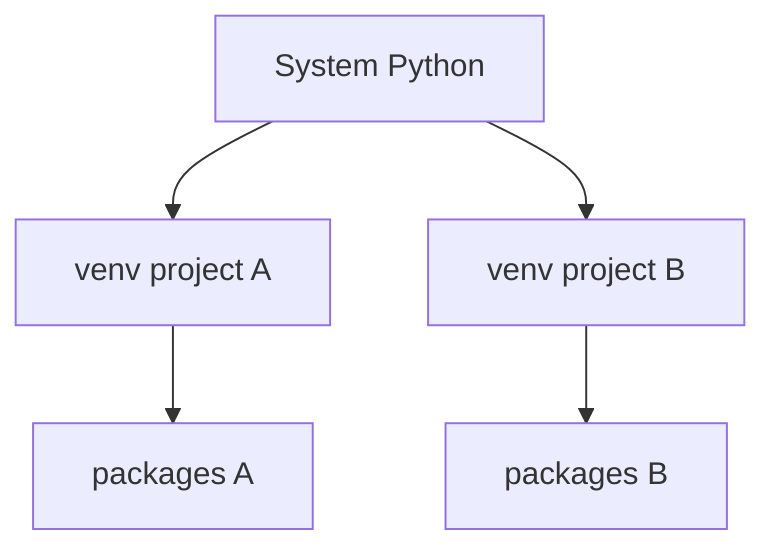

# Virtual Environments

> Isolate project dependencies with venv, virtualenv, and uv — why isolation matters and how to use it daily.

## Definition

A **virtual environment** is an isolated Python runtime directory with its own `python` / `pip` and installed packages. It prevents Project A’s dependencies from breaking Project B.

## Uses

- Keep AI projects (torch, fastapi, langchain) from colliding
- Reproduce installs per project
- Safe experimentation without polluting system Python

## Types / tools

| Tool | Notes |
|------|-------|
| `venv` | Standard library (recommended baseline) |
| `virtualenv` | Third-party predecessor |
| `uv venv` / `uv sync` | Modern fast tooling |
| Conda | Common in data science; different model |



## Code examples

```bash
# Create with stdlib venv
python3 -m venv .venv

# Activate (Linux/macOS)
source .venv/bin/activate

# Activate (Windows PowerShell)
# .venv\Scripts\Activate.ps1

# Confirm
which python
python -c "import sys; print(sys.prefix)"

# Deactivate
deactivate
```

```bash
# uv workflow (fast)
uv venv .venv
source .venv/bin/activate
uv pip install fastapi httpx
```

```bash
# Useful hygiene
echo ".venv/" >> .gitignore
python -m pip install --upgrade pip
```

## Rules of thumb

1. **One venv per project**
2. **Never sudo pip install into system Python** for app work
3. **Commit lockfiles**, not the venv folder
4. Document Python version (`.python-version` or `requires-python`)

## Common mistakes

- Installing packages while venv is inactive
- Checking `.venv` into git
- Mixing conda base env for everything

---

## Continue

- **Previous:** [Modules & Packages](20-modules-packages.md)
- **Hub:** [Python topics](../README.md)
- **Next:** [Package Management](22-package-management.md)
- **AI production guide:** [Python for AI Engineering](../python-for-ai-engineering.md)

---

## AI engineering angle

This topic shows up constantly in AI codebases: training scripts, eval runners, FastAPI services, agent tools, and data cleanup jobs. Prefer clear `main()` entrypoints, typed interfaces, and small testable functions over notebook-only workflows.

## Production checklist

- [ ] Errors are explicit (no bare `except:`)
- [ ] Logging instead of leftover `print` in services
- [ ] Deterministic seeds where experiments need reproduction
- [ ] Resource cleanup via `with` / context managers
- [ ] Unit tests for pure helpers

## Practice exercises

1. Rewrite one snippet from this page as a function with type hints and a docstring.
2. Add a failing unit test, then make it pass.
3. Note one way this concept appears in RAG, agents, or LLM API clients.

## Interview prompts

**Q: When would you choose a different approach than the default shown here?**

A: Tie the answer to performance, readability, concurrency, or API boundaries — and give a concrete AI-engineering example (streaming responses, batch embedding, tool sandboxing).

## See also

- [Python hub](../README.md)
- [Python Frameworks](../../python-frameworks-libraries/README.md)
- [LLM Application Development](../../llm-application-development/README.md)

