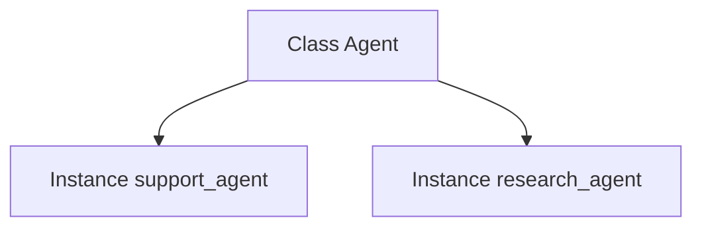

# Object-Oriented Programming

> Classes, objects, inheritance, composition, dunder methods, and when OOP helps AI codebases.

## Definition

**Object-Oriented Programming (OOP)** models software as **objects** — bundles of state (attributes) and behavior (methods) — created from **classes** (blueprints).

Python’s OOP is pragmatic: everything is an object, multiple inheritance exists, and composition is often better than deep hierarchies.

## Uses

- Model domain entities (User, Document, Agent, Tool)
- Share behavior via base classes/mixins carefully
- Encapsulate invariants and validation

## Core concepts

| Concept | Meaning |
|---------|---------|
| Class | Blueprint |
| Instance | Concrete object |
| Attribute | Data on object/class |
| Method | Function on class |
| Inheritance | Reuse/specialize |
| Composition | Has-a relationships |
| Encapsulation | Hide internals (`_protected`) |
| Polymorphism | Same interface, different behavior |



## Code examples

```python
class Document:
    def __init__(self, doc_id: str, text: str) -> None:
        self.doc_id = doc_id
        self.text = text

    def preview(self, n: int = 50) -> str:
        return self.text[:n]

doc = Document("d1", "Retrieval augmented generation ...")
print(doc.preview(20))
```

```python
# Inheritance
class Chunk(Document):
    def __init__(self, doc_id: str, text: str, index: int) -> None:
        super().__init__(doc_id, text)
        self.index = index

c = Chunk("d1", "hello world", 0)
print(c.doc_id, c.index)
```

```python
# Composition over deep inheritance
class Embedder:
    def embed(self, text: str) -> list[float]:
        return [float(len(text))]  # toy

class Retriever:
    def __init__(self, embedder: Embedder) -> None:
        self.embedder = embedder

    def query(self, text: str) -> list[float]:
        return self.embedder.embed(text)

print(Retriever(Embedder()).query("rag"))
```

```python
# Dunder methods
class Score:
    def __init__(self, value: float) -> None:
        self.value = value

    def __repr__(self) -> str:
        return f"Score({self.value!r})"

    def __lt__(self, other: "Score") -> bool:
        return self.value < other.value

print(sorted([Score(0.2), Score(0.9)]))
```

```python
# @property for derived/validated attributes
class User:
    def __init__(self, email: str) -> None:
        self._email = email

    @property
    def email(self) -> str:
        return self._email

    @email.setter
    def email(self, value: str) -> None:
        if "@" not in value:
            raise ValueError("invalid email")
        self._email = value
```

## When not to OOP everything

- Simple scripts → functions + dataclasses
- Deep inheritance trees → hard to change
- Prefer protocols for interfaces

## Common mistakes

- God classes that do everything
- Overusing inheritance for code reuse
- Mutable class attributes shared across instances

---

## Continue

- **Previous:** [Package Management](22-package-management.md)
- **Hub:** [Python topics](../README.md)
- **Next:** [Dataclasses](24-dataclasses.md)
- **AI production guide:** [Python for AI Engineering](../python-for-ai-engineering.md)
