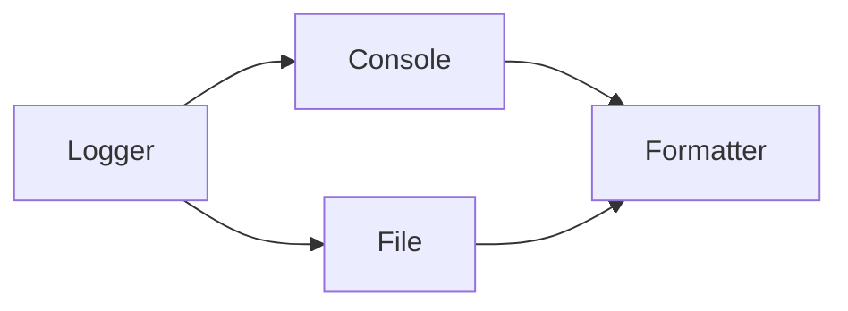

# Logging

> Structured, configurable application logs with the logging module — levels, handlers, formatters, and AI-service practice.

## Definition

**Logging** records events about a running program (info, warnings, errors) through the standard `logging` module (or structured libraries like `structlog`). Unlike `print`, logging is configurable by severity, destination, and format.

## Uses

- Debug production issues
- Audit agent/tool calls (with redaction)
- Ops alerts on `ERROR` rates

## Levels

| Level | Typical use |
|-------|-------------|
| DEBUG | Detailed diagnostics |
| INFO | Normal milestones |
| WARNING | Unexpected but handled |
| ERROR | Failure of an operation |
| CRITICAL | System unusable |



## Code examples

```python
import logging

logging.basicConfig(
    level=logging.INFO,
    format="%(asctime)s %(levelname)s %(name)s: %(message)s",
)
logger = logging.getLogger(__name__)

logger.info("server starting")
logger.warning("cache miss")
try:
    1 / 0
except ZeroDivisionError:
    logger.exception("division failed")  # includes stack trace
```

```python
# Per-module loggers (recommended)
log = logging.getLogger(__name__)
log.debug("retrieving k=%s", 5)  # lazy % formatting
```

```python
# Don't log secrets
user_id = "u_123"
logger.info("user=%s key=%s", user_id, "***")  # redact
```

```python
# Structured-ish key=value (or use structlog/JSON)
logger.info("llm_call model=%s latency_ms=%d", "gpt", 230)
```

## Practices for AI apps

1. Log **model**, **latency**, **token usage**, **request ids**
2. Redact prompts if they may contain PII (policy-driven)
3. Correlate with trace IDs
4. Prefer INFO in prod; DEBUG on demand

## Common mistakes

- `print` debugging left in libraries
- Logging full prompts + secrets
- No correlation IDs across services

---

## Continue

- **Previous:** [Functional Programming](29-functional-programming.md)
- **Hub:** [Python topics](../README.md)
- **Next:** [Unit Testing](31-unit-testing.md)
- **AI production guide:** [Python for AI Engineering](../python-for-ai-engineering.md)
