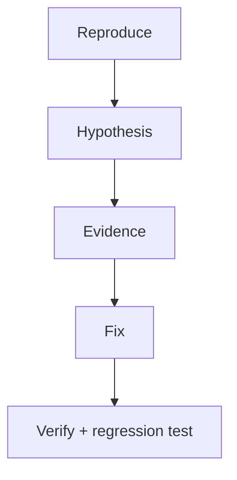

# Debugging

> Find and fix bugs systematically — prints, logging, pdb/breakpoint, bisecting, and AI-era failure modes.

## Definition

**Debugging** is the disciplined process of forming hypotheses about incorrect behavior, gathering evidence, and applying a minimal fix. Tools help, but process matters more.

## Uses

- Fix crashes and wrong outputs
- Diagnose flaky tests
- Understand production incidents from logs/traces

## Techniques

| Technique | When |
|-----------|------|
| Reproduce minimally | Always first |
| `print` / log values | Quick checks |
| `breakpoint()` / pdb | Interactive |
| Bisect / binary search | Regressions |
| Git bisect | When introduced? |
| Divide & conquer | Isolate layer |



## Code examples

```python
def score(xs: list[float]) -> float:
    print("DEBUG xs=", xs)          # temporary
    return sum(xs) / len(xs)
```

```python
def normalize(scores):
    breakpoint()                    # drops into debugger
    total = sum(scores)
    return [s / total for s in scores]

# pdb commands: n (next), s (step), c (continue), p expr, l, q
```

```python
def chunk(text: str, size: int) -> list[str]:
    assert size > 0, "size must be positive"
    return [text[i:i+size] for i in range(0, len(text), size)]
```

```python
import traceback
try:
    1 / 0
except Exception:
    traceback.print_exc()
```

## AI-specific debugging

| Symptom | Likely layer |
|---------|--------------|
| Wrong facts | Retrieval / grounding |
| Weird format | Prompt / schema validation |
| Timeouts | Provider / async blocking |
| Flaky answers | Temperature / non-determinism |
| Tool failures | Authz / args validation |

## Common mistakes

- Changing many things at once
- Fixing without a regression test
- Ignoring the first exception in a chain

---

## Continue

- **Previous:** [Unit Testing](31-unit-testing.md)
- **Hub:** [Python topics](../README.md)
- **Next:** [Concurrency](33-concurrency.md)
- **AI production guide:** [Python for AI Engineering](../python-for-ai-engineering.md)
