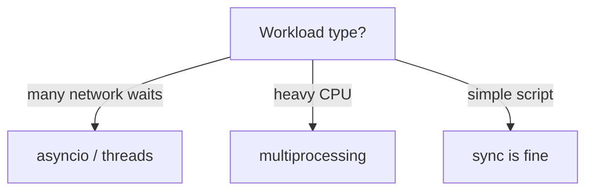

# Concurrency

> Doing overlapping work — concepts of concurrency vs parallelism, and Python’s main tools.

## Definition

**Concurrency** means structuring a program so multiple tasks make progress over the same time period (interleaved or parallel). **Parallelism** means tasks execute at the same instant on multiple CPUs.

In Python:

- **Async I/O** — concurrent waiting (network)
- **Threads** — concurrent I/O-bound work
- **Processes** — parallel CPU-bound work

## Uses

- Call many LLM/HTTP APIs efficiently
- Overlap retrieval + rerank prep
- Parallelize CPU-heavy preprocessing

## Mental model



## Comparison

| Tool | Best for | GIL impact |
|------|----------|------------|
| `asyncio` | Many sockets / HTTP | Avoids blocking if truly async |
| `threading` | I/O-bound, blocking libs | GIL limits CPU parallelism |
| `multiprocessing` | CPU-bound | Separate GILs / processes |

## Code sketch

```python
import time

def sync_sleep():
    time.sleep(0.1)           # blocks thread

# Async sleeps don't block the event loop (see topic 36)
# Threads can run blocking I/O concurrently (topic 34)
# Processes compute in parallel (topic 35)
```

## Common pitfalls

- Calling blocking I/O inside async event loops
- Sharing mutable state across threads without locks
- Assuming threads speed up pure-Python CPU loops

## What’s next

- [Multithreading](34-multithreading.md)
- [Multiprocessing](35-multiprocessing.md)
- [Asynchronous Programming](36-asynchronous-programming.md)

---

## Continue

- **Previous:** [Debugging](32-debugging.md)
- **Hub:** [Python topics](../README.md)
- **Next:** [Multithreading](34-multithreading.md)
- **AI production guide:** [Python for AI Engineering](../python-for-ai-engineering.md)
