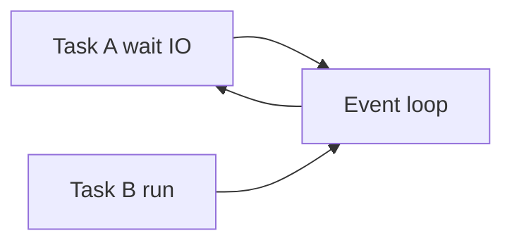

# Asynchronous Programming

> asyncio event loops, async/await, tasks, and non-blocking I/O for high-concurrency AI services.

## Definition

**Asynchronous programming** in Python uses `async` / `await` and an **event loop** (`asyncio`) to interleave many I/O-bound tasks in one thread without blocking on each wait.

## Uses

- FastAPI request handlers
- Concurrent LLM/provider calls
- Fan-out retrieval + tools
- Websockets / streaming responses

## Core concepts

| Concept | Meaning |
|---------|---------|
| Coroutine | `async def` function |
| await | Pause until awaitable completes |
| Task | Scheduled coroutine |
| Event loop | Schedules ready tasks |
| async with / for | Async CM / iteration |



## Code examples

```python
import asyncio

async def fetch(n: int) -> str:
    await asyncio.sleep(0.2)          # non-blocking sleep
    return f"result-{n}"

async def main():
    results = await asyncio.gather(*(fetch(i) for i in range(5)))
    print(results)

asyncio.run(main())
```

```python
async def bounded_gather(coros, limit: int = 10):
    sem = asyncio.Semaphore(limit)

    async def run(c):
        async with sem:
            return await c

    return await asyncio.gather(*(run(c) for c in coros))
```

```python
async def call():
    async with asyncio.timeout(1.0):   # 3.11+
        await asyncio.sleep(0.1)
        return "ok"
```

```python
import time
import asyncio

async def bad():
    time.sleep(1)                      # blocks everything

async def good():
    await asyncio.sleep(1)

async def read_blocking():
    return await asyncio.to_thread(time.sleep, 0.2)
```

## Rules for AI services

1. Use async HTTP clients (`httpx.AsyncClient`)
2. Bound concurrency (semaphores) to protect providers
3. Cancel/timeouts on every external call
4. Don’t mix blocking SDK calls into async handlers without `to_thread`

## Common mistakes

- Forgetting `await`
- Calling `asyncio.run` inside running loop
- CPU-heavy work on the loop thread

---

## Continue

- **Previous:** [Multiprocessing](35-multiprocessing.md)
- **Hub:** [Python topics](../README.md)
- **Next:** [Memory Management](37-memory-management.md)
- **AI production guide:** [Python for AI Engineering](../python-for-ai-engineering.md)
