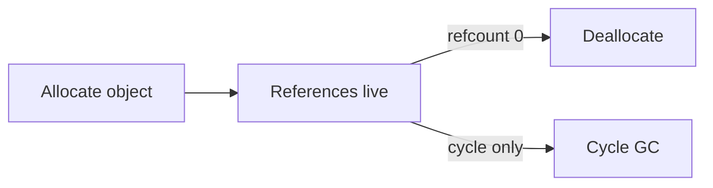

# Memory Management

> How Python allocates and frees objects — reference counting, GC, and practical memory hygiene.

## Definition

Python manages memory automatically via **reference counting** (primary in CPython) plus a **cyclic garbage collector** for reference cycles. Developers still must avoid retaining huge object graphs unnecessarily.

## Uses

- Stream large datasets instead of loading all
- Diagnose memory leaks in long-running services
- Choose structures (`slots`, generators) wisely

## Key ideas

| Idea | Meaning |
|------|---------|
| Refcount | Object freed when count → 0 |
| Cycle GC | Collects unreachable cycles |
| Peak vs leak | Spike OK; unbounded growth not |
| `__slots__` | Restrict attrs; save memory |



## Code examples

```python
import sys
a = []
b = a
print(sys.getrefcount(a))     # includes temporary refs from the call
```

```python
def numbers(n):
    for i in range(n):
        yield i

print(sum(numbers(1_000_000)))
```

```python
class Point:
    __slots__ = ("x", "y")
    def __init__(self, x, y):
        self.x = x
        self.y = y

p = Point(1, 2)
```

```python
import gc
gc.collect()

from functools import lru_cache

@lru_cache(maxsize=128)
def compute(x: int) -> int:
    return x * x
```

```python
import tracemalloc
tracemalloc.start()
data = [bytearray(1024) for _ in range(1000)]
print(tracemalloc.get_traced_memory())  # current, peak
tracemalloc.stop()
```

## Practical hygiene for AI apps

1. Don’t keep all raw documents in memory if you can stream
2. Bound queues and caches
3. Watch batch sizes for embeddings
4. Profile with `tracemalloc` when needed

## Common mistakes

- Global lists that grow forever (unbounded caches)
- Circular references in graphs/caches without weakrefs
- Copying giant lists accidentally

---

## Continue

- **Previous:** [Asynchronous Programming](36-asynchronous-programming.md)
- **Hub:** [Python topics](../README.md)
- **Next:** [Python Internals](38-python-internals.md)
- **AI production guide:** [Python for AI Engineering](../python-for-ai-engineering.md)
