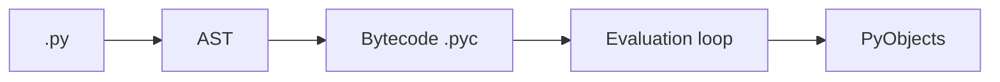

# Python Internals

> Under the hood of CPython — bytecode, the GIL, objects, import system, and why it matters for performance.

## Definition

**Python internals** means how CPython represents programs and objects: source → bytecode → evaluation loop, object headers, the GIL, and the import machinery.

You don’t need to hack CPython daily — but internals explain performance, threading limits, and weird edge cases.

## Why engineers care

- Understand why threads ≠ CPU speedups
- Read `dis` output for hotspots
- Know dict/list over-allocation behavior
- Debug import/packaging mysteries

## Pipeline



## Code examples

```python
import dis

def add(a, b):
    return a + b

dis.dis(add)                 # show bytecode
```

```python
x = 5
print(type(x), id(x))

# Small ints may be cached — don't rely on 'is' for values
a = 256
b = 256
print(a is b)                # often True — implementation detail
```

```python
def f(x, y=1):
    return x + y

print(f.__name__, f.__defaults__, f.__code__.co_argcount)
```

```python
import math
import sys
print("math" in sys.modules)
```

## GIL (short)

CPython’s GIL allows only one thread to execute Python bytecode at a time. I/O and many C extensions release it; pure-Python CPU loops don’t parallelize with threads.

## Dict/list internals (intuition)

- Lists: over-allocate capacity for amortized `append`
- Dicts: hash tables; insertion-ordered in modern CPython
- Strings: immutable; concatenation patterns matter

## Common misconceptions

- “Python is compiled or interpreted?” — both (bytecode + VM)
- “`is` means equality” — no, identity
- “Threads will use all cores for Python CPU” — not under GIL

---

## Continue

- **Previous:** [Memory Management](37-memory-management.md)
- **Hub:** [Python topics](../README.md)
- **Next:** [Performance Optimization](39-performance-optimization.md)
- **AI production guide:** [Python for AI Engineering](../python-for-ai-engineering.md)

---

## AI engineering angle

This topic shows up constantly in AI codebases: training scripts, eval runners, FastAPI services, agent tools, and data cleanup jobs. Prefer clear `main()` entrypoints, typed interfaces, and small testable functions over notebook-only workflows.

## Production checklist

- [ ] Errors are explicit (no bare `except:`)
- [ ] Logging instead of leftover `print` in services
- [ ] Deterministic seeds where experiments need reproduction
- [ ] Resource cleanup via `with` / context managers
- [ ] Unit tests for pure helpers

## Practice exercises

1. Rewrite one snippet from this page as a function with type hints and a docstring.
2. Add a failing unit test, then make it pass.
3. Note one way this concept appears in RAG, agents, or LLM API clients.

## Interview prompts

**Q: When would you choose a different approach than the default shown here?**

A: Tie the answer to performance, readability, concurrency, or API boundaries — and give a concrete AI-engineering example (streaming responses, batch embedding, tool sandboxing).

## See also

- [Python hub](../README.md)
- [Python Frameworks](../../python-frameworks-libraries/README.md)
- [LLM Application Development](../../llm-application-development/README.md)

