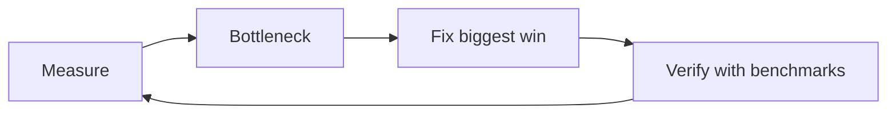

# Performance Optimization

> Make Python faster and leaner — measure first, then apply algorithmic, I/O, and runtime optimizations.

## Definition

**Performance optimization** improves latency, throughput, or memory. Rule zero: **measure before optimizing**. Premature optimization wastes time and harms clarity.

## Uses

- Speed up batch embedding / ETL
- Cut p95 API latency
- Reduce memory for large corpora

## Process



## Tooling

```python
import timeit
print(timeit.timeit("sum(range(1000))", number=1000))

import cProfile
cProfile.run("sum(i*i for i in range(100000))")
```

## High-ROI techniques

| Technique | Example |
|-----------|---------|
| Better algorithm | O(n) set membership vs O(n²) list scans |
| Generators | Stream instead of materializing |
| Vectorization | NumPy/Pandas over pure Python loops |
| Caching | `lru_cache` for pure expensive funcs |
| Avoid repeated work | Compile regex once |
| I/O concurrency | asyncio / batching |

## Code examples

```python
hay = list(range(10000))
needle = 9999
fast = set(hay)
print(needle in fast)
```

```python
parts = []
for i in range(1000):
    parts.append(str(i))
s = "".join(parts)                 # good
```

```python
import re
CRE = re.compile(r"\d+")
print(CRE.findall("a1b22"))
```

## AI-specific tips

1. Batch embedding requests
2. Bound concurrency to the sweet spot (not max)
3. Cache retrieval for identical queries when safe
4. Don’t micro-optimize prompts while retrieval is the bottleneck

## Common mistakes

- Optimizing without a profiler
- Trading clarity for tiny gains
- Caching without TTLs → stale/wrong answers

---

## Continue

- **Previous:** [Python Internals](38-python-internals.md)
- **Hub:** [Python topics](../README.md)
- **Next:** [Clean Code & Python Best Practices](40-clean-code-best-practices.md)
- **AI production guide:** [Python for AI Engineering](../python-for-ai-engineering.md)

---

## AI engineering angle

This topic shows up constantly in AI codebases: training scripts, eval runners, FastAPI services, agent tools, and data cleanup jobs. Prefer clear `main()` entrypoints, typed interfaces, and small testable functions over notebook-only workflows.

## Production checklist

- [ ] Errors are explicit (no bare `except:`)
- [ ] Logging instead of leftover `print` in services
- [ ] Deterministic seeds where experiments need reproduction
- [ ] Resource cleanup via `with` / context managers
- [ ] Unit tests for pure helpers

## Practice exercises

1. Rewrite one snippet from this page as a function with type hints and a docstring.
2. Add a failing unit test, then make it pass.
3. Note one way this concept appears in RAG, agents, or LLM API clients.

## Interview prompts

**Q: When would you choose a different approach than the default shown here?**

A: Tie the answer to performance, readability, concurrency, or API boundaries — and give a concrete AI-engineering example (streaming responses, batch embedding, tool sandboxing).

## See also

- [Python hub](../README.md)
- [Python Frameworks](../../python-frameworks-libraries/README.md)
- [LLM Application Development](../../llm-application-development/README.md)

