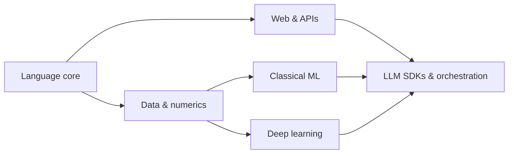

# Python Frameworks & Libraries

> The practical Python stack for building AI services — web frameworks, data/ML libraries, and LLM SDKs.

**Prerequisites:** [Python](../python-engineering/README.md)  
**Unlocks:** [LLM Application Development](../llm-application-development/README.md) · [Machine Learning](../machine-learning/README.md)

---

## Definition

**Python frameworks and libraries** are the reusable building blocks you use instead of writing everything from scratch: HTTP APIs (FastAPI), data arrays (NumPy), tables (Pandas), ML (scikit-learn), deep learning (PyTorch), and LLM SDKs (OpenAI, Anthropic, LangChain/LangGraph).

---

## Learning path

---

## Documents

| # | Topic | Document |
|---|-------|----------|
| 1 | Stack overview | [python-ai-stack.md](python-ai-stack.md) |
| 2 | Web frameworks for AI APIs | [web-frameworks-for-ai.md](web-frameworks-for-ai.md) |
| 3 | Data & ML libraries | [data-and-ml-libraries.md](data-and-ml-libraries.md) |

---

## Related topics

- [Python](../python-engineering/README.md)
- [FastAPI](../fastapi/README.md)
- [Backend Engineering](../backend-engineering/README.md)

---

## See also

- [Domains overview](../README.md)
- [Learning Roadmap](../../meta/roadmap.md)
- [Master Index](../../meta/indexes/MASTER-INDEX.md)
