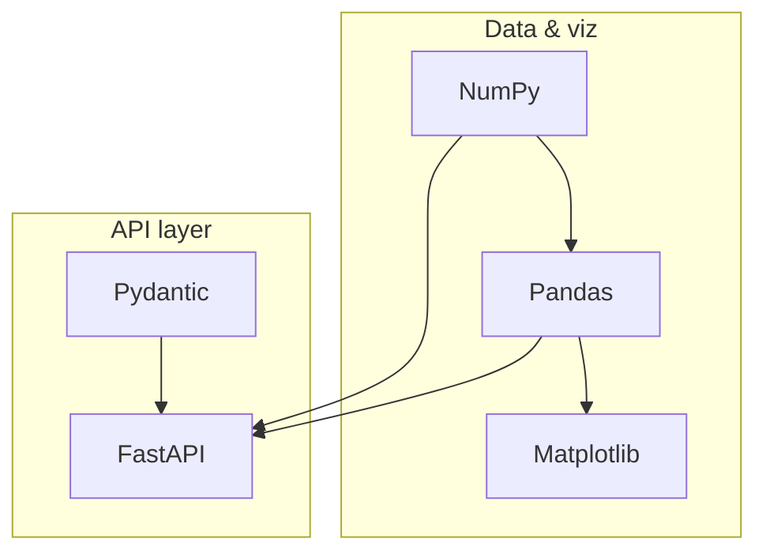
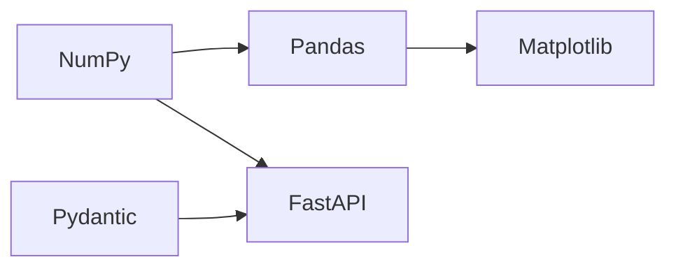

# Python Frameworks & Libraries

> Lessons deepened 2026-08-12.

> The practical Python stack for AI engineering — **NumPy**, **Pandas**, **Matplotlib**, **FastAPI**, and **Pydantic** — with definitions, key classes/functions, uses, and code.

**Prerequisites:** [Python](../python-engineering/README.md)  
**Unlocks:** [LLM Application Development](../llm-application-development/README.md) · [Machine Learning](../machine-learning/README.md)

Start with a framework hub below (or expand **2. Python Frameworks & Libraries** in the left sidebar). Each framework contains topic pages for important classes, functions, and patterns.

---

## Frameworks

| # | Framework | What you will learn | Hub |
|---|-----------|---------------------|-----|
| 1 | **NumPy** | `ndarray`, indexing, broadcasting, ufuncs, linalg | [numpy/](numpy/README.md) |
| 2 | **Pandas** | Series/DataFrame, I/O, filter, groupby, merge | [pandas/](pandas/README.md) |
| 3 | **Matplotlib** | Figures/Axes, charts, subplots, export | [matplotlib/](matplotlib/README.md) |
| 4 | **FastAPI** | Routes, params, DI, async, streaming | [fastapi/](fastapi/README.md) |
| 5 | **Pydantic** | BaseModel, Field, validators, settings | [pydantic/](pydantic/README.md) |

---

## Hierarchy

### 1. NumPy

| # | Topic |
|---|-------|
| 1 | [ndarray basics](numpy/01-ndarray-basics.md) |
| 2 | [Creating arrays](numpy/02-creating-arrays.md) |
| 3 | [Indexing & slicing](numpy/03-indexing-slicing.md) |
| 4 | [Shape, reshape & axes](numpy/04-shape-reshape-axes.md) |
| 5 | [Universal functions (ufuncs)](numpy/05-ufuncs-math.md) |
| 6 | [Aggregations](numpy/06-aggregations.md) |
| 7 | [Broadcasting](numpy/07-broadcasting.md) |
| 8 | [Linear algebra essentials](numpy/08-linear-algebra.md) |
| 9 | [Random module](numpy/09-random.md) |
| 10 | [Important APIs cheat sheet](numpy/10-important-apis.md) |

### 2. Pandas

| # | Topic |
|---|-------|
| 1 | [Series & DataFrame](pandas/01-series-dataframe.md) |
| 2 | [Reading & writing data](pandas/02-io-read-write.md) |
| 3 | [Selecting & filtering](pandas/03-selecting-filtering.md) |
| 4 | [Missing data](pandas/04-missing-data.md) |
| 5 | [GroupBy & aggregation](pandas/05-groupby-aggregation.md) |
| 6 | [Merge, join & concat](pandas/06-merge-join-concat.md) |
| 7 | [Apply & transforms](pandas/07-apply-transforms.md) |
| 8 | [Important APIs cheat sheet](pandas/08-important-apis.md) |

### 3. Matplotlib

| # | Topic |
|---|-------|
| 1 | [Figures & Axes](matplotlib/01-figures-axes.md) |
| 2 | [Line, scatter & bar](matplotlib/02-line-scatter-bar.md) |
| 3 | [Subplots & layout](matplotlib/03-subplots-layout.md) |
| 4 | [Labels, legends & style](matplotlib/04-labels-legends-style.md) |
| 5 | [Histograms & heatmaps](matplotlib/05-histograms-heatmaps.md) |
| 6 | [Saving figures](matplotlib/06-saving-figures.md) |
| 7 | [Important APIs cheat sheet](matplotlib/07-important-apis.md) |

### 4. FastAPI

| # | Topic |
|---|-------|
| 1 | [App, router & routes](fastapi/01-app-routes.md) |
| 2 | [Path, query & body parameters](fastapi/02-path-query-body.md) |
| 3 | [Request/response models](fastapi/03-request-response-models.md) |
| 4 | [Dependency injection](fastapi/04-dependency-injection.md) |
| 5 | [Status codes & errors](fastapi/05-status-errors.md) |
| 6 | [Async endpoints](fastapi/06-async-endpoints.md) |
| 7 | [Streaming responses](fastapi/07-streaming.md) |
| 8 | [Middleware & CORS](fastapi/08-middleware-cors.md) |
| 9 | [Important APIs cheat sheet](fastapi/09-important-apis.md) |

### 5. Pydantic

| # | Topic |
|---|-------|
| 1 | [BaseModel basics](pydantic/01-basemodel-basics.md) |
| 2 | [Fields & constraints](pydantic/02-fields-constraints.md) |
| 3 | [Nested models & collections](pydantic/03-nested-collections.md) |
| 4 | [Validators](pydantic/04-validators.md) |
| 5 | [Serialization](pydantic/05-serialization.md) |
| 6 | [Settings management](pydantic/06-settings.md) |
| 7 | [Important APIs cheat sheet](pydantic/07-important-apis.md) |

---

## Suggested order

1. **NumPy** → **Pandas** → **Matplotlib** (data path)  
2. **Pydantic** → **FastAPI** (API path)  
3. Combine both for AI services (features in NumPy/Pandas, API in FastAPI+Pydantic)

---

## Also in this folder

| Document | Description |
|----------|-------------|
| [Stack overview](python-ai-stack.md) | Broader AI Python stack map |
| [Web frameworks for AI](web-frameworks-for-ai.md) | Framework choice notes |
| [Data & ML libraries](data-and-ml-libraries.md) | NumPy/Pandas/sklearn/PyTorch roles |

Production FastAPI deep dive: [domains/fastapi](../fastapi/README.md)

---

## Related topics

- [Python](../python-engineering/README.md)
- [Backend Engineering](../backend-engineering/README.md)
- [LLM Application Development](../llm-application-development/README.md)

---

## See also

- [Domains overview](../README.md)
- [Learning Roadmap](../../meta/roadmap.md)
- [Master Index](../../meta/indexes/MASTER-INDEX.md)

---

## Continue learning

Next: [Mathematics & Statistics](../mathematics-statistics/README.md) or [LLM App Dev](../llm-application-development/README.md)

