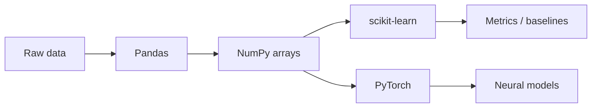

# Data and ML Libraries

> NumPy, Pandas, scikit-learn, and PyTorch — what each is for in an AI engineering career path.

## Definition

**Data/ML libraries** turn Python into a scientific computing environment: NumPy (arrays), Pandas (tabular data), scikit-learn (classical ML), PyTorch (deep learning tensors and training).

## Why it matters

Even if you call hosted LLMs all day, you still need these for evaluation datasets, embedding analysis, fine-tuning experiments, and understanding model internals.

## How it works

## Key principles

1. **Use Pandas for datasets** — Golden sets, logs, and eval tables live here.
2. **Use sklearn for baselines** — Always beat a simple baseline before complex DL.
3. **Use PyTorch when training** — Fine-tuning and custom heads need a DL framework.

## Common applications

| Application | Description |
|-------------|-------------|
| Eval pipelines | Load traces, score, aggregate with Pandas |
| Classical ML features | Intent classifiers, anomaly detection |
| Fine-tuning | Tokenize → torch Dataset → Trainer |

## Common mistakes

- Skipping baselines and jumping straight to LLM/DL
- Holding giant DataFrames in API memory
- Confusing inference SDKs with training frameworks

## Further reading

- [Machine Learning](../machine-learning/README.md)
- [Deep Learning](../deep-learning/README.md)
- [LLM Fine-Tuning](../llm-fine-tuning/README.md)
