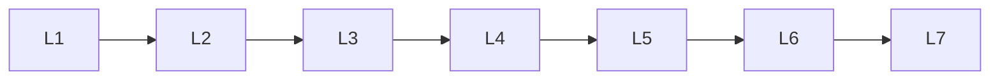

# Matplotlib

> Deep lessons for **Matplotlib** in the Python Frameworks & Libraries handbook.

## Lessons

| # | Lesson |
|---|--------|
| 1 | [Matplotlib: Figures & Axes](01-figures-axes.md) |
| 2 | [Matplotlib: Line, Scatter & Bar](02-line-scatter-bar.md) |
| 3 | [Matplotlib: Subplots & Layout](03-subplots-layout.md) |
| 4 | [Matplotlib: Labels, Legends & Style](04-labels-legends-style.md) |
| 5 | [Matplotlib: Histograms & Heatmaps](05-histograms-heatmaps.md) |
| 6 | [Matplotlib: Saving Figures](06-saving-figures.md) |
| 7 | [Matplotlib: Important APIs Cheat Sheet](07-important-apis.md) |

**Topic hub:** [../README.md](../README.md)
