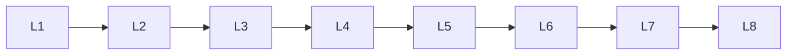

# Numpy

> Deep lessons for **Numpy** in the Python Frameworks & Libraries handbook.

## Lessons

| # | Lesson |
|---|--------|
| 1 | [NumPy: ndarray Basics](01-ndarray-basics.md) |
| 2 | [NumPy: Creating Arrays](02-creating-arrays.md) |
| 3 | [NumPy: Indexing & Slicing](03-indexing-slicing.md) |
| 4 | [NumPy: Shape, Reshape & Axes](04-shape-reshape-axes.md) |
| 5 | [NumPy: Universal Functions (ufuncs)](05-ufuncs-math.md) |
| 6 | [NumPy: Aggregations](06-aggregations.md) |
| 7 | [NumPy: Broadcasting](07-broadcasting.md) |
| 8 | [NumPy: Linear Algebra Essentials](08-linear-algebra.md) |
| 9 | [NumPy: Random Module](09-random.md) |
| 10 | [NumPy: Important APIs Cheat Sheet](10-important-apis.md) |

**Topic hub:** [../README.md](../README.md)
