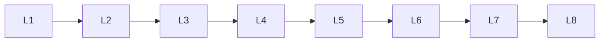

# Pandas

> Deep lessons for **Pandas** in the Python Frameworks & Libraries handbook.

## Lessons

| # | Lesson |
|---|--------|
| 1 | [Pandas: Series & DataFrame](01-series-dataframe.md) |
| 2 | [Pandas: Reading & Writing Data](02-io-read-write.md) |
| 3 | [Pandas: Selecting & Filtering](03-selecting-filtering.md) |
| 4 | [Pandas: Missing Data](04-missing-data.md) |
| 5 | [Pandas: GroupBy & Aggregation](05-groupby-aggregation.md) |
| 6 | [Pandas: Merge, Join & Concat](06-merge-join-concat.md) |
| 7 | [Pandas: Apply & Transforms](07-apply-transforms.md) |
| 8 | [Pandas: Important APIs Cheat Sheet](08-important-apis.md) |

**Topic hub:** [../README.md](../README.md)
