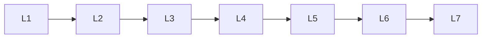

# Pydantic

> Deep lessons for **Pydantic** in the Python Frameworks & Libraries handbook.

## Lessons

| # | Lesson |
|---|--------|
| 1 | [Pydantic: BaseModel Basics](01-basemodel-basics.md) |
| 2 | [Pydantic: Fields & Constraints](02-fields-constraints.md) |
| 3 | [Pydantic: Nested Models & Collections](03-nested-collections.md) |
| 4 | [Pydantic: Validators](04-validators.md) |
| 5 | [Pydantic: Serialization](05-serialization.md) |
| 6 | [Pydantic: Settings Management](06-settings.md) |
| 7 | [Pydantic: Important APIs Cheat Sheet](07-important-apis.md) |

**Topic hub:** [../README.md](../README.md)
