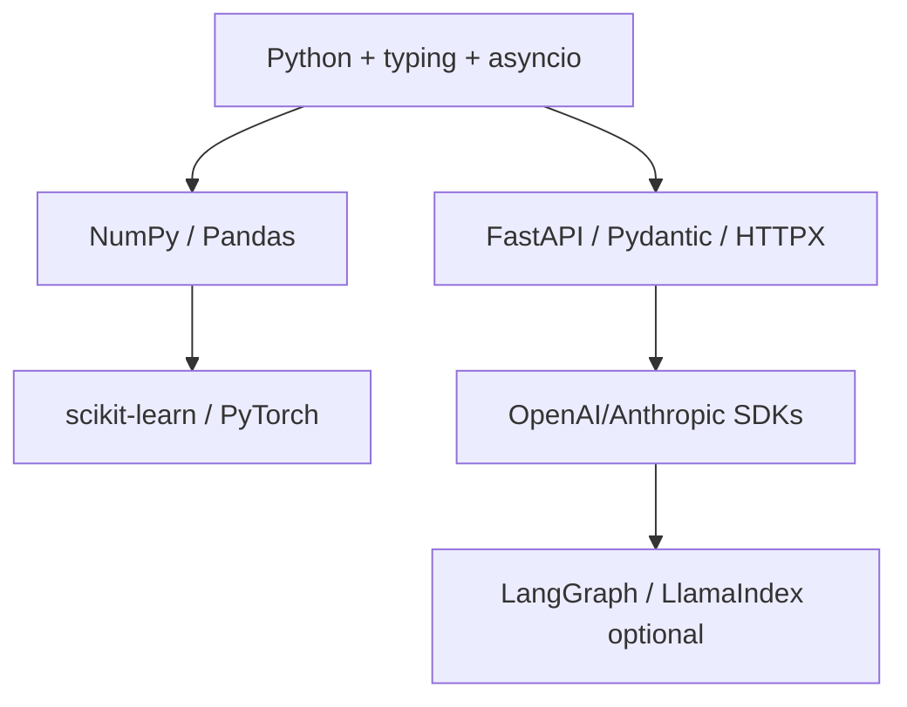

# Python AI Stack Overview

> Map of the Python libraries you actually need for AI engineering — and when to use each layer.

## Definition

An **AI Python stack** is a layered set of libraries: language/runtime → web/API → data → ML/DL → LLM orchestration. Each layer solves a different job; skipping layers or mixing too many frameworks is a common source of fragile systems.

## Why it matters

Choosing the right stack early reduces rewrite cost. Production AI apps are usually FastAPI + Pydantic + a provider SDK, with optional LangGraph/LlamaIndex only when orchestration complexity justifies it.

## How it works

## Key principles

1. **Prefer boring defaults** — FastAPI + official provider SDKs cover most production LLM APIs.
2. **Add frameworks for complexity** — Use LangGraph/agents frameworks when you need durable workflows, not for a single chat call.
3. **Keep data tools separate** — NumPy/Pandas/sklearn belong in training/eval pipelines more than in request hot paths.

## Common applications

| Application | Description |
|-------------|-------------|
| LLM chat API | FastAPI + OpenAI/Anthropic SDK + Redis cache |
| RAG service | FastAPI + embedding SDK + vector DB client |
| Offline eval | Pandas + custom metrics + optional sklearn |

## Common mistakes

- Pulling LangChain into every endpoint when a 20-line SDK call would do
- Using Flask/Django sync patterns for streaming LLM responses without async planning
- Training-stack libraries (PyTorch) inside latency-sensitive API workers

## Further reading

- [Web frameworks for AI](web-frameworks-for-ai.md)
- [FastAPI domain](../fastapi/README.md)
- [Python for AI Engineering](../python-engineering/python-for-ai-engineering.md)
