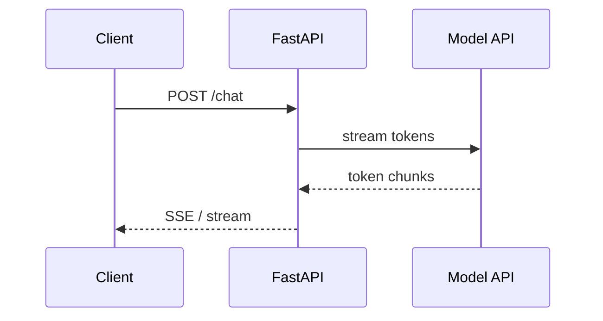

# Web Frameworks for AI APIs

> How to choose and structure Python web frameworks for LLM and RAG services.

## Definition

A **web framework** handles HTTP routing, validation, auth, and response streaming. For AI services, the critical features are async I/O, Pydantic models, OpenAPI docs, and first-class streaming (SSE/WebSocket).

## Why it matters

LLM calls are slow and I/O-bound. An async-friendly framework (FastAPI/Starlette) lets you serve many concurrent requests without blocking workers on token generation.

## How it works

## Key principles

1. **Async by default** — LLM and vector DB calls should not block the event loop.
2. **Validate at the edge** — Pydantic request/response models catch bad inputs early.
3. **Stream when UX needs it** — Chat UIs almost always want token streaming.

## Common applications

| Application | Description |
|-------------|-------------|
| Chat completions API | POST endpoint + SSE stream |
| RAG query API | retrieve → generate → cite |
| Webhook/tool callbacks | agent tool results posted back to your API |

## Common mistakes

- Buffering full LLM responses when the product needs streaming
- Putting business logic only in route handlers with no service layer
- Ignoring timeouts/cancellation on long generations

## Further reading

- [FastAPI](../fastapi/README.md)
- [APIs](../apis/README.md)
- [LLM Application Development](../llm-application-development/README.md)
