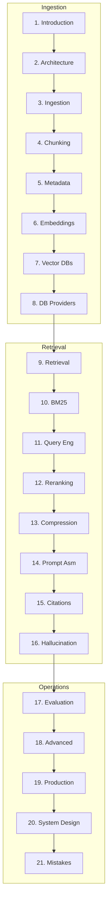

# Retrieval-Augmented Generation (RAG)

> The definitive engineering handbook for designing, implementing, evaluating, and scaling production RAG systems.
> **Prerequisites:** [Context Engineering](../context-engineering/README.md) · [Prompt Engineering](../prompt-engineering/README.md) · [LLM Engineering](../llm-engineering/README.md)

---

## Module Overview

RAG is a complete **information retrieval and knowledge engineering system** — not "LLM + vector database."

**Unlocks:** [AI Agents](../ai-agents/README.md) · [MCP](../mcp/README.md) · [Multi-Agent Systems](../multi-agent-systems/README.md)

---

## Documents (21 Sections)

| # | Topic | Document |
|---|-------|----------|
| 1 | Introduction | [introduction-to-rag.md](introduction-to-rag.md) |
| 2 | End-to-End Architecture | [end-to-end-rag-architecture.md](end-to-end-rag-architecture.md) |
| 3 | Document Ingestion | [document-ingestion-pipeline.md](document-ingestion-pipeline.md) |
| 4 | Chunking | [chunking.md](chunking.md) |
| 5 | Metadata Engineering | [metadata-engineering.md](metadata-engineering.md) |
| 6 | Embeddings | [embeddings-for-rag.md](embeddings-for-rag.md) |
| 7 | Vector Databases | [vector-databases.md](vector-databases.md) |
| 8 | Vector DB Providers | [providers/README.md](providers/README.md) |
| 9 | Retrieval Strategies | [retrieval-strategies.md](retrieval-strategies.md) |
| 10 | BM25 | [bm25.md](bm25.md) |
| 11 | Query Engineering | [query-engineering.md](query-engineering.md) |
| 12 | Reranking | [reranking.md](reranking.md) |
| 13 | Context Compression | [rag-context-compression.md](rag-context-compression.md) |
| 14 | Prompt Assembly | [rag-prompt-assembly.md](rag-prompt-assembly.md) |
| 15 | Citations & Grounding | [citations-and-grounding.md](citations-and-grounding.md) |
| 16 | Hallucination Prevention | [hallucination-prevention.md](hallucination-prevention.md) |
| 17 | RAG Evaluation | [rag-evaluation.md](rag-evaluation.md) |
| 18 | Advanced Architectures | [advanced-rag-architectures.md](advanced-rag-architectures.md) |
| 19 | Production RAG | [production-rag.md](production-rag.md) |
| 20 | System Design | [rag-system-design.md](rag-system-design.md) |
| 21 | Common Mistakes | [rag-mistakes.md](rag-mistakes.md) |

**Comparisons:** [rag-comparison-guides.md](rag-comparison-guides.md)

### Vector Database Guides (Section 8)

[FAISS](providers/faiss.md) · [Chroma](providers/chroma.md) · [PGVector](providers/pgvector.md) · [Pinecone](providers/pinecone.md) · [Milvus](providers/milvus.md) · [Weaviate](providers/weaviate.md) · [Qdrant](providers/qdrant.md)

---

## Code Examples

13 examples in [`examples/rag/`](../../examples/rag/) including complete pipeline, hybrid search, BM25, evaluation, FastAPI, Qdrant, reranking.

---

## Cheat Sheets

- [Chunking Selection](../../cheat-sheets/rag-chunking-selection-cheat-sheet.md)
- [Embedding Selection](../../cheat-sheets/rag-embedding-selection-cheat-sheet.md)
- [Vector DB Selection](../../cheat-sheets/rag-vector-database-selection-cheat-sheet.md)
- [Retrieval Strategy](../../cheat-sheets/rag-retrieval-strategy-cheat-sheet.md)
- [Reranking Checklist](../../cheat-sheets/rag-reranking-checklist.md)
- [Evaluation Checklist](../../cheat-sheets/rag-evaluation-checklist.md)
- [Production Deployment](../../cheat-sheets/rag-production-deployment-checklist.md)
- [Hallucination Debugging](../../cheat-sheets/rag-hallucination-debugging-checklist.md)
- [Performance Optimization](../../cheat-sheets/rag-performance-optimization-checklist.md)

---

## Learning Path

1. **Foundations** — Introduction → Architecture → Ingestion → Chunking → Metadata
2. **Index** — Embeddings → Vector DBs → Provider guides
3. **Retrieve** — Strategies → BM25 → Query → Rerank → Compress → Assemble
4. **Trust** — Citations → Hallucination prevention → Evaluation
5. **Scale** — Advanced architectures → Production → System design → Mistakes

**Milestone:** Hybrid RAG with golden eval set, recall@5 gate in CI, traced citations, tenant ACL filters.

---

## Completion Checklist

- [ ] Read all 21 sections + 7 provider guides
- [ ] Implement ingest → chunk → embed → index pipeline
- [ ] Hybrid retrieval + reranking
- [ ] Golden dataset with ≥50 labeled questions
- [ ] recall@5 regression in CI
- [ ] FastAPI query endpoint with metadata filters
- [ ] Review [RAG mistakes](rag-mistakes.md) against your system

---

## See Also

- [Context Engineering](../context-engineering/README.md)
- [RAG Query Template](../../prompts/templates/rag-query.md)
- [Master Index](../../meta/indexes/MASTER-INDEX.md)
