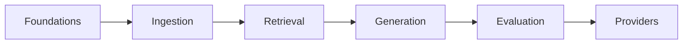

# RAG

> Retrieval-augmented generation — ingestion, retrieval, grounding, eval, and production.

**Prerequisites:** [Embeddings & Vector Databases](../embeddings-vector-databases/README.md) · [Prompt Engineering](../prompt-engineering/README.md)  
**Unlocks:** [AI Agents](../ai-agents/README.md) · [LLM Evaluation](../ai-evaluation/README.md)

Thin lessons deepened 2026-08-12. Start with a section hub below (or expand the topic in the left sidebar).

---

## Sections

| # | Section | What you will learn | Hub |
|---|---------|---------------------|-----|
| 1 | **Foundations** | Intro and architectures | [foundations/](foundations/README.md) |
| 2 | **Ingestion** | Docs, chunking, metadata | [ingestion/](ingestion/README.md) |
| 3 | **Retrieval** | Dense, sparse, hybrid, rerank | [retrieval/](retrieval/README.md) |
| 4 | **Generation & Grounding** | Prompts, citations, compression | [generation-and-grounding/](generation-and-grounding/README.md) |
| 5 | **Evaluation & Production** | Eval, ops, mistakes | [evaluation-and-production/](evaluation-and-production/README.md) |
| 6 | **Providers** | VDB provider notes (see also topic 13) | [providers/](providers/README.md) |

```mermaid
flowchart LR
  S1[Foundations] --> S2[Ingestion] --> S3[Retrieval] --> S4[Generation] --> S5[Evaluation] --> S6[Providers]
```

---

## Hierarchy

### Foundations

| # | Topic |
|---|-------|
| 1 | [Introduction To Rag](foundations/01-introduction-to-rag.md) |
| 2 | [End To End Rag Architecture](foundations/02-end-to-end-rag-architecture.md) |
| 3 | [Advanced Rag Architectures](foundations/03-advanced-rag-architectures.md) |

### Ingestion

| # | Topic |
|---|-------|
| 1 | [Document Ingestion Pipeline](ingestion/01-document-ingestion-pipeline.md) |
| 2 | [Chunking](ingestion/02-chunking.md) |
| 3 | [Metadata Engineering](ingestion/03-metadata-engineering.md) |

### Retrieval

| # | Topic |
|---|-------|
| 1 | [Embeddings For Rag](retrieval/01-embeddings-for-rag.md) |
| 2 | [Vector Databases](retrieval/02-vector-databases.md) |
| 3 | [Bm25](retrieval/03-bm25.md) |
| 4 | [Retrieval Strategies](retrieval/04-retrieval-strategies.md) |
| 5 | [Query Engineering](retrieval/05-query-engineering.md) |
| 6 | [Reranking](retrieval/06-reranking.md) |

### Generation & Grounding

| # | Topic |
|---|-------|
| 1 | [Rag Prompt Assembly](generation-and-grounding/01-rag-prompt-assembly.md) |
| 2 | [Citations And Grounding](generation-and-grounding/02-citations-and-grounding.md) |
| 3 | [Hallucination Prevention](generation-and-grounding/03-hallucination-prevention.md) |
| 4 | [Rag Context Compression](generation-and-grounding/04-rag-context-compression.md) |

### Evaluation & Production

| # | Topic |
|---|-------|
| 1 | [Rag Evaluation](evaluation-and-production/01-rag-evaluation.md) |
| 2 | [Production Rag](evaluation-and-production/02-production-rag.md) |
| 3 | [Rag System Design](evaluation-and-production/03-rag-system-design.md) |
| 4 | [Rag Mistakes](evaluation-and-production/04-rag-mistakes.md) |
| 5 | [Rag Comparison Guides](evaluation-and-production/05-rag-comparison-guides.md) |

### Providers

| # | Topic |
|---|-------|
| 1 | [Chroma](providers/01-chroma.md) |
| 2 | [Faiss](providers/02-faiss.md) |
| 3 | [Milvus](providers/03-milvus.md) |
| 4 | [Pgvector](providers/04-pgvector.md) |
| 5 | [Pinecone](providers/05-pinecone.md) |
| 6 | [Qdrant](providers/06-qdrant.md) |
| 7 | [Weaviate](providers/07-weaviate.md) |

---

## Definition

**RAG** grounds LLM answers in retrieved evidence from your corpora, with pipelines for ingest, retrieve, generate, cite, and evaluate.

---

## Related topics

- [Domains overview](../README.md)
- [Master Index](../../meta/indexes/MASTER-INDEX.md)
