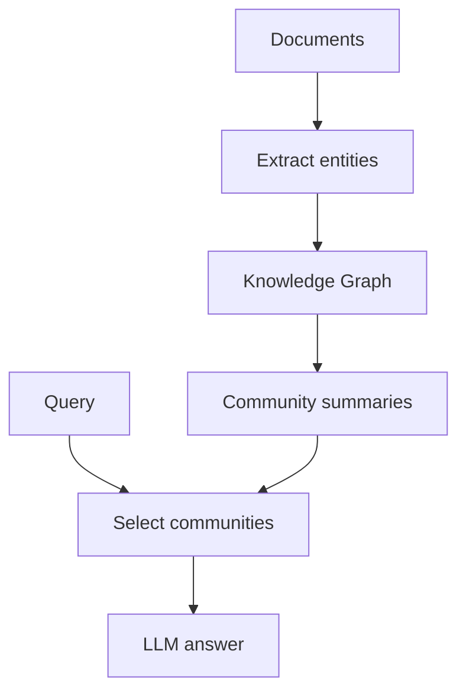

# Advanced RAG Architectures

> Beyond naive retrieve-then-generate — when and how to adopt advanced patterns.

## Overview

Section **18** of Phase 7.

| Architecture | Idea | Production fit |
|--------------|------|----------------|
| **GraphRAG** | KG + community summaries | Large corpus global questions |
| **RAPTOR** | Recursive tree summaries | Hierarchical long docs |
| **Self-RAG** | Model reflects on retrieve/generate | Research → emerging prod |
| **CRAG** | Correct retrieval with web fallback | High stakes + web |
| **Agentic RAG** | Agent tools for search | Complex multi-step |
| **Corrective RAG** | Grade retrieval, reformulate | Noisy corpora |
| **Adaptive RAG** | Route simple vs complex paths | Cost optimization |
| **Modular RAG** | Swappable modules | Enterprise platforms |
| **Multi-hop RAG** | Iterative retrieval chains | Research, legal |
| **Knowledge Graph RAG** | Entity-relationship traversal | Structured domains |
| **Recursive RAG** | Repeated refine loops | Deep analysis |
| **Long Context RAG** | Huge window + minimal retrieve | When model allows |
| **Multi-Agent RAG** | Specialized retriever/writer agents | Large orgs |

## GraphRAG

## Self-RAG

Retrieve → generate → **self-critique** tokens (relevant? supported?) → revise.

## Agentic RAG

Agent decides: search KB, search web, or answer from memory — prepares [AI Agents](../ai-agents/README.md) phase.

## Navigation

- [Production RAG](production-rag.md)

---

## Changelog

| Version | Date | Changes |
|---------|------|---------|
| 1.0 | 2026-07-13 | Phase 7 Section 18 |
