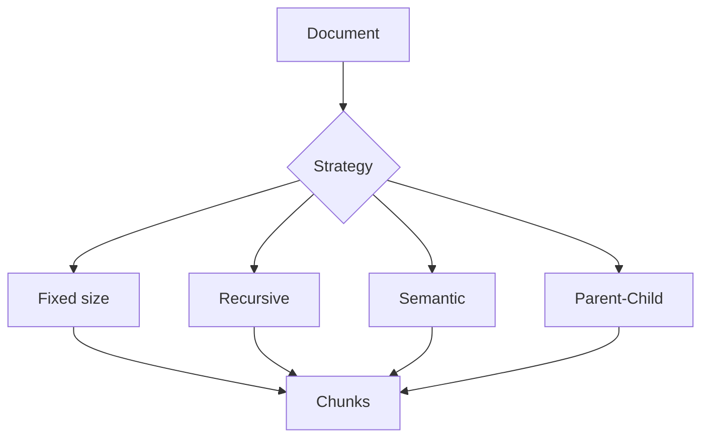

# Chunking for RAG

> Chunking determines retrieval granularity — the highest-leverage RAG hyperparameter.

## Table of Contents

- [Overview](#overview)
- [Why Chunking Exists](#why-chunking-exists)
- [Chunking Strategies](#chunking-strategies)
- [Strategy Comparison](#strategy-comparison)
- [Implementation Patterns](#implementation-patterns)
- [Production Considerations](#production-considerations)
- [Python Examples](#python-examples)
- [Interview Preparation](#interview-preparation)
- [Navigation](#navigation)

---

## Overview

Section **4** of Phase 7.



---

## Why Chunking Exists

Embedding models have limited context; retrieval returns top-K **passages**, not whole books. Chunks must be:

- **Self-contained enough** to answer questions
- **Small enough** for precise retrieval
- **Overlapping** where boundaries split facts

---

## Chunking Strategies

### Fixed Chunking
Split every N characters/tokens.

| Pros | Cons |
|------|------|
| Simple, fast | Splits mid-sentence |

### Recursive Chunking
Split on `\n\n`, `\n`, `.`, space hierarchy ([LangChain](https://python.langchain.com/) pattern).

| Pros | Cons |
|------|------|
| Respects structure better | Still arbitrary at leaf |

### Semantic Chunking
Embed sentences; split when similarity drops.

| Pros | Cons |
|------|------|
| Topic-coherent chunks | Slower, embedding cost |

### Sliding Window
Fixed size + overlap (e.g. 512 tokens, 128 overlap).

| Pros | Cons |
|------|------|
| Reduces boundary loss | Storage duplication |

### Parent-Child Chunking
Small **child** chunks for retrieval; large **parent** for generation context.

| Pros | Cons |
|------|------|
| Precision + context | Index complexity |

### Sentence / Token Chunking
Sentence boundaries or tokenizer-aware splits.

### Markdown / Code Chunking
Split on `#` headings or AST functions/classes.

### Hierarchical Chunking
Document → section → paragraph tree; retrieve leaves, expand to parents.

### Adaptive Chunking
Chunk size by content type (code vs prose).

---

## Strategy Comparison

| Strategy | Retrieval quality | Cost | Latency | Best for |
|----------|-------------------|------|---------|----------|
| Fixed | Low–Med | Low | Low | Prototypes |
| Recursive | Med | Low | Low | General docs |
| Semantic | High | High | Med | Mixed topics |
| Parent-child | High | Med | Med | Enterprise KB |
| Code AST | High | Med | Med | Repos |

---

## Implementation Patterns

```python
# Recursive separators (typical order)
SEPARATORS = ["\n\n", "\n", ". ", " ", ""]
```

**Rule of thumb:** Start 512 tokens, 10–20% overlap, recursive on paragraphs; tune with eval recall@K.

---

## Production Considerations

- Store `chunk_index`, `start_char`, `parent_id` in metadata
- Re-chunk on policy change = reindex version bump
- Never chunk without preserving `doc_id` lineage

---

## Python Examples

```python
def recursive_split(text: str, chunk_size: int, separators: list[str]) -> list[str]:
    if len(text) <= chunk_size or not separators:
        return [text[:chunk_size]] if text else []
    sep, rest = separators[0], separators[1:]
    parts = text.split(sep)
    chunks, current = [], ""
    for part in parts:
        candidate = current + sep + part if current else part
        if len(candidate) <= chunk_size:
            current = candidate
        else:
            if current:
                chunks.extend(recursive_split(current, chunk_size, rest))
            current = part
    if current:
        chunks.extend(recursive_split(current, chunk_size, rest))
    return chunks
```

---

## Interview Preparation

**Q: How choose chunk size?**

> Eval recall@K on golden questions; typical 256–1024 tokens; use parent-child if answers need surrounding context.

---

## Navigation

### Prerequisites

- [Document Ingestion Pipeline](document-ingestion-pipeline.md)

### Next

- [Metadata Engineering](metadata-engineering.md)

---

## Changelog

| Version | Date | Changes |
|---------|------|---------|
| 1.0 | 2026-07-13 | Initial publication — Phase 7 Section 4 |
