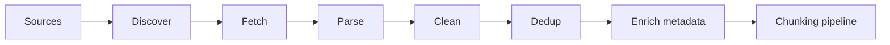

# Document Ingestion Pipeline

> Production workflows for turning heterogeneous sources into clean, indexed knowledge.

## Table of Contents

- [Overview](#overview)
- [Ingestion Architecture](#ingestion-architecture)
- [Source Types](#source-types)
- [Cleaning and Normalization](#cleaning-and-normalization)
- [Parsing Strategies](#parsing-strategies)
- [Deduplication](#deduplication)
- [Enrichment](#enrichment)
- [Production Workflow](#production-workflow)
- [Performance Considerations](#performance-considerations)
- [Security Considerations](#security-considerations)
- [Python Examples](#python-examples)
- [Interview Preparation](#interview-preparation)
- [Navigation](#navigation)

---

## Overview

Section **3** of Phase 7. Ingestion quality caps retrieval quality — garbage in, hallucinations out.



---

## Ingestion Architecture

| Component | Role |
|-----------|------|
| Connector | Pull from S3, Drive, Git, DB |
| Parser | Extract text + structure |
| Normalizer | Unicode, whitespace, encoding |
| Deduplicator | Skip unchanged content |
| Enricher | Title, author, ACL, language |
| Publisher | Emit to chunking queue |

---

## Source Types

| Source | Parser approach | Notes |
|--------|-----------------|-------|
| **PDF** | PyMuPDF, pdfplumber, Unstructured | OCR for scans |
| **DOCX** | python-docx, Unstructured | Preserve headings |
| **HTML** | BeautifulSoup, Trafilatura | Strip nav/ads |
| **Markdown** | AST by headings | Native structure |
| **Code repos** | Tree-sitter, file walk | Language-aware |
| **Websites** | Crawl + sitemap | Respect robots.txt |
| **Images** | OCR (Tesseract, Vision API) | Quality varies |
| **Audio/Video** | Whisper transcripts | Timestamp metadata |
| **Structured data** | Row → text template | SQL, CSV, JSON |
| **Databases** | CDC or batch export | Freshness hooks |

---

## Cleaning and Normalization

- Fix encoding (UTF-8)
- Collapse excessive whitespace
- Remove headers/footers (PDF boilerplate)
- Strip HTML scripts/styles
- Normalize bullets and lists
- Language detection for routing

---

## Parsing Strategies

**Layout-aware parsing** preserves tables and headings — critical for legal/financial docs.

**Structure-first:** Markdown/HTML → heading hierarchy before token chunking.

---

## Deduplication

| Level | Method |
|-------|--------|
| Document | `checksum` / `content_hash` |
| Near-duplicate | SimHash, MinHash |
| Version | `source_version` — update not duplicate |

Skip re-embed if content hash unchanged.

---

## Enrichment

- Extract title, author, dates
- Infer `doc_type`, `product`, `language`
- Attach `tenant_id`, `acl` from source system
- Link parent/child for hierarchical docs

---

## Production Workflow

1. Event trigger (upload, webhook, schedule)
2. Idempotent job with `doc_id`
3. Parse → validate min content length
4. Write to staging → chunk → embed → upsert
5. Mark index version; alert on failure DLQ

---

## Performance Considerations

- Parallel workers per document type
- Stream large PDFs page-by-page
- Rate-limit external APIs (OCR, crawl)

---

## Security Considerations

- Scan uploads for malware
- Respect document ACL at ingest
- Redact secrets in code repos (gitleaks)

---

## Python Examples

```python
from dataclasses import dataclass
import hashlib


@dataclass
class IngestedDocument:
    doc_id: str
    text: str
    metadata: dict
    content_hash: str

    @classmethod
    def from_text(cls, doc_id: str, text: str, metadata: dict) -> "IngestedDocument":
        h = hashlib.sha256(text.encode()).hexdigest()
        return cls(doc_id=doc_id, text=text, metadata=metadata, content_hash=h)


def parse_pdf(path: str) -> str:
    import fitz  # PyMuPDF
    doc = fitz.open(path)
    return "\n\n".join(page.get_text() for page in doc)
```

---

## Interview Preparation

**Q: How handle PDF ingestion at scale?**

> Queue workers, layout parser, OCR branch for scans, checksum dedup, metadata ACL, incremental embed, monitor failure DLQ.

---

## Navigation

### Prerequisites

- [End-to-End RAG Architecture](end-to-end-rag-architecture.md)

### Next

- [Chunking](chunking.md)

---

## Changelog

| Version | Date | Changes |
|---------|------|---------|
| 1.0 | 2026-07-13 | Initial publication — Phase 7 Section 3 |
