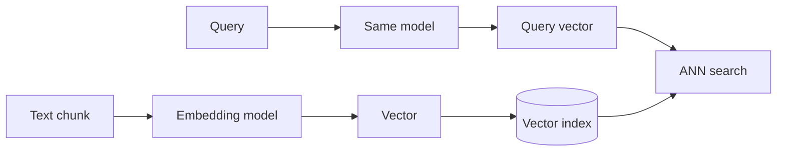

# Embeddings for RAG

> Embedding models convert text to vectors for semantic retrieval — model choice, metrics, and lifecycle management.

## Table of Contents

- [Overview](#overview)
- [Dense Embeddings](#dense-embeddings)
- [Sparse Embeddings](#sparse-embeddings)
- [Hybrid Embeddings](#hybrid-embeddings)
- [Similarity Metrics](#similarity-metrics)
- [Dimensions and Normalization](#dimensions-and-normalization)
- [Model Comparison](#model-comparison)
- [Specialized Embeddings](#specialized-embeddings)
- [Embedding Drift and Versioning](#embedding-drift-and-versioning)
- [Production Considerations](#production-considerations)
- [Python Examples](#python-examples)
- [Interview Preparation](#interview-preparation)
- [Navigation](#navigation)

---

## Overview

Section **6** of Phase 7 — one of the largest RAG topics.



> **See also:** [LLM Engineering Embeddings](../llm-engineering/embeddings.md) for transformer fundamentals.

---

## Dense Embeddings

Neural encoder maps text → ℝⁿ. Semantic similarity ≈ cosine distance in embedding space.

**Use for:** paraphrase, conceptual match, multilingual (with right model).

---

## Sparse Embeddings

High-dimensional sparse vectors (SPLADE, BM25-like learned sparse). Strong on exact terminology.

---

## Hybrid Embeddings

Combine dense + sparse scores (weighted or RRF) — production default for enterprise search.

---

## Similarity Metrics

| Metric | Formula intuition | When |
|--------|-------------------|------|
| **Cosine** | Angle between vectors | Normalized embeddings (default) |
| **Dot product** | Magnitude + angle | When norms carry signal |
| **Euclidean** | L2 distance | Less common for text |

For normalized vectors: `cosine(a,b) = dot(a,b)`.

---

## Dimensions and Normalization

| Model | Dimensions |
|-------|------------|
| text-embedding-3-small | 1536 (reducible) |
| text-embedding-3-large | 3072 |
| bge-large-en-v1.5 | 1024 |
| voyage-3 | 1024 |

Higher dims ≠ always better — match index and eval. **Normalize** for cosine ANN libraries.

---

## Model Comparison

| Model | Strength | Cost | Best for |
|-------|----------|------|----------|
| OpenAI text-embedding-3-large | General quality | API $ | Fast start |
| Cohere embed-v3 | Multilingual | API $ | Global KB |
| BGE / E5 (open) | Self-host, privacy | GPU | On-prem |
| Voyage | Long context | API $ | Long passages |
| Code-specific (Voyage-code, StarCoder) | Code similarity | Varies | Repo search |

**Rule:** Same model for index and query. Never mix models in one collection.

---

## Specialized Embeddings

- **Multilingual** — `multilingual-e5`, Cohere embed-multilingual
- **Code** — code-aware models preserve identifiers
- **Image** — CLIP for multimodal RAG (overview)

---

## Embedding Drift and Versioning

Changing embedding model requires **full reindex**. Track in metadata:

```
embedding_model: "text-embedding-3-large"
embedding_model_version: "2024-01"
index_version: 12
```

Run dual-index migration: build v12, eval, cutover, retire v11.

---

## Production Considerations

- Batch embed during ingestion (100–500 texts/call)
- Cache query embeddings briefly
- Monitor embedding API latency and errors

---

## Python Examples

```python
import math


def cosine_similarity(a: list[float], b: list[float]) -> float:
    dot = sum(x * y for x, y in zip(a, b))
    na = math.sqrt(sum(x * x for x in a))
    nb = math.sqrt(sum(x * x for x in b))
    return dot / (na * nb) if na and nb else 0.0


async def embed_batch(client, texts: list[str], model: str) -> list[list[float]]:
    response = await client.embeddings.create(input=texts, model=model)
    return [d.embedding for d in response.data]
```

---

## Interview Preparation

**Q: Cosine vs dot product for retrieval?**

> Cosine for normalized embeddings (standard). Dot product when vectors not normalized or magnitude meaningful.

**Q: When reindex entire corpus?**

> Embedding model change, chunking policy change, metadata schema breaking filter logic.

---

## Navigation

### Next

- [Vector Databases](vector-databases.md)

---

## Changelog

| Version | Date | Changes |
|---------|------|---------|
| 1.0 | 2026-07-13 | Initial publication — Phase 7 Section 6 |
