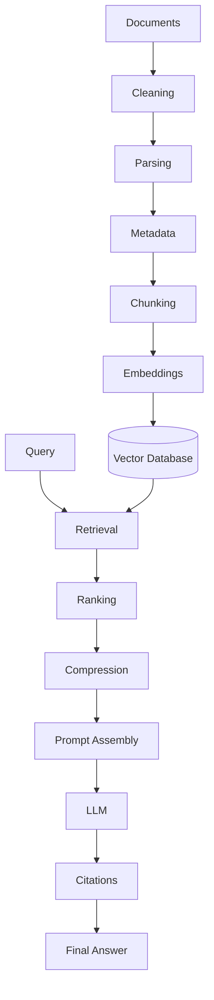
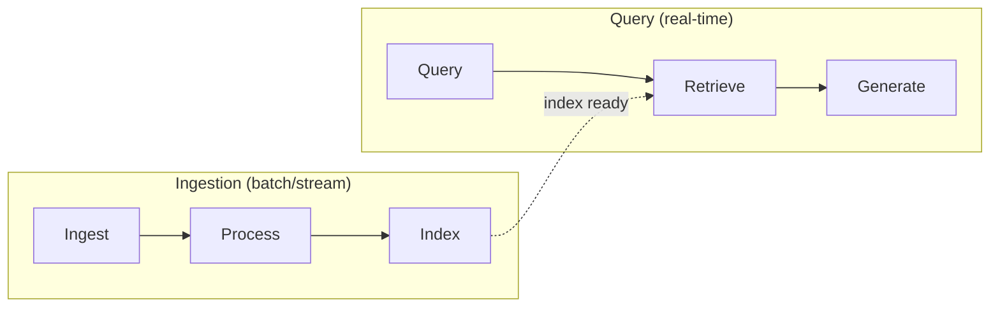
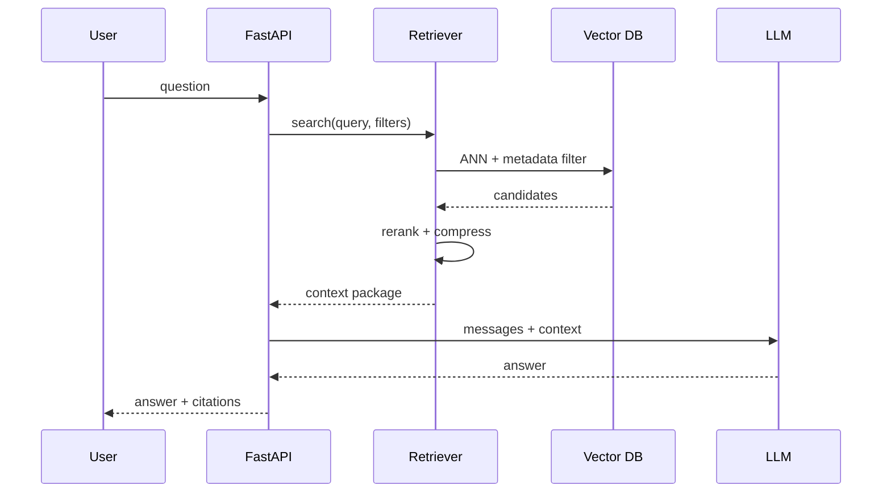

# End-to-End RAG Architecture

> Every stage of a production RAG system — from raw documents to grounded answers with citations.

## Table of Contents

- [Overview](#overview)
- [Pipeline Stages](#pipeline-stages)
- [Offline vs Online Paths](#offline-vs-online-paths)
- [Stage-by-Stage Detail](#stage-by-stage-detail)
- [Data Flow Diagram](#data-flow-diagram)
- [Production Workflow](#production-workflow)
- [Performance Considerations](#performance-considerations)
- [Cost Considerations](#cost-considerations)
- [Scalability](#scalability)
- [Security Considerations](#security-considerations)
- [Best Practices](#best-practices)
- [Python Examples](#python-examples)
- [Interview Preparation](#interview-preparation)
- [Navigation](#navigation)

---

## Overview

Section **2** of Phase 7. This document maps the full pipeline engineers must implement, operate, and debug.



---

## Pipeline Stages

| Stage | Mode | Output |
|-------|------|--------|
| Documents | Input | Raw files, URLs, DB rows |
| Cleaning | Offline | Normalized text |
| Parsing | Offline | Structured content + layout |
| Metadata | Offline | Searchable attributes |
| Chunking | Offline | Passages with IDs |
| Embeddings | Offline | Vectors + sparse terms |
| Vector DB | Storage | Indexed collection |
| Retrieval | Online | Candidate chunks |
| Ranking | Online | Ordered passages |
| Compression | Online | Budget-fitted context |
| Prompt Assembly | Online | LLM messages |
| LLM | Online | Draft answer |
| Citations | Online | Source attribution |
| Final Answer | Online | User response |

---

## Offline vs Online Paths



Decouple with queues (Celery, SQS) — ingestion spikes must not affect query latency.

---

## Stage-by-Stage Detail

### Documents
Source of truth: S3, SharePoint, Git, Confluence. Track `source_uri`, `checksum`, `version`.

### Cleaning
Remove boilerplate, normalize whitespace, fix encoding. See [Document Ingestion](document-ingestion-pipeline.md).

### Parsing
Extract text preserving structure (headings, tables). PDF/DOCX/HTML parsers differ in quality.

### Metadata
`doc_id`, `tenant_id`, `acl`, `created_at`, `tags` — required for filtering. See [Metadata Engineering](metadata-engineering.md).

### Chunking
Split for retrieval granularity. See [Chunking](chunking.md).

### Embeddings
Dense (+ optional sparse) vectors. See [Embeddings for RAG](embeddings-for-rag.md).

### Vector Database
ANN index + metadata filters. See [Vector Databases](vector-databases.md).

### Retrieval
Dense, sparse, hybrid strategies. See [Retrieval Strategies](retrieval-strategies.md).

### Ranking
Rerank top candidates. See [Reranking](reranking.md).

### Compression
Fit passages to token budget. See [RAG Context Compression](rag-context-compression.md).

### Prompt Assembly
Format context + grounding rules. See [RAG Prompt Assembly](rag-prompt-assembly.md).

### LLM
Generate answer with [Phase 5](../prompt-engineering/README.md) templates.

### Citations
Map claims to `chunk_id`. See [Citations and Grounding](citations-and-grounding.md).

---

## Data Flow Diagram



---

## Production Workflow

1. **Design** — schema, chunking policy, embedding model
2. **Ingest** — initial backfill with monitoring
3. **Validate** — retrieval eval on golden set
4. **Serve** — API with auth + filters
5. **Monitor** — recall proxies, latency, empty retrieval rate
6. **Iterate** — chunking/rerank/query tuning from failures

---

## Performance Considerations

- Batch embedding during ingestion (GPU or API batch endpoints)
- HNSW parameters trade recall vs speed
- Cache embedding model locally for dev

---

## Cost Considerations

- One-time embed cost ∝ document tokens
- Query cost ∝ (retrieval + rerank + LLM) per request
- Incremental indexing cheaper than full reindex

---

## Scalability

| Component | Scale approach |
|-----------|----------------|
| Ingestion | Horizontal workers |
| Vector DB | Sharding, replicas |
| Query API | Stateless replicas |
| Embeddings | Dedicated inference service |

---

## Security Considerations

- ACL in metadata; filter every query
- Encrypt index at rest
- No cross-tenant collection sharing without logical isolation

---

## Best Practices

- Immutable chunk IDs with content hash
- Lineage: chunk → doc → source
- Idempotent ingestion jobs

---

## Python Examples

```python
from dataclasses import dataclass


@dataclass
class RAGPipelineConfig:
    embedding_model: str
    chunk_size: int
    chunk_overlap: int
    top_k: int
    rerank_top_n: int
    collection: str


class RAGOrchestrator:
    def __init__(self, config: RAGPipelineConfig, ingestor, retriever, generator):
        self.config = config
        self.ingestor = ingestor
        self.retriever = retriever
        self.generator = generator

    async def ingest_document(self, path: str, metadata: dict) -> int:
        return await self.ingestor.run(path, metadata)

    async def query(self, question: str, filters: dict) -> dict:
        chunks = await self.retriever.retrieve(question, filters, self.config.top_k)
        return await self.generator.generate(question, chunks)
```

---

## Interview Preparation

**Q: Walk through end-to-end RAG for a PDF knowledge base.**

> Parse PDF → chunk with overlap → embed → upsert with metadata → query embed → hybrid search → rerank → assemble prompt → generate with citations → log trace.

---

## Navigation

### Prerequisites

- [Introduction to RAG](introduction-to-rag.md)

### Next

- [Document Ingestion Pipeline](document-ingestion-pipeline.md)

---

## Changelog

| Version | Date | Changes |
|---------|------|---------|
| 1.0 | 2026-07-13 | Initial publication — Phase 7 Section 2 |
