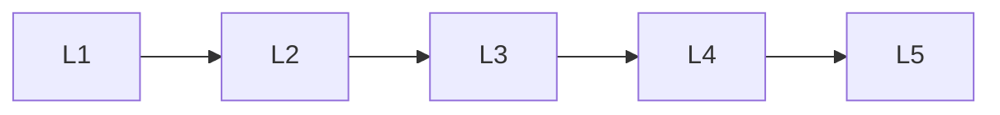

# Evaluation & Production

> Section of the **rag** handbook.

## Lessons

| # | Lesson |
|---|--------|
| 1 | [Rag Evaluation](01-rag-evaluation.md) |
| 2 | [Production Rag](02-production-rag.md) |
| 3 | [Rag System Design](03-rag-system-design.md) |
| 4 | [Rag Mistakes](04-rag-mistakes.md) |
| 5 | [Rag Comparison Guides](05-rag-comparison-guides.md) |

**Topic hub:** [../README.md](../README.md)
