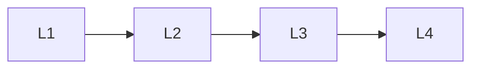

# Generation & Grounding

> Section of the **rag** handbook.

## Lessons

| # | Lesson |
|---|--------|
| 1 | [Rag Prompt Assembly](01-rag-prompt-assembly.md) |
| 2 | [Citations And Grounding](02-citations-and-grounding.md) |
| 3 | [Hallucination Prevention](03-hallucination-prevention.md) |
| 4 | [Rag Context Compression](04-rag-context-compression.md) |

**Topic hub:** [../README.md](../README.md)
