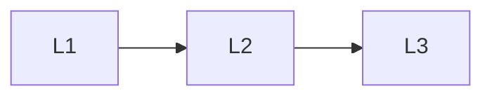

# Ingestion

> Section of the **rag** handbook.

## Lessons

| # | Lesson |
|---|--------|
| 1 | [Document Ingestion Pipeline](01-document-ingestion-pipeline.md) |
| 2 | [Chunking](02-chunking.md) |
| 3 | [Metadata Engineering](03-metadata-engineering.md) |

**Topic hub:** [../README.md](../README.md)
