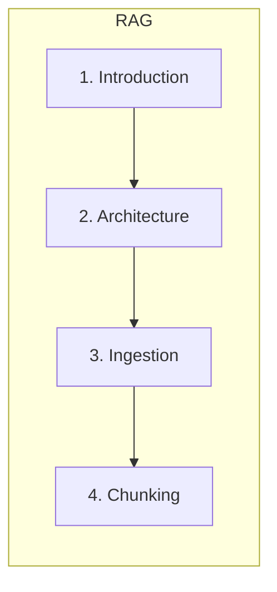
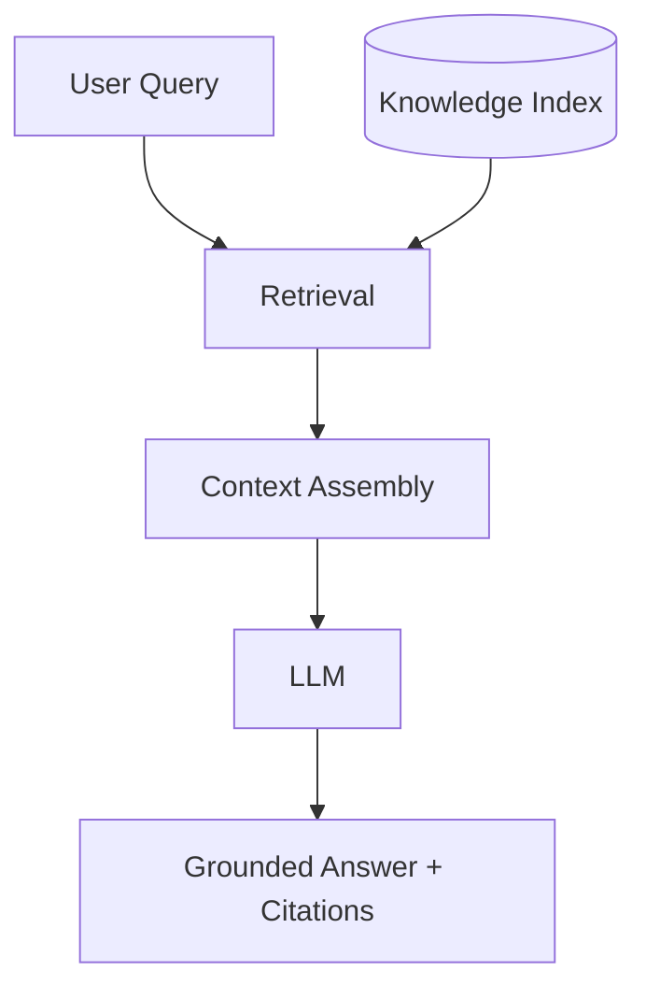
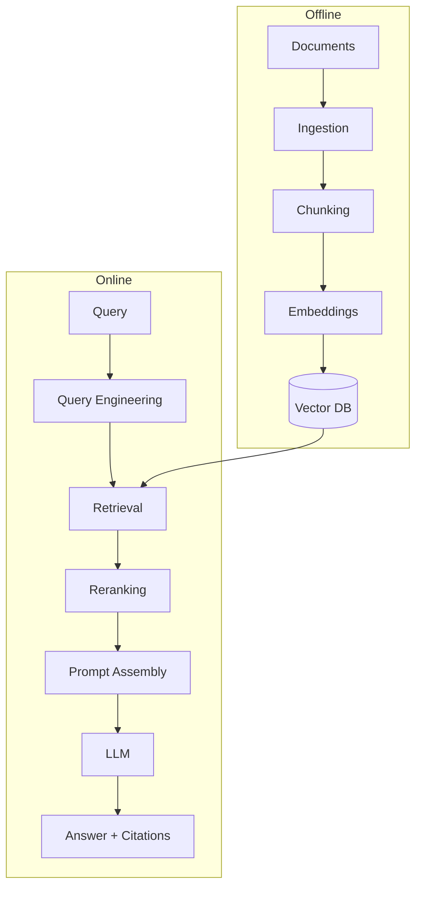
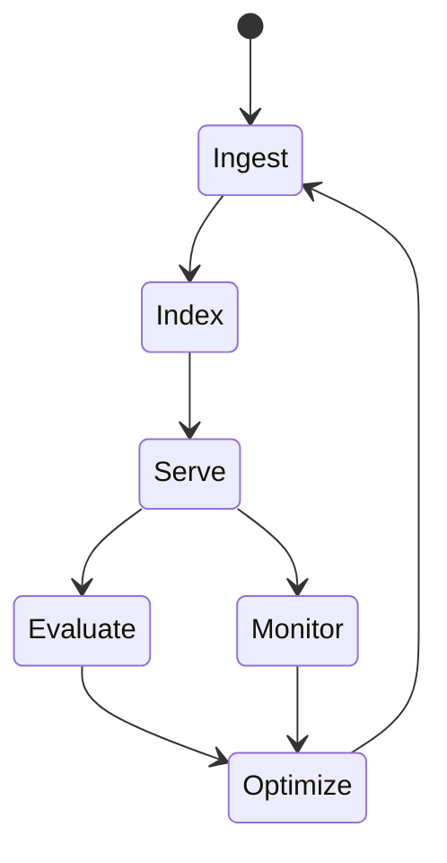

# Introduction to Retrieval-Augmented Generation

> RAG is an information retrieval and knowledge engineering system that grounds LLM outputs in verifiable external knowledge — not simply "LLM + vector database."

## Table of Contents

- [Overview](#overview)
- [What Is RAG?](#what-is-rag)
- [Why RAG Exists](#why-rag-exists)
- [Limitations of LLMs](#limitations-of-llms)
- [Knowledge Cutoff](#knowledge-cutoff)
- [Hallucinations](#hallucinations)
- [External Knowledge](#external-knowledge)
- [Freshness](#freshness)
- [Grounding](#grounding)
- [Enterprise Use Cases](#enterprise-use-cases)
- [RAG Architecture](#rag-architecture)
- [RAG Lifecycle](#rag-lifecycle)
- [RAG Ecosystem](#rag-ecosystem)
- [Types of RAG](#types-of-rag)
- [Engineering Motivation](#engineering-motivation)
- [Production Considerations](#production-considerations)
- [Cost Considerations](#cost-considerations)
- [Latency Considerations](#latency-considerations)
- [Security Considerations](#security-considerations)
- [Best Practices](#best-practices)
- [Anti-Patterns](#anti-patterns)
- [Python Examples](#python-examples)
- [Interview Preparation](#interview-preparation)
- [Navigation](#navigation)

---

## Overview

**Retrieval-Augmented Generation (RAG)** connects a language model to an organization’s knowledge through a retrieval pipeline: ingest documents, chunk and embed them, search at query time, rank results, assemble context, generate an answer with citations.

Production RAG is **knowledge engineering** — ingestion quality, metadata, chunking, retrieval, evaluation, and operations matter as much as the LLM.

This document is **Section 1** of this handbook.



> **Prerequisites:** [Context Engineering](../context-engineering/README.md) · [Prompt Engineering](../prompt-engineering/README.md) · [LLM Engineering](../llm-engineering/README.md)

---

## What Is RAG?

| Term | Definition |
|------|------------|
| **RAG** | Architecture pattern: retrieve relevant knowledge, then generate using that context |
| **Index** | Searchable store of chunked, embedded documents |
| **Retrieval** | Finding candidate passages for a query |
| **Grounding** | Constraining answers to retrieved evidence |
| **Citation** | Linking claims to source documents |



---

## Why RAG Exists

LLMs alone cannot reliably answer questions about private, recent, or domain-specific information. RAG provides:

- **Access** to proprietary data without fine-tuning
- **Freshness** via index updates
- **Traceability** through citations
- **Cost efficiency** vs training custom models
- **Control** over what knowledge the model may use

---

## Limitations of LLMs

| Limitation | RAG Mitigation |
|------------|----------------|
| Knowledge cutoff | Index current documents |
| No access to private data | Enterprise index |
| Hallucination | Grounding + citations |
| Stale training data | Reindexing pipeline |
| Cannot cite sources | Citation layer |

RAG does not eliminate hallucination — it **reduces** it when retrieval and grounding are engineered correctly.

---

## Knowledge Cutoff

Training data ends at a fixed date. RAG indexes live documents independent of model training. Update index on publish — not on model release.

---

## Hallucinations

Hallucinations in RAG often trace to:

1. Retrieval miss (answer not in index)
2. Wrong chunk retrieved
3. Weak grounding instructions
4. Model ignoring context

See [Hallucination Prevention](hallucination-prevention.md).

---

## External Knowledge

Knowledge sources: PDFs, wikis, tickets, code, databases, APIs. Each requires an [ingestion pipeline](document-ingestion-pipeline.md) with parsing, cleaning, and metadata.

---

## Freshness

| Strategy | Freshness SLA |
|----------|---------------|
| Batch nightly reindex | Hours–days |
| Incremental on change | Minutes |
| Real-time API overlay | Seconds |

Define freshness SLO per product — legal/medical need stricter SLAs.

---

## Grounding

Grounding = answers supported by retrieved passages. Enforced via prompts, citation requirements, retrieval thresholds, and post-generation validation.

---

## Enterprise Use Cases

| System | RAG Role |
|--------|----------|
| Enterprise AI search | Full-document index + hybrid retrieval |
| Support copilot | Ticket + KB retrieval |
| Legal AI | Clause-level chunks + citation |
| Code search | AST-aware chunking + code embeddings |
| Research assistant | Multi-hop + reranking |
| Internal company search | Permission-filtered metadata |

See [RAG System Design](rag-system-design.md).

---

## RAG Architecture

High-level components:



---

## RAG Lifecycle



Continuous loop: ingest → index → retrieve → generate → measure → improve.

---

## RAG Ecosystem

| Layer | Technologies |
|-------|--------------|
| Parsing | Unstructured, Docling, PyMuPDF |
| Chunking | LangChain, LlamaIndex, custom |
| Embeddings | OpenAI, Cohere, BGE, Voyage |
| Vector DB | pgvector, Pinecone, Qdrant, Milvus |
| Retrieval | Dense, BM25, hybrid |
| Reranking | Cohere, cross-encoders |
| Eval | RAGAS, DeepEval, custom golden sets |
| Orchestration | FastAPI, Celery, LangGraph |

---

## Types of RAG

| Type | Description |
|------|-------------|
| **Naive RAG** | Embed → search → prompt |
| **Advanced RAG** | Query rewrite, hybrid, rerank, compress |
| **Modular RAG** | Swappable ingestion/retrieval/generation modules |
| **Agentic RAG** | Agent decides when/how to retrieve |
| **GraphRAG** | Knowledge graph + community summaries |
| **Self-RAG** | Model reflects on retrieval need and quality |

See [Advanced RAG Architectures](advanced-rag-architectures.md).

---

## Engineering Motivation

RAG is how organizations ship **trustworthy AI on private knowledge**. Engineering focus: recall@K, faithfulness, latency p95, cost per query, and permission correctness — not demo quality.

---

## Production Considerations

- Version indexes and embedding models together
- Permission filters at query time
- Golden dataset regression in CI
- Separate dev/staging/prod indexes

---

## Cost Considerations

Costs: embedding ingestion (one-time + updates), vector storage, retrieval compute, reranker API, LLM tokens. Hybrid search on pgvector can reduce vendor lock-in cost.

---

## Latency Considerations

Budget: query rewrite (50ms) + retrieval (50–200ms) + rerank (100–500ms) + LLM (1–10s). Parallelize where possible; cache frequent queries.

---

## Security Considerations

- Tenant isolation in index and filters
- PII handling in ingestion
- Audit retrieval for compliance

See [Production RAG](production-rag.md).

---

## Best Practices

1. Treat RAG as a system, not a notebook
2. Measure retrieval separately from generation
3. Start with hybrid retrieval + reranking
4. Invest in chunking and metadata early

---

## Anti-Patterns

| Anti-Pattern | Why It Fails |
|--------------|--------------|
| "Just use Chroma" | Ignores ingestion, eval, permissions |
| Single embedding model forever | Drift on model change |
| No citations | Untrustable in enterprise |
| Eval only end-to-end | Cannot diagnose retrieval vs generation |

---

## Python Examples

```python
"""Minimal RAG query path (conceptual)."""

async def rag_query(query: str, index, llm, top_k: int = 5) -> dict:
    chunks = await index.search(query, top_k=top_k)
    context = "\n\n".join(f"[{c.doc_id}] {c.text}" for c in chunks)
    prompt = f"Answer using only:\n{context}\n\nQuestion: {query}"
    answer = await llm.complete(prompt)
    return {"answer": answer, "sources": [c.doc_id for c in chunks]}
```

---

## Interview Preparation

**Q: What is RAG and why not fine-tune instead?**

> RAG retrieves live knowledge at query time with citations and faster iteration. Fine-tuning is for behavior/style, not replacing a searchable knowledge base.

**Q: Where do most RAG failures originate?**

> Retrieval layer (chunking, indexing, wrong docs) before generation. Diagnose recall@K first.

---

## Navigation

### Prerequisites

- [Context Engineering](../context-engineering/README.md)
- [Retrieval Context](../context-engineering/retrieval-context.md)

### Next

- [End-to-End RAG Architecture](end-to-end-rag-architecture.md)

### Unlocks

- [AI Agents](../ai-agents/README.md) · [MCP](../mcp/README.md)

---

## Changelog

| Version | Date | Changes |
|---------|------|---------|
| 1.0 | 2026-07-13 | Initial publication |
