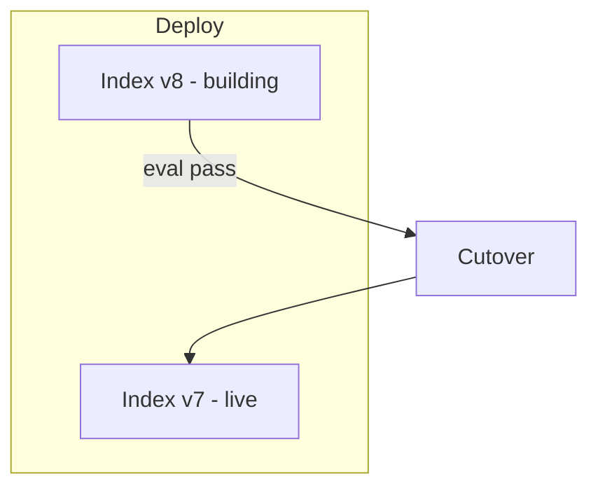

# Production RAG

## Overview

Section **19**.

## Operations Checklist

| Area | Practice |
|------|----------|
| **Caching** | Query embed, retrieval results, prompt prefix |
| **Incremental index** | Upsert changed docs only |
| **Reindexing** | Blue/green collections on model change |
| **Freshness** | CDC webhooks from CMS |
| **Monitoring** | recall proxy, latency, empty retrieval % |
| **Retries** | Idempotent upsert; DLQ for ingest failures |
| **Scaling** | Stateless API + sharded vector DB |
| **Multi-tenant** | Filter + optional separate collections |
| **Permissions** | ACL metadata enforced every query |
| **Security** | Encrypt at rest, audit logs |

## Navigation

- [RAG System Design](rag-system-design.md)

---

## Changelog

| Version | Date | Changes |
|---------|------|---------|
| 1.0 | 2026-07-13 | Initial publication |
